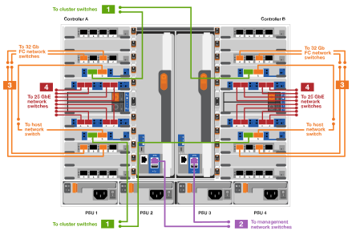
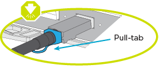

= Pasos detallados - FAS9500
:allow-uri-read: 
:icons: font
:imagesdir: ../media/

[role="lead"]
Este artículo ofrece instrucciones detalladas paso a paso para la instalación de un sistema típico de NetApp. Utilice este artículo si desea instrucciones de instalación más detalladas.

== Paso 1: Preparar la instalación

Para instalar el sistema, debe crear una cuenta en el sitio de soporte de NetApp, registrar el sistema y obtener claves de licencia. También es necesario realizar el inventario del número y tipo de cables adecuados para el sistema y recopilar información específica de la red.

Debe tener acceso a https://hwu.netapp.com["Hardware Universe de NetApp"^] para obtener información acerca de los requisitos del sitio así como información adicional sobre el sistema configurado.

.Lo que necesita
Puede que también desee tener acceso a http://mysupport.netapp.com/documentation/productlibrary/index.html?productID=62286["Notas de la versión de ONTAP 9"^] Para su versión de ONTAP para obtener más información sobre este sistema.

Debe proporcionar lo siguiente en el sitio:

* Espacio en rack para el sistema de almacenamiento
* Destornillador Phillips número 2
* Cables de red adicionales para conectar el sistema al conmutador de red y al portátil o a la consola con un navegador Web

.Pasos
. Extraiga el contenido de todas las cajas.
. Registre el número de serie del sistema de las controladoras.
+
image::../media/drw_ssn_label.svg[Ejemplo del número de serie del sistema]

. Realice un inventario y anote el número y los tipos de cables recibidos.
+
En la siguiente tabla se identifican los tipos de cables que pueden recibir. Si recibe un cable no enumerado en la tabla, consulte la Hardware Universe para localizar el cable e identificar su uso.

+
https://hwu.netapp.com["Hardware Universe de NetApp"^]

+
[cols="1,2,1,2"]
|===
| Tipo de cable... | Número de pieza y longitud | Tipo de conector | Durante... 

 a| 
Cable de datos de 25 GbE
 a| 
X66240A-05 (112-00639), 0,5 m

X66240A-2 (112-00598), 2 m

X66240A-5 (112-00600), 5 m
 a| 
image::../media/oie_cable_sfp_gbe_copper.png[Conector de cobre SFP GbE]
 a| 
Cable de red

 a| 
FC de 32 GB (SFP+ Op)
 a| 
X66250-2 (112-00342), 2 m

X66250-5 (112-00344), 5 m

X66250-15 (112-00346), 15m
 a| 
image::../media/oie_cable_sfp_gbe_copper.png[Conector de cobre SFP GbE]
 a| 
Cable de red óptica FC

 a| 
Cable de red de 40 GbE
 a| 
X66100-1 (112-00542), 1 m.

X66100-3 (112-00543), 3 m.

X66100-5 (112-00544), 5 m
 a| 
image::../media/oie_cable100_gbe_qsfp28.png[Conector QSFP de 100 GbE]
 a| 
Datos Ethernet, red en clúster

 a| 
Cable de 100 GbE
 a| 
X66211B-1 (112-00573), 1 m.

X66211B-2 (112-00574), 2 m

X66211B-5 (112-00576), 5 m
 a| 
image::../media/oie_cable100_gbe_qsfp28.png[Conector QSFP de 100 GbE]
 a| 
Red,

Datos Ethernet,

red de clúster

 a| 
Cables ópticos
 a| 
X66031A (112-00436), 1 m.

X66032A (112-00437), 2 m

X66033A (112-00438), 3 m.
 a| 
image::../media/oie_cable_fiber_lc_connector.png[Conector óptico LC]
 a| 
Red óptica FC

 a| 
Cat 6, RJ-45 (según pedido)
 a| 
Números de referencia X6585-R6 (112-00291), 3m

X6562-R6 (112-00196), 5 m
 a| 
image::../media/oie_cable_rj45.png[Conector RJ-45]
 a| 
Red de gestión y datos Ethernet

 a| 
Reducida
 a| 
X66031A (112-00436), 1 m.

X66032A (112-00437), 2 m

X66033A (112-00438), 3 m.
 a| 
image::../media/oie_cable_mini_sas_hd_to_mini_sas_hd.svg[Conector mini SAS]
 a| 
Reducida

 a| 
Cable de consola Micro-USB
 a| 
No aplicable
 a| 
image::../media/oie_cable_micro_usb.png[Conector micro USB]
 a| 
Conexión de consola durante la configuración del software en un portátil/consola que no sea Windows o Mac

 a| 
Cables de alimentación
 a| 
No aplicable
 a| 
image::../media/oie_cable_power.png[Cables de alimentación]
 a| 
Encendido del sistema

|===
. Revise la https://library.netapp.com/ecm/ecm_download_file/ECMLP2862613["Guía de configuración de ONTAP"^] y recopilar la información necesaria que aparece en esa guía.

== Paso 2: Instale el hardware

Debe instalar el sistema en un rack de 4 parantes o armario del sistema de NetApp, según corresponda.

. Instale los kits de raíles, según sea necesario.
. Instale y asegure el sistema siguiendo las instrucciones incluidas con el kit de raíl.
+

NOTE: Debe ser consciente de los problemas de seguridad asociados con el peso del sistema.

+
La etiqueta de la izquierda indica un chasis vacío, mientras que la etiqueta de la derecha indica un sistema completamente cargado.

+
image::../media/drw_9500_lifting_icon.svg[Etiqueta de precaución para levantar el peso]

. Conecte los dispositivos de administración de cables (como se muestra).
+
image::../media/drw_9500_cable_management_arms.svg[Asas de elevación y dispositivo de gestión de cables]

. Coloque el panel frontal en la parte delantera del sistema.

== Paso 3: Conecte los controladores a la red

Puede conectar las controladoras a la red mediante el método de clúster sin switch de dos nodos o mediante la red de interconexión de clúster.

[role="tabbed-block"]
====
.Opción 1: Clúster sin switches de dos nodos
--
Los puertos de red de gestión, red de datos y gestión de las controladoras se conectan a los switches. Los puertos de interconexión de clúster se cablean en ambas controladoras.

.Antes de empezar
Debe haberse puesto en contacto con el administrador de red para obtener información sobre la conexión del sistema a los switches.

Asegúrese de comprobar la dirección de las pestañas de contacto del cable al insertar los cables en los puertos. Las pestañas de cable están hacia arriba para todos los puertos del módulo de red.

image::../media/oie_cable_pull_tab_up.png[Dirección de la lengüeta de tracción del cable]

NOTE: Al insertar el conector, debería sentir que hace clic en su lugar; si no cree que hace clic, quítelo, vuelva a convertirlo y vuelva a intentarlo.

. Utilice la animación o la ilustración para completar el cableado entre las controladoras y los switches:
+
.Animación: Cableado de clúster sin switches de dos nodos
video::da08295f-ba8c-4de7-88c3-ae7c0170408d[panopto]
+
image::../media/drw_9500_tnsc_network_cabling.svg[cableado de red drw 9500 tnsc]

+
[cols="20%,80%"]
|===
| Paso | Ejecute cada controladora 

 a| 
image::../media/icon_square_1_green.png[Icono de llamada 1]
 a| 
Conectar puertos de interconexión de clúster:

** Ranura A4 y B4 (e4a)
** Ranura A8 y B8 (e8a)

image::../media/oie_cable100_gbe_qsfp28.png[Conector QSFP de 100 GbE]

 a| 
image::../media/icon_square_2_purple.png[Icono de llamada 2]
 a| 
Conecte los cables de los puertos de gestión de las controladoras (llave inglesa).

image::../media/oie_cable_rj45.png[Conector RJ-45]

 a| 
image::../media/icon_square_3_orange.png[Icono de llamada 3]
 a| 
Cable de switches de red FC de 32 GB:

Puertos de las ranuras A3 y B3 (e3a y e3c) y A9 y B9 (e9a y e9c) a los switches de red FC de 32 GB.

image::../media/oie_cable_sfp_gbe_copper.png[Conector de cobre SFP GbE]

Switches de red de host de 40 GbE:

Conecte los puertos b del host‐en las ranuras A4 y B4 (e4b) y la ranura A8 y B8 (e8b) al conmutador host.

image::../media/oie_cable100_gbe_qsfp28.png[Conector QSFP de 100 GbE]

 a| 
image::../media/icon_square_4_red.png[Icono de llamada 4]
 a| 
Cable de conexiones de 25 GbE:

Puertos de cable de las ranuras A5 y B5 (5a, 5b, 5c y 5d) y A7 y B7 (7a, 7b, 7c y 7d) a los switches de red de 25 GbE.

image::../media/oie_cable_sfp_gbe_copper.png[Conector de cobre SFP GbE]

 a| 
image::../media/icon_square_5_grey.png[Icono de llamada 4]
 a| 
** Sujete los cables a los brazos organizadores de cables (no se muestran).
** Conecte los cables de alimentación a las PSU y conéctelos a distintas fuentes de alimentación (no se muestran). Los PSU 1 y 3 proporcionan alimentación a todos los componentes del lado A, mientras que PSU2 y PSU4 proporcionan alimentación a todos los componentes del lado B.

image::../media/oie_cable_power.png[Cables de alimentación]

image::../media/drw_a900fas9500_power_icon_IEOPS-1142.svg[Fuentes de alimentación]

|===

--
.Opción 2: Clúster de switches
--
Los puertos de red de gestión, red de datos y gestión de las controladoras se conectan a los switches. Los puertos de interconexión de clúster y alta disponibilidad están conectados mediante cable al switch de clúster/alta disponibilidad.

.Antes de empezar
Debe haberse puesto en contacto con el administrador de red para obtener información sobre la conexión del sistema a los switches.

Asegúrese de comprobar la dirección de las pestañas de contacto del cable al insertar los cables en los puertos. Las pestañas de cable están hacia arriba para todos los puertos del módulo de red.

image::../media/oie_cable_pull_tab_up.png[Dirección de la lengüeta de tracción del cable]

NOTE: Al insertar el conector, debería sentir que hace clic en su lugar; si no cree que hace clic, quítelo, vuelva a convertirlo y vuelva a intentarlo.

. Utilice la animación o la ilustración para completar el cableado entre las controladoras y los switches:
+
.Animación: Cableado de clúster conmutado
video::3ad3f118-8339-4683-865f-ae7c0170400c[panopto]
+

+
[cols="20%,80%"]
|===
| Paso | Ejecute cada controladora 

 a| 
image::../media/icon_square_1_green.png[Número de llamada 1]
 a| 
Conectar los puertos a de interconexión en clúster:

** Ranura A4 y B4 (e4a) en el conmutador de red del clúster.
** Coloque A8 y B8 (e8a) en el conmutador de red del clúster.

image::../media/oie_cable100_gbe_qsfp28.png[Conector QSFP de 100 GbE]

 a| 
image::../media/icon_square_2_purple.png[Icono de llamada 2]
 a| 
Conecte los cables de los puertos de gestión de las controladoras (llave inglesa).

image::../media/oie_cable_rj45.png[Conector RJ-45]

 a| 
image::../media/icon_square_3_orange.png[Icono de llamada 3]
 a| 
Cable de switches de red FC de 32 GB:

Puertos de las ranuras A3 y B3 (e3a y e3c) y A9 y B9 (e9a y e9c) a los switches de red FC de 32 GB.

image::../media/oie_cable_sfp_gbe_copper.png[Conector de cobre SFP GbE]

Switches de red de host de 40 GbE:

Conecte los puertos b del host‐en las ranuras A4 y B4 (e4b) y la ranura A8 y B8 (e8b) al conmutador host.

image::../media/oie_cable100_gbe_qsfp28.png[Conector QSFP de 100 GbE]

 a| 
image::../media/icon_square_4_red.png[Icono de llamada 4]
 a| 
Cable de conexiones de 25 GbE:

Puertos de cable de las ranuras A5 y B5 (5a, 5b, 5c y 5d) y A7 y B7 (7a, 7b, 7c y 7d) a los switches de red de 25 GbE.

image::../media/oie_cable_sfp_gbe_copper.png[Conector de cobre 100 GbE]

 a| 
image::../media/icon_square_4_red.png[Icono de llamada 4]
 a| 
** Sujete los cables a los brazos organizadores de cables (no se muestran).
** Conecte los cables de alimentación a las PSU y conéctelos a distintas fuentes de alimentación (no se muestran). Los PSU 1 y 3 proporcionan alimentación a todos los componentes del lado A, mientras que PSU2 y PSU4 proporcionan alimentación a todos los componentes del lado B.

image::../media/oie_cable_power.png[Cables de alimentación]

image::../media/drw_a900fas9500_power_icon_IEOPS-1142.svg[Fuentes de alimentación]

|===

--
====

== Paso 4: Conecte las controladoras a las bandejas de unidades

Conecte mediante cable las bandejas de unidades DS212C o DS224C a las controladoras.

NOTE: Para obtener más información sobre el cableado SAS y hojas de cálculo, consulte link:../sas3/overview-cabling-rules-examples.html["Información general sobre las reglas, hojas de trabajo y ejemplos de cableado SAS: Bandejas con módulos IOM12"]

.Antes de empezar
* Rellene la hoja de datos del cableado SAS para el sistema. Consulte link:../sas3/overview-cabling-rules-examples.html["Información general sobre las reglas, hojas de trabajo y ejemplos de cableado SAS: Bandejas con módulos IOM12"].
* Asegúrese de comprobar que la flecha de la ilustración tenga la orientación correcta de la lengüeta de extracción del conector del cable. La pestaña desplegable del cable de los módulos de almacenamiento está hacia arriba, mientras que las pestañas de las bandejas están hacia abajo.

image::../media/oie_cable_pull_tab_up.png[Dirección de la lengüeta de tracción del cable]

NOTE: Al insertar el conector, debería sentir que hace clic en su lugar; si no cree que hace clic, quítelo, vuelva a convertirlo y vuelva a intentarlo.

. Utilice la siguiente animación o dibujos para cablear las controladoras a tres (una pila de una bandeja de unidades y una pila de dos bandejas de unidades) bandejas de unidades DS224C.
+
.Animación: Cableado de las estanterías de la unidad
video::c958aae6-9d08-4d3d-a213-ae7c017040cd[panopto]
+
image::../media/drw_9500_sas_shelf_cabling.svg[cableado de bandejas sas drw 9500]

+
[cols="20%,80%"]
|===
| Paso | Ejecute cada controladora 

 a| 
image::../media/icon_square_1_blue.png[icono cuadrado 1 azul]
 a| 
Conecte la pila de la bandeja de unidades uno a las controladoras, mediante el gráfico como referencia.

* Cable Mini-SAS*

image::../media/oie_cable_mini_sas_hd_to_mini_sas_hd.svg[cable de la oie mini sas hd a mini sas hd]

 a| 
image::../media/icon_square_2_yellow.png[Icono de llamada 2]
 a| 
Conecte las bandejas de unidades dentro de la pila dos entre sí, utilizando el gráfico de referencia.

* Cable Mini-SAS*

image::../media/oie_cable_mini_sas_hd_to_mini_sas_hd.svg[cable de la oie mini sas hd a mini sas hd]

 a| 
image::../media/icon_square_3_tourquoise.png[Icono de llamada 3]
 a| 
Conecte la pila de la bandeja de unidades dos a las controladoras con el gráfico como referencia.

* Cable Mini-SAS*

image::../media/oie_cable_mini_sas_hd_to_mini_sas_hd.svg[cable de la oie mini sas hd a mini sas hd]

|===

== Paso 5: Pasos completos para la instalación y la configuración del sistema

Puede completar la instalación y configuración del sistema mediante la detección de clústeres mediante una sola conexión al switch y el portátil, o bien conectarse directamente a una controladora del sistema y luego conectarse al switch de gestión.

[role="tabbed-block"]
====
.Opción 1: Si la detección de red está activada
--
Si tiene la detección de red habilitada en el portátil, puede completar la configuración y la instalación del sistema mediante la detección automática del clúster.

. Use la animación o el dibujo siguientes para establecer uno o varios ID de bandeja de unidades:
+
.Animación: Defina su ID de bandeja&#8217;s.
video::95a29da1-faa3-4ceb-8a0b-ac7600675aa6[panopto]
+
image::../media/drw_power-on_set_shelf_ID_set.svg[drw enciende el conjunto de ID de bandeja]

+
[cols="20%,80%"]
|===

 a| 
image::../media/icon_round_1.png[Número de llamada 1]
 a| 
Retire la tapa de cierre.

 a| 
image::../media/icon_round_2.png[Número de llamada 2]
 a| 
Mantenga presionado el botón de ID de la bandeja hasta que el primer dígito parpadee, y presione para avanzar a 0-9.

NOTE: El primer dígito continúa parpadeando

 a| 
image::../media/icon_round_2.png[Número de llamada 2]
 a| 
Mantenga presionado el botón de ID de la bandeja hasta que el primer dígito parpadee, y presione para avanzar a 0-9.

NOTE: El primer dígito deja de parpadear y el segundo dígito continúa parpadeando.

 a| 
image::../media/icon_round_4.png[Número de llamada 4]
 a| 
Vuelva a colocar la tapa de cierre.

 a| 
image::../media/icon_round_5.png[Número de llamada 5]
 a| 
Espere 10 segundos para el LED ámbar (!) Para aparecer, apague y encienda la bandeja de unidades para configurar el ID de bandeja.

|===
. Encienda los switches de alimentación de las fuentes de alimentación a ambos nodos.
+
.Animación: Active la alimentación de los controladores
video::a905e56e-c995-4704-9673-adfa0005a891[panopto]
+
image::../media/drw_9500_power-on.svg[encendido del drw 9500]

+

NOTE: El arranque inicial puede tardar hasta ocho minutos.

. Asegúrese de que el ordenador portátil tiene activado el descubrimiento de red.
+
Consulte la ayuda en línea de su portátil para obtener más información.

. Utilice la siguiente animación para conectar el portátil al conmutador de administración.
+
.Animación: Conecte el portátil al conmutador de administración
video::d61f983e-f911-4b76-8b3a-ab1b0066909b[panopto]
+
image::../media/dwr_laptop_to_switch_only.svg[ordenador portátil dwr sólo para cambiar]

. Seleccione un icono de ONTAP que aparece para detectar:
+
image::../media/drw_autodiscovery_controler_select_ieops-1849.svg[Cómo descubrir sus controladores con el Explorador de archivos de Windows]

+
.. Abra el Explorador de archivos.
.. Haga clic en *Red* en el panel izquierdo y haga clic con el botón derecho y seleccione *actualizar*.
.. Haga doble clic en el icono de ONTAP y acepte los certificados que aparecen en la pantalla.
+

NOTE: XXXXX es el número de serie del sistema para el nodo de destino.

+
Se abrirá System Manager.

. Utilice la configuración guiada de System Manager para configurar el sistema con los datos recogidos en el https://library.netapp.com/ecm/ecm_download_file/ECMLP2862613["Guía de configuración de ONTAP"^].
. Configure su cuenta y descargue Active IQ Config Advisor:
+
.. Inicie sesión en su cuenta existente o cree una cuenta.
+
https://mysupport.netapp.com/eservice/public/now.do["Registro de soporte de NetApp"^]

.. Registre su sistema.
+
https://mysupport.netapp.com/eservice/registerSNoAction.do?moduleName=RegisterMyProduct["Registro de productos de NetApp"^]

.. Descargue Active IQ Config Advisor.
+
https://mysupport.netapp.com/site/tools/tool-eula/activeiq-configadvisor["Descargas de NetApp: Config Advisor"^]

. Compruebe el estado del sistema ejecutando Config Advisor.
. Una vez completada la configuración inicial, vaya a https://docs.netapp.com/us-en/ontap/index.html["Documentación de ONTAP 9"^] para obtener información acerca de cómo configurar funciones adicionales en ONTAP.

--
.Opción 2: Si la detección de red no está activada
--
Si no está utilizando un portátil o consola basados en Windows o Mac o si no está activado la detección automática, debe completar la configuración y la configuración con esta tarea.

. Conecte y configure el portátil o la consola:
+
.. Ajuste el puerto de la consola del portátil o de la consola en 115,200 baudios con N-8-1.
+

NOTE: Consulte la ayuda en línea del portátil o de la consola para saber cómo configurar el puerto de la consola.

.. Conecte el cable de consola al portátil o a la consola mediante el cable de consola incluido con el sistema y, a continuación, conecte el portátil al conmutador de la subred de administración.
+
image::../media/drw_9500_cable_console_switch_controller.svg[controlador de conmutador de consola de cable drw 9500]

.. Asigne una dirección TCP/IP al portátil o consola, utilizando una que esté en la subred de gestión.

. Utilice la animación siguiente para establecer uno o varios ID de bandeja de unidades:
+
.Animación: Defina su ID de bandeja&#8217;s.
video::95a29da1-faa3-4ceb-8a0b-ac7600675aa6[panopto]
+
image::../media/drw_power-on_set_shelf_ID_set.svg[drw enciende el conjunto de ID de bandeja]

+
[cols="20%,80%"]
|===

 a| 
image::../media/icon_round_1.png[Número de llamada 1]
 a| 
Retire la tapa de cierre.

 a| 
image::../media/icon_round_2.png[Número de llamada 2]
 a| 
Mantenga presionado el botón de ID de la bandeja hasta que el primer dígito parpadee, y presione para avanzar a 0-9.

NOTE: El primer dígito continúa parpadeando

 a| 
image::../media/icon_round_2.png[Número de llamada 2]
 a| 
Mantenga presionado el botón de ID de la bandeja hasta que el primer dígito parpadee, y presione para avanzar a 0-9.

NOTE: El primer dígito deja de parpadear y el segundo dígito continúa parpadeando.

 a| 
image::../media/icon_round_4.png[Número de llamada 4]
 a| 
Vuelva a colocar la tapa de cierre.

 a| 
image::../media/icon_round_5.png[Número de llamada 5]
 a| 
Espere 10 segundos para el LED ámbar (!) Para aparecer, apague y encienda la bandeja de unidades para configurar el ID de bandeja.

|===
. Encienda los switches de alimentación de las fuentes de alimentación a ambos nodos.
+
.Animación: Active la alimentación de los controladores
video::a905e56e-c995-4704-9673-adfa0005a891[panopto]
+
image::../media/drw_9500_power-on.svg[encendido del drw 9500]

+

NOTE: El arranque inicial puede tardar hasta ocho minutos.

. Asigne una dirección IP de gestión de nodos inicial a uno de los nodos.
+
[cols="1,2"]
|===
| Si la red de gestión tiene DHCP... | Realice lo siguiente... 

 a| 
Configurado
 a| 
Registre la dirección IP asignada a las nuevas controladoras.

 a| 
No configurado
 a| 
.. Abra una sesión de consola mediante PuTTY, un servidor terminal o el equivalente para su entorno.
+

NOTE: Si no sabe cómo configurar PuTTY, compruebe la ayuda en línea del ordenador portátil o de la consola.

.. Introduzca la dirección IP de administración cuando se lo solicite el script.

|===
. Mediante System Manager en el portátil o la consola, configure su clúster:
+
.. Dirija su navegador a la dirección IP de gestión de nodos.
+

NOTE: El formato de la dirección es +https://x.x.x.x+.

.. Configure el sistema con los datos recogidos en el https://library.netapp.com/ecm/ecm_download_file/ECMLP2862613["Guía de configuración de ONTAP"^] .

. Configure su cuenta y descargue Active IQ Config Advisor:
+
.. Inicie sesión en su cuenta existente o cree una cuenta.
+
https://mysupport.netapp.com/eservice/public/now.do["Registro de soporte de NetApp"^]

.. Registre su sistema.
+
https://mysupport.netapp.com/eservice/registerSNoAction.do?moduleName=RegisterMyProduct["Registro de productos de NetApp"^]

.. Descargue Active IQ Config Advisor.
+
https://mysupport.netapp.com/site/tools/tool-eula/activeiq-configadvisor["Descargas de NetApp: Config Advisor"^]

. Compruebe el estado del sistema ejecutando Config Advisor.
. Una vez completada la configuración inicial, vaya a https://docs.netapp.com/us-en/ontap/index.html["Documentación de ONTAP 9"^] para obtener información acerca de cómo configurar funciones adicionales en ONTAP.

--
====