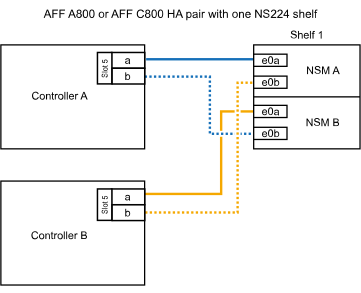

= Bandeja de cables a sistemas AFF - Bandejas NS224
:allow-uri-read: 
:icons: font
:imagesdir: ../media/

[role="lead"]
Conecte mediante cable cada bandeja NS224 que esté añadiendo en caliente de modo que cada bandeja tenga dos conexiones a cada controladora del par de alta disponibilidad.

.Acerca de esta tarea
El sistema de hardware puede ser compatible tanto con bandejas NS224 con módulos NSM100 como con bandejas NS224 con módulos NSM100B. Para comprobar la compatibilidad y los nombres de puerto de su hardware y estantes, consulte el https://hwu.netapp.com["Hardware Universe de NetApp"].

.Conecte el cable de la bandeja a AFF A1K
[%collapsible]
====
Puede agregar en caliente hasta tres bandejas NS224 adicionales (para un total de cuatro bandejas) en una pareja de alta disponibilidad AFF A1K.

.Antes de empezar
* Debe haber revisado el link:requirements-hot-add-shelf.html["requisitos de incorporación en caliente y prácticas recomendadas"].
* Debe haber completado los procedimientos aplicables en link:prepare-hot-add-shelf.html["Prepárese para añadir en caliente una bandeja"].
* Debe haber instalado las bandejas, encenderlas y definir los ID de bandeja tal como se describe en link:prepare-hot-add-shelf.html["Instale una bandeja para una incorporación en caliente"].

.Acerca de esta tarea
* En este procedimiento se asume que el par de alta disponibilidad tiene al menos una bandeja NS224 existente.
* Este procedimiento aborda los siguientes escenarios de adición en caliente:
+
** Adición en caliente de una segunda bandeja a una pareja de alta disponibilidad con dos módulos I/O compatibles con RoCE en cada controladora. (Instaló un segundo módulo de I/O y volvió a buscar la primera bandeja a ambos módulos de I/O o ya tenía la primera bandeja cableada a dos módulos de I/O. Conectará la segunda bandeja mediante cable a módulos de I/O).
** Adición en caliente de una tercera bandeja a una pareja de alta disponibilidad con tres módulos I/O compatibles con RoCE en cada controladora. (Ha instalado un tercer módulo de I/O y conectará la tercera bandeja únicamente al tercer módulo de I/O).
** Adición en caliente de una tercera bandeja a una pareja de alta disponibilidad con cuatro módulos de I/O compatibles con RoCE en cada controladora. (Ha instalado un tercer y cuarto módulo de E/S y conectará la tercera bandeja al tercer y cuarto módulo I/O).
** Adición en caliente de una cuarta bandeja a una pareja de alta disponibilidad con cuatro módulos I/O compatibles con RoCE en cada controladora. (Ha instalado un cuarto módulo de I/O y ha vuelto a buscar la tercera bandeja a los módulos de I/O del tercer y cuarto, o bien ya se ha cableado la tercera bandeja al tercer y cuarto módulo I/O. Conectará mediante cable la cuarta bandeja al tercer y cuarto módulo I/O.

.Pasos
. Si la bandeja NS224 que está agregando en caliente será la segunda bandeja NS224 del par de alta disponibilidad, complete los siguientes subpasos.
+
De lo contrario, vaya al paso siguiente.

+
.. Bandeja de cables NSM de un puerto e0a a a la ranura de controladora A 10 puertos a (e10a).
.. Cable de la bandeja NSM Del puerto e0b a la ranura de la controladora B, puerto b (e11b) 11.
.. Puerto e0a de la bandeja de cables NSM B a la ranura de la controladora B, puerto a 10 (e10a).
.. Cable de la bandeja NSM B del puerto e0b a la ranura de la controladora A 11, puerto b (e11b).
+
En la siguiente ilustración, se destaca el cableado de la segunda bandeja de la pareja de alta disponibilidad con dos módulos I/O compatibles con RoCE en cada controladora:

+
image::../media/drw_ns224_vino_m_2shelves_2cards_ieops-1642.svg[Cableado para AFF/ASA A1K con dos bandejas y dos módulos IO]

. Si la bandeja NS224 que desea añadir en caliente será la tercera bandeja NS224 del par de alta disponibilidad con tres módulos de I/O compatibles con RoCE en cada controladora, complete los siguientes pasos secundarios. De lo contrario, vaya al paso siguiente.
+
.. Conecte el puerto NSM de La bandeja de cables e0a al puerto a de la controladora A en la ranura 9 (e9a).
.. Conecte el cable del puerto NSM A e0b a la ranura de la controladora B, puerto b (e9b) de 9.
.. Conecte el puerto NSM B de la bandeja de cables e0a a la ranura de la controladora B, puerto a 9 (e9a).
.. Cable del puerto e0b NSM B a la ranura de la controladora A 9, puerto b (e9b).
+
En la siguiente ilustración se destaca el cableado de la tercera bandeja de la pareja de alta disponibilidad con tres módulos I/O compatibles con RoCE en cada controladora:

+
image::../media/drw_ns224_vino_m_3shelves_3cards_ieops-1643.svg[Cableado para AFF/ASA A1K con tres bandejas y tres módulos IO]

. Si la bandeja NS224 que desea añadir en caliente será la tercera bandeja NS224 del par de alta disponibilidad con cuatro módulos de I/O compatibles con RoCE en cada controladora, complete los siguientes pasos secundarios. De lo contrario, vaya al paso siguiente.
+
.. Conecte el puerto NSM de La bandeja de cables e0a al puerto a de la controladora A en la ranura 9 (e9a).
.. Conecte el cable del puerto NSM A e0b a la ranura de la controladora B, puerto b (e8b) de 8.
.. Conecte el puerto NSM B de la bandeja de cables e0a a la ranura de la controladora B, puerto a 9 (e9a).
.. Cable del puerto e0b NSM B a la ranura de la controladora A 8, puerto b (e8b).
+
En la siguiente ilustración se destaca el cableado de la tercera bandeja de la pareja de alta disponibilidad con cuatro módulos I/O compatibles con RoCE en cada controladora:

+
image::../media/drw_ns224_vino_m_3shelves_4cards_ieops-1644.svg[Cableado para AFF/ASA A1K con tres bandejas y cuatro módulos IO]

. Si la bandeja NS224 que desea añadir en caliente será la cuarta bandeja NS224 de la pareja de alta disponibilidad con cuatro módulos de I/O compatibles con RoCE en cada controladora, complete los siguientes pasos secundarios.
+
.. Conecte el puerto NSM de La bandeja de cables e0a al puerto a de la controladora A en la ranura 8 (e8a).
.. Conecte el cable del puerto NSM A e0b a la ranura de la controladora B, puerto b (e9b) de 9.
.. Conecte el puerto NSM B de la bandeja de cables e0a a la ranura de la controladora B, puerto a 8 (e8a).
.. Cable del puerto e0b NSM B a la ranura de la controladora A 9, puerto b (e9b).
+
En la siguiente ilustración se destaca el cableado de la cuarta bandeja de la pareja de alta disponibilidad con cuatro módulos I/O compatibles con RoCE en cada controladora:

+
image::../media/drw_ns224_vino_m_4shelves_4cards_ieops-1645.svg[Cableado para AFF/ASA A1K con cuatro bandejas y cuatro módulos IO]

. Compruebe que la bandeja añadida en caliente se ha cableado correctamente https://mysupport.netapp.com/site/tools/tool-eula/activeiq-configadvisor["Active IQ Config Advisor"^]mediante .
+
Si se genera algún error de cableado, siga las acciones correctivas proporcionadas.

.El futuro
Si se deshabilitó la asignación automática de unidades como parte de la preparación para este procedimiento, debe asignar manualmente la propiedad de la unidad y, después, volver a habilitar la asignación automática de unidades, si es necesario. Vaya a link:complete-hot-add-shelf.html["Complete el hot-add"].

De lo contrario, finalizó el procedimiento de bandeja con adición en caliente.

====
.Conecte el cable de la bandeja a AFF A20
[%collapsible]
====
Puede agregar en caliente una bandeja NS224 a un par de alta disponibilidad de AFF A20 cuando necesite almacenamiento adicional (a la bandeja interna).

.Antes de empezar
* Debe haber revisado el link:requirements-hot-add-shelf.html["requisitos de incorporación en caliente y prácticas recomendadas"].
* Debe haber completado los procedimientos aplicables en link:prepare-hot-add-shelf.html["Prepárese para agregar en caliente una bandeja"].
* Debe haber instalado las bandejas, encenderlas y definir los ID de bandeja tal como se describe en link:prepare-hot-add-shelf.html["Instale una bandeja para una incorporación en caliente"].

.Acerca de esta tarea
* En este procedimiento se asume que su par de alta disponibilidad solo tiene almacenamiento interno (no hay bandejas externas) y que se puede agregar en caliente a una bandeja adicional.
* Este procedimiento aborda los siguientes escenarios de adición en caliente:
+
** Adición en caliente de la primera bandeja a una pareja de alta disponibilidad con un módulo I/O compatible con RoCE en cada controladora.
** Adición en caliente de la primera bandeja a una pareja de alta disponibilidad con dos módulos I/O compatibles con RoCE en cada controladora.

* Estos sistemas son compatibles con bandejas NS224 con módulos NSM100 y bandejas NS224 con módulos NSM100B. Para asegurarse de conectar los controladores a los puertos correctos, sustituya la “X” de cada diagrama por el número de puerto correcto para su módulo:
+
[cols="1,4"]
|===
| Tipo de módulo | Etiquetado de puertos 

 a| 
NSM100
 a| 
«0»

ej. e0a

 a| 
NSM100B
 a| 
«1»

ej. e1a

|===

.Pasos
. Si va a añadir en caliente una bandeja con un conjunto de puertos compatibles con RoCE (un módulo de I/O compatible con RoCE) en cada módulo de controladora, y esta es la única bandeja NS224 de la pareja de alta disponibilidad, complete los siguientes pasos secundarios.
+
De lo contrario, vaya al paso siguiente.

+

NOTE: En este paso se supone que se ha instalado el módulo de I/O compatible con RoCE en la ranura 3.

+
.. Bandeja de cables NSM A puerto EXA a la controladora A 3 puerto A (E3A).
.. Bandeja de cables NSM A puerto EXB a ranura 3 de la controladora B puerto b (E3b).
.. Bandeja de cables Puerto NSM B EXA a ranura 3 de la controladora B, puerto A (E3A).
.. Bandeja de cables NSM B port EXB a la controladora A ranura 3 puerto b (E3b).
+
En la siguiente ilustración, se muestra el cableado de una bandeja añadida en caliente mediante un módulo de I/o compatible con roce en cada módulo de la controladora:

+
image::../media/drw_ns224_g_1shelf_1card_ieops-2002.svg[Cableado para AFF/ASA A20 con una bandeja y un módulo I/O.]

. Si va a añadir en caliente una bandeja con dos conjuntos de puertos compatibles con RoCE (dos módulos de I/O compatibles con RoCE) en cada módulo de controladora, complete los siguientes pasos secundarios.
+
.. Conecte el cable de NSM A port EXA a la controladora A ranura 3 puerto A (E3A).
.. Conecte el cable del puerto A de NSM al puerto b (e1b) de la ranura 1 de la controladora B.
.. Conecte mediante cable el puerto NSM B EXA al puerto A (E3A) de la ranura 3 de la controladora B.
.. Conecte mediante cable el puerto NSM B EXB al puerto b de la ranura 1 de la controladora A (e1b).

En la siguiente ilustración, se muestra el cableado para una bandeja añadida en caliente con dos módulos I/O compatibles con RoCE en cada módulo de controladora:

image::../media/drw_ns224_g_1shelf_2card_ieops-2005.svg[Cableado para AFF/ASA A20 con una bandeja y dos módulos IO]

. Compruebe que la bandeja añadida en caliente se ha cableado correctamente https://mysupport.netapp.com/site/tools/tool-eula/activeiq-configadvisor["Active IQ Config Advisor"^]mediante .
+
Si se genera algún error de cableado, siga las acciones correctivas proporcionadas.

.El futuro
Si se deshabilitó la asignación automática de unidades como parte de la preparación para este procedimiento, debe asignar manualmente la propiedad de la unidad y, después, volver a habilitar la asignación automática de unidades, si es necesario. Vaya a link:complete-hot-add-shelf.html["Complete el hot-add"].

De lo contrario, finalizó el procedimiento de bandeja con adición en caliente.

====
.Conecte los cables de la bandeja a AFF A30, AFF A50, AFF C30 o AFF C60
[%collapsible]
====
Puede agregar en caliente hasta dos bandejas NS224 a un par de alta disponibilidad AFF A30, AFF C30, AFF A50 o AFF C60 cuando necesite almacenamiento adicional (a la bandeja interna).

.Antes de empezar
* Debe haber revisado el link:requirements-hot-add-shelf.html["requisitos de incorporación en caliente y prácticas recomendadas"].
* Debe haber completado los procedimientos aplicables en link:prepare-hot-add-shelf.html["Prepárese para agregar en caliente una bandeja"].
* Debe haber instalado las bandejas, encenderlas y definir los ID de bandeja tal como se describe en link:prepare-hot-add-shelf.html["Instale una bandeja para una incorporación en caliente"].

.Acerca de esta tarea
* En este procedimiento se asume que su pareja de alta disponibilidad solo tiene almacenamiento interno (sin bandejas externas) y que se puede agregar en caliente hasta dos bandejas adicionales y dos módulos de I/O compatibles con RoCE en cada controladora.
* Este procedimiento aborda los siguientes escenarios de adición en caliente:
+
** Adición en caliente de la primera bandeja a una pareja de alta disponibilidad con un módulo I/O compatible con RoCE en cada controladora.
** Adición en caliente de la primera bandeja a una pareja de alta disponibilidad con dos módulos I/O compatibles con RoCE en cada controladora.
** Adición en caliente de la segunda bandeja a una pareja de alta disponibilidad con dos módulos I/O compatibles con RoCE en cada controladora.

* Estos sistemas son compatibles con bandejas NS224 con módulos NSM100 y bandejas NS224 con módulos NSM100B. Para asegurarse de conectar los controladores a los puertos correctos, sustituya la “X” de cada diagrama por el número de puerto correcto para su módulo:
+
[cols="1,4"]
|===
| Tipo de módulo | Etiquetado de puertos 

 a| 
NSM100
 a| 
«0»

ej. e0a

 a| 
NSM100B
 a| 
«1»

ej. e1a

|===

.Pasos
. Si va a añadir en caliente una bandeja con un conjunto de puertos compatibles con RoCE (un módulo de I/O compatible con RoCE) en cada módulo de controladora, y esta es la única bandeja NS224 de la pareja de alta disponibilidad, complete los siguientes pasos secundarios.
+
De lo contrario, vaya al paso siguiente.

+

NOTE: En este paso se supone que se ha instalado el módulo de I/O compatible con RoCE en la ranura 3.

+
.. Bandeja de cables NSM A puerto EXA a la controladora A 3 puerto A (E3A).
.. Bandeja de cables NSM A puerto EXB a ranura 3 de la controladora B puerto b (E3b).
.. Bandeja de cables Puerto NSM B EXA a ranura 3 de la controladora B, puerto A (E3A).
.. Bandeja de cables NSM B port EXB a la controladora A ranura 3 puerto b (E3b).
+
En la siguiente ilustración, se muestra el cableado de una bandeja añadida en caliente mediante un módulo de I/o compatible con roce en cada módulo de la controladora:

+
image::../media/drw_ns224_g_1shelf_1card_ieops-2002.svg[Cableado para AFF/ASA A30,452px,AFF/ASA A50]

. Si va a añadir una o dos bandejas en caliente usando dos conjuntos de puertos compatibles con roce (dos módulos de I/o compatibles con roce) en cada módulo de la controladora, complete los subpasos aplicables.
+

NOTE: En este paso se supone que se han instalado los módulos I/O compatibles con RoCE en las ranuras 3 y 1.

+
[cols="1,3"]
|===
| Bandejas | Cableado 

 a| 
Bandeja 1
 a| 
.. Conecte el cable de NSM A port EXA a la controladora A ranura 3 puerto A (E3A).
.. Conecte el cable del puerto A de NSM al puerto b (e1b) de la ranura 1 de la controladora B.
.. Conecte mediante cable el puerto NSM B EXA al puerto A (E3A) de la ranura 3 de la controladora B.
.. Conecte mediante cable el puerto NSM B EXB al puerto b de la ranura 1 de la controladora A (e1b).
.. Si va a agregar un segundo estante en caliente, complete los pasos secundarios "Estante 2"; de lo contrario, vaya al siguiente paso.

En la siguiente ilustración, se muestra el cableado para una bandeja añadida en caliente con dos módulos I/O compatibles con RoCE en cada módulo de controladora:

image::../media/drw_ns224_g_1shelf_2card_ieops-2005.svg[Cableado para AFF/ASA A30,452px,AFF/ASA A50]

 a| 
Estante 2
 a| 
.. Conecte el cable de NSM A port EXA a la controladora A ranura 1 puerto A (e1a).
.. Conecte el cable del puerto A de NSM al puerto b (E3b) de la ranura 3 de la controladora B.
.. Conecte mediante cable el puerto NSM B EXA al puerto A (e1a) de la ranura 1 de la controladora B.
.. Conecte mediante cable el puerto NSM B EXB al puerto b de la ranura 3 de la controladora A (E3b).
.. Vaya al paso siguiente.

En la siguiente ilustración, se muestra el cableado para dos bandejas añadidas en caliente mediante dos módulos I/O compatibles con RoCE en cada módulo de controladora:

image::../media/drw_ns224_g_2shelf_2card_ieops-2003.svg[Cableado para AFF A30/ASA,452px,AFF/ASA A50]

|===
. Compruebe que la bandeja añadida en caliente se ha cableado correctamente https://mysupport.netapp.com/site/tools/tool-eula/activeiq-configadvisor["Active IQ Config Advisor"^]mediante .
+
Si se genera algún error de cableado, siga las acciones correctivas proporcionadas.

.El futuro
Si se deshabilitó la asignación automática de unidades como parte de la preparación para este procedimiento, debe asignar manualmente la propiedad de la unidad y, después, volver a habilitar la asignación automática de unidades, si es necesario. Vaya a link:complete-hot-add-shelf.html["Complete el hot-add"].

De lo contrario, finalizó el procedimiento de bandeja con adición en caliente.

====
.Conecte el cable de la bandeja a AFF A70, AFF A90 o AFF C80
[%collapsible]
====
Puede agregar en caliente hasta dos bandejas NS224 a un par de alta disponibilidad AFF A70, AFF A90 o AFF C80 cuando necesite almacenamiento adicional (a la bandeja interna).

.Antes de empezar
* Debe haber revisado el link:requirements-hot-add-shelf.html["requisitos de incorporación en caliente y prácticas recomendadas"].
* Debe haber completado los procedimientos aplicables en link:prepare-hot-add-shelf.html["Prepárese para agregar en caliente una bandeja"].
* Debe haber instalado las bandejas, encenderlas y definir los ID de bandeja tal como se describe en link:prepare-hot-add-shelf.html["Instale una bandeja para una incorporación en caliente"].

.Acerca de esta tarea
* En este procedimiento se asume que su pareja de alta disponibilidad solo tiene almacenamiento interno (sin bandejas externas) y que se puede agregar en caliente hasta dos bandejas adicionales y dos módulos de I/O compatibles con RoCE en cada controladora.
* Este procedimiento aborda los siguientes escenarios de adición en caliente:
+
** Adición en caliente de la primera bandeja a una pareja de alta disponibilidad con un módulo I/O compatible con RoCE en cada controladora.
** Adición en caliente de la primera bandeja a una pareja de alta disponibilidad con dos módulos I/O compatibles con RoCE en cada controladora.
** Adición en caliente de la segunda bandeja a una pareja de alta disponibilidad con dos módulos I/O compatibles con RoCE en cada controladora.

.Pasos
. Si va a añadir en caliente una bandeja con un conjunto de puertos compatibles con RoCE (un módulo de I/O compatible con RoCE) en cada módulo de controladora, y esta es la única bandeja NS224 de la pareja de alta disponibilidad, complete los siguientes pasos secundarios.
+
De lo contrario, vaya al paso siguiente.

+

NOTE: En este paso se supone que se ha instalado el módulo de I/O compatible con RoCE en la ranura 11.

+
.. Conecte el cable de la bandeja NSM de Un puerto e0a a a la ranura de controladora A 11 puerto a (e11a).
.. Cable de la bandeja NSM Del puerto e0b a la ranura de la controladora B, puerto b (e11b) 11.
.. Conecte el puerto NSM B de la bandeja de cables e0a al puerto a de la ranura de la controladora B 11 (e11a).
.. Cable de la bandeja NSM B del puerto e0b a la ranura de la controladora A 11, puerto b (e11b).
+
En la siguiente ilustración, se muestra el cableado de una bandeja añadida en caliente mediante un módulo de I/o compatible con roce en cada módulo de la controladora:

+
image::../media/drw_ns224_vino_i_1shelf_1card_ieops-1639.svg[Cableado para AFF/ASA A70 o A90 con una bandeja y un módulo I/O.]

. Si va a añadir una o dos bandejas en caliente usando dos conjuntos de puertos compatibles con roce (dos módulos de I/o compatibles con roce) en cada módulo de la controladora, complete los subpasos aplicables.
+

NOTE: En este paso se supone que se han instalado los módulos I/O compatibles con RoCE en las ranuras 11 y 8.

+
[cols="1,3"]
|===
| Bandejas | Cableado 

 a| 
Bandeja 1
 a| 
.. Conecte El cable NSM de Un puerto e0a al puerto a de la ranura controladora A 11 (e11a).
.. Conecte el cable NSM del puerto e0b a la ranura de la controladora B 8 del puerto b (e8b).
.. Conecte el cable del puerto NSM B e0a al puerto a de la ranura de la controladora B de 11 puertos (e11a).
.. Conecte el cable del puerto e0b NSM B al puerto b (e8b) de la controladora A la ranura 8.
.. Si va a agregar un segundo estante en caliente, complete los pasos secundarios "Estante 2"; de lo contrario, vaya al siguiente paso.

En la siguiente ilustración, se muestra el cableado para una bandeja añadida en caliente con dos módulos I/O compatibles con RoCE en cada módulo de controladora:

image::../media/drw_ns224_vino_i_1shelf_2cards_ieops-1640.svg[Cableado para AFF/ASA A70 o A90 con una bandeja y dos módulos IO]

 a| 
Estante 2
 a| 
.. Conecte El cable NSM de Un puerto e0a al puerto a de la ranura controladora A 8 (e8a).
.. Conecte el cable NSM del puerto e0b a la ranura de la controladora B 11 del puerto b (e11b).
.. Conecte el cable del puerto NSM B e0a al puerto a de la ranura de la controladora B de 8 puertos (e8a).
.. Conecte el cable del puerto e0b NSM B al puerto b (e11b) de la controladora A la ranura 11.
.. Vaya al paso siguiente.

En la siguiente ilustración, se muestra el cableado para dos bandejas añadidas en caliente mediante dos módulos I/O compatibles con RoCE en cada módulo de controladora:

image::../media/drw_ns224_vino_i_2shelves_2cards_ieops-1641.svg[Cableado para AFF/ASA A70 o A90 con dos bandejas y dos módulos IO]

|===
. Compruebe que la bandeja añadida en caliente se ha cableado correctamente https://mysupport.netapp.com/site/tools/tool-eula/activeiq-configadvisor["Active IQ Config Advisor"^]mediante .
+
Si se genera algún error de cableado, siga las acciones correctivas proporcionadas.

.El futuro
Si se deshabilitó la asignación automática de unidades como parte de la preparación para este procedimiento, debe asignar manualmente la propiedad de la unidad y, después, volver a habilitar la asignación automática de unidades, si es necesario. Vaya a link:complete-hot-add-shelf.html["Complete el hot-add"].

De lo contrario, finalizó el procedimiento de bandeja con adición en caliente.

====
.Conecte el cable de la bandeja a AFF A250 o AFF C250
[%collapsible]
====
Cuando se necesita almacenamiento adicional, puede agregar en caliente un máximo de una bandeja NS224 a un par AFF A250 o AFF C250 de alta disponibilidad.

.Antes de empezar
* Debe haber revisado el link:requirements-hot-add-shelf.html["requisitos de incorporación en caliente y prácticas recomendadas"].
* Debe haber completado los procedimientos aplicables en link:prepare-hot-add-shelf.html["Prepárese para agregar en caliente una bandeja"].
* Debe haber instalado las bandejas, encenderlas y definir los ID de bandeja tal como se describe en link:prepare-hot-add-shelf.html["Instale una bandeja para una incorporación en caliente"].

.Acerca de esta tarea
Una vez visto desde la parte posterior del chasis de la plataforma, el puerto para tarjetas compatible con roce de la izquierda es el puerto "a" (e1a) y el puerto de la derecha es el puerto "b" (e1b).

.Pasos
. Conecte los cables de las conexiones de la bandeja:
+
.. Conecte El puerto NSM de La bandeja de cables e0a al puerto a de la ranura 1 de la controladora (e1a).
.. Conecte el cable del puerto NSM A e0b a la ranura de la controladora B del puerto b (e1b).
.. Conecte el puerto NSM B de la bandeja de cables e0a al puerto a de la ranura de la controladora B (e1a).
.. Conecte el puerto e0b NSM B de la bandeja a la controladora, puerto b (e1b) de la ranura 1. + la siguiente ilustración muestra el cableado de las bandejas cuando se completa.
+
image::../media/drw_ns224_a250_c250_f500f_1shelf_ieops-1824.svg[Cableado para un AFF/ASA A250 C250 o FAS500f con una bandeja NS224 y un conjunto de puertos de tarjeta PCIe]

. Compruebe que la bandeja añadida en caliente se ha cableado correctamente https://mysupport.netapp.com/site/tools/tool-eula/activeiq-configadvisor["Active IQ Config Advisor"^]mediante .
+
Si se genera algún error de cableado, siga las acciones correctivas proporcionadas.

.El futuro
Si se deshabilitó la asignación automática de unidades como parte de la preparación para este procedimiento, debe asignar manualmente la propiedad de la unidad y, después, volver a habilitar la asignación automática de unidades, si es necesario. Vaya a link:complete-hot-add-shelf.html["Complete el hot-add"].

De lo contrario, finalizó el procedimiento de bandeja con adición en caliente.

====
.Conecte el cable de la bandeja a AFF A400 o AFF C400
[%collapsible]
====
La forma de conectar la red de una bandeja NS224 por una adición en caliente depende de si tiene un par de alta disponibilidad AFF A400 o AFF C400.

.Antes de empezar
* Debe haber revisado el link:requirements-hot-add-shelf.html["requisitos de incorporación en caliente y prácticas recomendadas"].
* Debe haber completado los procedimientos aplicables en link:prepare-hot-add-shelf.html["Prepárese para agregar en caliente una bandeja"].
* Debe haber instalado las bandejas, encenderlas y definir los ID de bandeja tal como se describe en link:prepare-hot-add-shelf.html["Instale una bandeja para una incorporación en caliente"].

* Estante de cable a un par AFF A400 HA*

Para una pareja de alta disponibilidad AFF A400, puede agregar en caliente hasta dos bandejas y utilizar los puertos integrados e0c/e0d y los puertos en la ranura 5 según sea necesario.

.Pasos
. Si va a añadir en caliente una bandeja con un conjunto de puertos compatibles con RoCE (puertos integrados compatibles con RoCE) en cada controladora, y esta es la única bandeja NS224 de la pareja de alta disponibilidad, complete los siguientes pasos secundarios.
+
De lo contrario, vaya al paso siguiente.

+
.. Conecte el cable de la bandeja NSM De Un puerto e0a al puerto e0c de la controladora A.
.. Cable de la bandeja NSM Del puerto e0b al puerto e0d de la controladora B.
.. Cable del puerto NSM B e0a al puerto e0c de la controladora B.
.. Conecte el cable del puerto e0b NSM B al puerto e0d de la controladora A.
+
En la siguiente ilustración, se muestra el cableado para una bandeja añadida en caliente mediante un conjunto de puertos compatibles con RoCE de cada controladora:

+
image::../media/drw_ns224_a400_1shelf.png[Cableado para un AFF/ASA A400 con una bandeja NS224 y un conjunto de puertos internos]

. Si va a añadir en caliente una o dos bandejas mediante dos conjuntos de puertos compatibles con RoCE (integrados y de tarjeta PCIe compatibles con RoCE) en cada controladora, complete los siguientes pasos secundarios.
+
[cols="1,3"]
|===
| Bandejas | Cableado 

 a| 
Bandeja 1
 a| 
.. Conecte El cable NSM de Un puerto e0a al puerto e0c de la controladora A.
.. Conecte el cable del puerto a e0b a la ranura 2 de la controladora B 5 (e5b).
.. Conecte el cable del puerto NSM B e0a al puerto e0c de la controladora B.
.. Conecte el cable del puerto e0b NSM B al puerto 2 de la ranura 5 de la controladora A (e5b).
.. Si va a agregar un segundo estante en caliente, complete los pasos secundarios "Estante 2"; de lo contrario, vaya al siguiente paso.

 a| 
Estante 2
 a| 
.. Conecte El cable NSM de Un puerto e0a al puerto 1 de la ranura 5 De la controladora A (e5a).
.. Conecte el cable NSM del puerto e0b al puerto e0d de la controladora B.
.. Conecte el cable del puerto NSM B e0a al puerto 1 de la ranura de la controladora B 5 (e5a).
.. Conecte el cable del puerto e0b NSM B al puerto e0d de la controladora A.
.. Vaya al paso siguiente.

|===
+
En la siguiente ilustración, se muestra el cableado de dos bandejas añadidas en caliente:

+
image::../media/drw_ns224_a400_2shelves_IEOPS-983.svg[Cableado para un /ASA A400 con dos bandejas NS224 y un conjunto de puertos internos y un conjunto de puertos en tarjetas PCIe]

. Compruebe que la bandeja añadida en caliente se ha cableado correctamente https://mysupport.netapp.com/site/tools/tool-eula/activeiq-configadvisor["Active IQ Config Advisor"^]mediante .
+
Si se genera algún error de cableado, siga las acciones correctivas proporcionadas.

. Si se deshabilitó la asignación automática de unidades como parte de la preparación para este procedimiento, debe asignar manualmente la propiedad de la unidad y volver a habilitar la asignación automática de unidades, si es necesario. Consulte link:complete-hot-add-shelf.html["Complete el hot-add"].
+
De lo contrario, ha finalizado este procedimiento.

* Estante de cable a un par AFF C400 HA*

Para un par de alta disponibilidad AFF C400, puede agregar en caliente hasta dos bandejas y utilizar puertos en la ranura 4 y 5 según sea necesario.

.Pasos
. Si va a agregar en caliente una bandeja con un conjunto de puertos compatibles con RoCE en cada controladora, y esta es la única bandeja NS224 de la pareja de alta disponibilidad, complete los siguientes pasos secundarios.
+
De lo contrario, vaya al paso siguiente.

+
.. Bandeja de cables NSM de un puerto e0a a a la ranura de la controladora A 4, puerto 1 (e4a).
.. Cable de la bandeja NSM Del puerto e0b a a la ranura de la controladora B, puerto 4 (e4b).
.. Puerto NSM B de la bandeja de cables e0a a a la ranura del controlador B, puerto 4 (e4a).
.. Cable de la bandeja NSM B del puerto e0b a la ranura de la controladora A 4, puerto 2 (e4b).
+
En la siguiente ilustración, se muestra el cableado para una bandeja añadida en caliente mediante un conjunto de puertos compatibles con RoCE de cada controladora:

+
image::../media/drw_ns224_c400_1shelf_IEOPS-985.svg[Cableado para un AFF/ASA C400 con una bandeja NS224 y un conjunto de puertos de tarjeta PCIe]

. Si va a añadir en caliente una o dos bandejas mediante dos conjuntos de puertos compatibles con RoCE en cada controladora, complete los siguientes pasos secundarios.
+
[cols="1,3"]
|===
| Bandejas | Cableado 

 a| 
Bandeja 1
 a| 
.. Conecte el cable NSM del puerto e0a al puerto 1 de la ranura 4 Del controlador A (e4a).
.. Conecte el cable del puerto a e0b a la ranura 2 de la controladora B 5 (e5b).
.. Conecte el cable del puerto NSM B e0a al puerto de la controladora B, puerto 4 1 (e4a).
.. Conecte el cable del puerto e0b NSM B al puerto 2 de la ranura 5 de la controladora A (e5b).
.. Si va a agregar un segundo estante en caliente, complete los pasos secundarios "Estante 2"; de lo contrario, vaya al siguiente paso.

 a| 
Estante 2
 a| 
.. Conecte El cable NSM de Un puerto e0a al puerto 1 de la ranura 5 De la controladora A (e5a).
.. Conecte el cable NSM del puerto e0b a la ranura del controlador B, puerto 4 (e4b).
.. Conecte el cable del puerto NSM B e0a al puerto 1 de la ranura de la controladora B 5 (e5a).
.. Conecte el cable del puerto e0b NSM B al puerto 2 de la ranura 4 de la controladora A (e4b).
.. Vaya al paso siguiente.

|===
+
En la siguiente ilustración, se muestra el cableado de dos bandejas añadidas en caliente:

+
image::../media/drw_ns224_c400_2shelves_IEOPS-984.svg[Cableado para un AFF/ASA C400 con dos bandejas NS224 y dos conjuntos de puertos de tarjeta PCIe]

. Compruebe que la bandeja añadida en caliente se ha cableado correctamente https://mysupport.netapp.com/site/tools/tool-eula/activeiq-configadvisor["Active IQ Config Advisor"^]mediante .
+
Si se genera algún error de cableado, siga las acciones correctivas proporcionadas.

.El futuro
Si se deshabilitó la asignación automática de unidades como parte de la preparación para este procedimiento, debe asignar manualmente la propiedad de la unidad y, después, volver a habilitar la asignación automática de unidades, si es necesario. Vaya a link:complete-hot-add-shelf.html["Complete el hot-add"].

De lo contrario, finalizó el procedimiento de bandeja con adición en caliente.

====
.Conecte el cable de la bandeja a AFF A800 o AFF C800
[%collapsible]
====
La forma de conectar el cable de una bandeja NS224 en un par de alta disponibilidad AFF A800 o AFF C800 depende del número de bandejas añadidas en caliente y de la cantidad de conjuntos de puertos compatibles con RoCE (uno o dos) que se usan en las controladoras.

.Antes de empezar
* Debe haber revisado el link:requirements-hot-add-shelf.html["requisitos de incorporación en caliente y prácticas recomendadas"].
* Debe haber completado los procedimientos aplicables en link:prepare-hot-add-shelf.html["Prepárese para agregar en caliente una bandeja"].
* Debe haber instalado las bandejas, encenderlas y definir los ID de bandeja tal como se describe en link:prepare-hot-add-shelf.html["Instale una bandeja para una incorporación en caliente"].

.Pasos
. Si va a añadir en caliente una bandeja con un conjunto de puertos compatibles con RoCE (una tarjeta PCIe compatible con RoCE) en cada controladora, y esta es la única bandeja NS224 de la pareja de alta disponibilidad, complete los siguientes pasos secundarios.
+
De lo contrario, vaya al paso siguiente.

+

NOTE: Este paso supone que se instaló la tarjeta PCIe compatible con roce en la ranura 5.

+
.. Conecte el puerto NSM de La bandeja de cables e0a al puerto a de la controladora A en la ranura 5 (e5a).
.. Conecte el cable del puerto NSM A e0b a la ranura de la controladora B, puerto b (e5b) de 5.
.. Conecte el puerto NSM B de la bandeja de cables e0a a la ranura de la controladora B, puerto a 5 (e5a).
.. Cable del puerto e0b NSM B a la ranura de la controladora A 5, puerto b (e5b).
+
En la siguiente ilustración, se muestra el cableado para una bandeja añadida en caliente usando una tarjeta PCIe compatible con RoCE en cada controladora:

+

. Si va a añadir en caliente una o dos bandejas mediante dos conjuntos de puertos compatibles con RoCE (dos tarjetas PCIe compatibles con RoCE) en cada controladora, complete los subpasos correspondientes.
+

NOTE: Este paso supone que instaló las tarjetas PCIe compatibles con roce en la ranura 5 y la ranura 3.

+
[cols="1,3"]
|===
| Bandejas | Cableado 

 a| 
Bandeja 1
 a| 

NOTE: Estos subpasos suponen que se está iniciando el cableado por el puerto de bandeja e0a a a a la tarjeta PCIe compatible con roce en la ranura 5, en lugar de la ranura 3.

.. Conecte El cable NSM de Un puerto e0a a al puerto a de la controladora A en la ranura 5 (e5a).
.. Conecte el cable NSM del puerto e0b 3 a la ranura de la controladora B del puerto b (e3b).
.. Conecte el cable del puerto NSM B e0a al puerto a de la ranura de la controladora B 5 (e5a).
.. Conecte el cable del puerto e0b NSM B al puerto b (e3b) de la controladora a y la ranura 3.
.. Si va a agregar un segundo estante en caliente, complete los pasos secundarios "Estante 2"; de lo contrario, vaya al siguiente paso.

 a| 
Estante 2
 a| 

NOTE: En estos subpasos se asume que está comenzando el cableado por el puerto de bandeja e0a a a la tarjeta PCIe compatible con roce en la ranura 3, en lugar de la ranura 5 (que se correlaciona con los subpasos de cableado de la bandeja 1).

.. Conecte El cable NSM de Un puerto e0a al puerto a de la ranura controladora A 3 (e3a).
.. Conecte el cable NSM del puerto e0b a la ranura de la controladora B 5 del puerto b (e5b).
.. Conecte el cable del puerto NSM B e0a al puerto a de la ranura de la controladora B de 3 puertos (e3a).
.. Conecte el cable del puerto e0b NSM B al puerto b (e5b) de la controladora A la ranura 5.
.. Vaya al paso siguiente.

|===
+
En la siguiente ilustración, se muestra el cableado de dos bandejas añadidas en caliente:

+
image::../media/drw_ns224_a800_c800_2shelves_IEOPS-966.svg[drw ns224 a800 c800 2 bandejas IEOPS 966]

. Compruebe que la bandeja añadida en caliente se ha cableado correctamente https://mysupport.netapp.com/site/tools/tool-eula/activeiq-configadvisor["Active IQ Config Advisor"^]mediante .
+
Si se genera algún error de cableado, siga las acciones correctivas proporcionadas.

.El futuro
Si se deshabilitó la asignación automática de unidades como parte de la preparación para este procedimiento, debe asignar manualmente la propiedad de la unidad y, después, volver a habilitar la asignación automática de unidades, si es necesario. Vaya a link:complete-hot-add-shelf.html["Complete el hot-add"].

De lo contrario, finalizó el procedimiento de bandeja con adición en caliente.

====
.Conecte el cable de la bandeja a AFF A900
[%collapsible]
====
Cuando se necesita almacenamiento adicional, puede añadir hasta tres bandejas de unidades NS224 adicionales (con un total de cuatro bandejas) a un par de alta disponibilidad A900 de AFF.

.Antes de empezar
* Debe haber revisado el link:requirements-hot-add-shelf.html["requisitos de incorporación en caliente y prácticas recomendadas"].
* Debe haber completado los procedimientos aplicables en link:prepare-hot-add-shelf.html["Prepárese para agregar en caliente una bandeja"].
* Debe haber instalado las bandejas, encenderlas y definir los ID de bandeja tal como se describe en link:prepare-hot-add-shelf.html["Instale una bandeja para una incorporación en caliente"].

.Acerca de esta tarea
* En este procedimiento se asume que su par de alta disponibilidad tiene al menos una bandeja NS224 existente y que va a añadir hasta tres bandejas adicionales en caliente.
* Si su par de alta disponibilidad tiene solo una bandeja NS224 existente, en este procedimiento se asume que la bandeja se cableó en dos módulos I/o de 100 GbE compatibles con roce de cada controladora.

.Pasos
. Si la bandeja NS224 que está agregando en caliente será la segunda bandeja NS224 del par de alta disponibilidad, complete los siguientes subpasos.
+
De lo contrario, vaya al paso siguiente.

+
.. Bandeja de cables NSM de un puerto e0a a a la ranura de controladora A 10 puertos a (e10a).
.. Cable de la bandeja NSM Del puerto e0b a al puerto b de la ranura 2 de la controladora B (e2b).
.. Puerto e0a de la bandeja de cables NSM B a la ranura de la controladora B, puerto a 10 (e10a).
.. Cable del puerto e0b NSM B a la ranura 2 de la controladora a, puerto b (e2b).
+
En la siguiente ilustración, se muestra el cableado de la segunda bandeja (y la primera bandeja).

+
image::../media/drw_ns224_a900_2shelves.png[Cableado para un AFF/ASA A900 con dos bandejas NS224 y dos módulos IO]

. Si la bandeja NS224 que está agregando en caliente será la tercera bandeja NS224 del par de alta disponibilidad, complete los siguientes subpasos.
+
De lo contrario, vaya al paso siguiente.

+
.. Conecte El puerto NSM de La bandeja de cables e0a al puerto a de la ranura 1 de la controladora (e1a).
.. Cable de la bandeja NSM Del puerto e0b a la ranura de la controladora B, puerto b (e11b) 11.
.. Conecte el puerto NSM B de la bandeja de cables e0a al puerto a de la ranura de la controladora B (e1a).
.. Cable de la bandeja NSM B del puerto e0b a la ranura de la controladora A 11, puerto b (e11b).
+
En la siguiente ilustración, se muestra el cableado de la tercera bandeja.

+
image::../media/drw_ns224_a900_3shelves.png[Cableado para un AFF/ASA A900 con tres bandejas NS224 y cuatro módulos IO]

. Si la bandeja NS224 que está agregando en caliente será la cuarta bandeja NS224 del par de alta disponibilidad, complete los siguientes subpasos.
+
De lo contrario, vaya al paso siguiente.

+
.. Conecte el cable de la bandeja NSM de Un puerto e0a a a la ranura de controladora A 11 puerto a (e11a).
.. Conecte el cable del puerto NSM A e0b a la ranura de la controladora B del puerto b (e1b).
.. Conecte el puerto NSM B de la bandeja de cables e0a al puerto a de la ranura de la controladora B 11 (e11a).
.. Conecte el puerto e0b NSM B de la bandeja a la controladora, puerto b (e1b) de la ranura 1.
+
En la siguiente ilustración, se muestra el cableado de la cuarta bandeja.

+
image::../media/drw_ns224_a900_4shelves.png[Cableado para un AFF/ASA A900 con cuatro bandejas NS224 y cuatro módulos IO]

. Compruebe que la bandeja añadida en caliente se ha cableado correctamente https://mysupport.netapp.com/site/tools/tool-eula/activeiq-configadvisor["Active IQ Config Advisor"^]mediante .
+
Si se genera algún error de cableado, siga las acciones correctivas proporcionadas.

.El futuro
Si se deshabilitó la asignación automática de unidades como parte de la preparación para este procedimiento, debe asignar manualmente la propiedad de la unidad y, después, volver a habilitar la asignación automática de unidades, si es necesario. Vaya a link:complete-hot-add-shelf.html["Complete el hot-add"].

De lo contrario, finalizó el procedimiento de bandeja con adición en caliente.

====