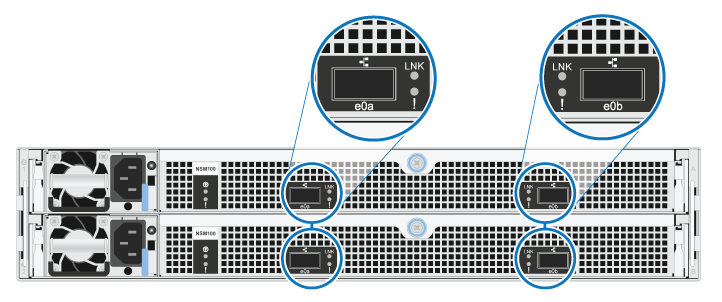

= Información general sobre el cableado para bandejas NS224 agregadas en caliente
:allow-uri-read: 
:icons: font
:imagesdir: ../media/

[role="lead"]
Conecte mediante cable cada bandeja NS224 que esté añadiendo en caliente de modo que cada bandeja tenga dos conexiones a cada controladora del par de alta disponibilidad.

En esta sección de cableado se describe cómo conectar la bandeja NS224 a los sistemas de almacenamiento siguientes:

* link:cable-aff-systems-hot-add-shelf.html["Conectar los sistemas AFF"]
* link:cable-asa-systems-hot-add-shelf.html["Conectar los sistemas ASA"]
* link:cable-eoa-systems-hot-add-shelf.html["Cable a los sistemas EOA"]

== Acerca de esta tarea

* Familiarícese con la orientación correcta del conector de cables, así como con la ubicación y el etiquetado de los puertos en los módulos de bandeja NS224 NSM100.
+
** Los cables se insertan con la lengüeta de extracción del conector hacia arriba.
+
Cuando se inserta correctamente un cable, éste hace clic en su lugar.

+
Después de conectar ambos extremos del cable, se encienden los LED LNK (verde) de la bandeja y el puerto de la controladora. Si un LED LNK de puerto no se ilumina, vuelva a colocar el cable.

+
image::../media/oie_cable_pull_tab_up.png[Los cables se insertan con la lengüeta del conector hacia arriba]

** Puede usar la siguiente ilustración para identificar físicamente los puertos NSM100, e0a y e0b de la bandeja.
+
Una bandeja NS224 contiene dos módulos NSM100. El módulo superior va en la ranura A (NSM A) y el módulo inferior va en la ranura B (NSM B).

+
Cada módulo de NSM100 incluye 2 puertos 100GbE QSFP28: e0a y e0b.

+

* Después de cablear una bandeja añadida en caliente, ONTAP reconoce la bandeja:
+
** La propiedad de la unidad se asigna si la asignación automática de unidad está habilitada.
** El firmware de la bandeja NSM y el de la unidad deben actualizarse automáticamente, si es necesario.
+

NOTE: Las actualizaciones de firmware pueden tardar hasta 30 minutos.

