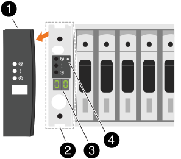

= Cambiar un ID de bandeja - bandejas NS224
:allow-uri-read: 
:icons: font
:imagesdir: ../media/

[role="lead"]
Se puede cambiar un ID de bandeja de un sistema cuando ONTAP aún no se está ejecutando o cuando se añade una bandeja en caliente antes de cablearla al sistema. También puede cambiar un ID de bandeja cuando ONTAP está activo y en ejecución (los módulos de controladora están disponibles para servir datos) y todas las unidades de la bandeja son propiedad, piezas de repuesto o parte de los agregados desconectados.

.Antes de empezar
* Si ONTAP está activo y en ejecución (los módulos de controladora están disponibles para servir datos), debe haber verificado que todas las unidades de la bandeja son propiedad, piezas de repuesto o parte de los agregados desconectados.
+
Es posible verificar el estado de las unidades mediante el `storage disk show -shelf _shelf_number_` comando. Salida en la `Container Type` la columna debe aparecer `spare` o. `broken` si es una unidad con error. Además, el `Container Name` y.. `Owner` las columnas deben tener un guión.

* Necesita un clip de papel con un bolígrafo enderezado o con punta estrecha.
+
Utilice el clip de papel o el bolígrafo para acceder al botón ID de la bandeja a través del orificio pequeño, a la derecha de los LED, en el panel de visualización del operador (ODP).

.Acerca de esta tarea
* Un ID de bandeja válido tiene un valor de 00 a 99.
* Los ID de bandeja deben ser únicos en cada par de alta disponibilidad.
* Debe apagar y encender una bandeja (desenchufe ambos cables de alimentación, espere la cantidad de tiempo adecuada y vuelva a enchufarlos) para que el ID de bandeja pueda aplicarse.
+
La cantidad de tiempo que espera antes de volver a enchufar los cables de alimentación depende del estado de ONTAP, como se describe más adelante en este procedimiento.

+

NOTE: Las bandejas NS224 no tienen interruptores de alimentación en las fuentes de alimentación.

.Pasos
. Encienda la bandeja si no está todavía encendida.
+
Conecte primero los cables de alimentación a la bandeja, fijándolos en su sitio con el retenedor del cable de alimentación y, a continuación, conecte los cables de alimentación a distintas fuentes de alimentación para obtener resistencia.

. Quite la tapa del extremo izquierdo para localizar el orificio pequeño a la derecha de los LED.
+

+
[cols="20%,80%"]
|===

 a| 
image::../media/icon_round_1.png[Número de llamada 1]
 a| 
Tapa final de estante

 a| 
image::../media/icon_round_2.png[[Número de referencia 2]
 a| 
Placa frontal de la bandeja

 a| 
image::../media/icon_round_3.png[[Número de referencia 3]
 a| 
Número de ID de la bandeja

 a| 
image::../media/icon_round_4.png[[Número de referencia 4]
 a| 
Botón de ID de bandeja

|===
. Cambie la primera cantidad de ID de bandeja:
+
.. Inserte el clip de papel o el bolígrafo en el orificio pequeño.
.. Mantenga presionado el botón hasta que el primer número de la pantalla digital parpadee y, a continuación, suelte el botón.
+
Este número puede tardar hasta 15 segundos en parpadear. De este modo se activa el modo de programación del identificador de bandeja.

+

NOTE: Si el ID tarda más de 15 segundos en parpadear, mantenga pulsado el botón de nuevo y asegúrese de pulsarlo completamente.

.. Pulse y suelte el botón para avanzar el número hasta alcanzar el número deseado de 0 a 9.
+
Cada duración de la prensa y la liberación puede ser de un segundo.

+
El primer número continúa parpadeando.

. Cambie el segundo número de ID de bandeja:
+
.. Mantenga presionado el botón hasta que el primer número de la pantalla digital parpadee.
+
Este número puede tardar hasta tres segundos en parpadear.

+
El primer número de la pantalla digital deja de parpadear.

.. Pulse y suelte el botón para avanzar el número hasta alcanzar el número deseado de 0 a 9.
+
El segundo número continúa parpadeando.

. Bloquee el número deseado y salga del modo de programación manteniendo pulsado el botón hasta que el segundo número deje de parpadear.
+
El número puede tardar hasta tres segundos en dejar de parpadear.

+
Ambos números de la pantalla digital comienzan a parpadear y el LED ámbar del ODP se ilumina después de unos cinco segundos, para avisarle de que el ID de bandeja pendiente aún no ha entrado en vigor.

. Apague y encienda la bandeja para que el ID de bandeja quede registrado.
+
Debe desconectar el cable de alimentación de ambas fuentes de alimentación de la bandeja, esperar la cantidad de tiempo adecuada y volver a conectarlo a las fuentes de alimentación de la bandeja para completar el ciclo de alimentación.

+
Una fuente de alimentación se enciende en cuanto el cable de alimentación está conectado. Su LED bicolor debería iluminarse en verde.

+
** Si ONTAP aún no está en ejecución o va a añadir una bandeja (que aún no se ha cableado al sistema), espere al menos 10 segundos.
** Si ONTAP se está ejecutando (las controladoras están disponibles para servir datos) y todas las unidades de la bandeja son propiedad de la bandeja, repuestos o parte de los agregados desconectados, espere al menos 70 segundos.
+
Esta vez, ONTAP puede eliminar correctamente la dirección de la bandeja antigua y actualizar la copia de la nueva dirección de la bandeja.

. Vuelva a colocar la tapa del extremo izquierdo.

