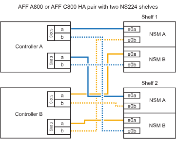

= Conecta un shelf NS224 a tu sistema ASA A800 o ASA C800
:allow-uri-read: 
:icons: font
:imagesdir: ../media/

[role="lead"]
Conecta tu estantería NS224 a tu sistema ASA A800 o ASA C800 para que cada estantería tenga dos conexiones a cada controlador del par de HA.

.Pasos
. Si va a añadir en caliente una bandeja con un conjunto de puertos compatibles con RoCE (una tarjeta PCIe compatible con RoCE) en cada controladora, y esta es la única bandeja NS224 de la pareja de alta disponibilidad, complete los siguientes pasos secundarios.
+
De lo contrario, vaya al paso siguiente.

+

NOTE: Este paso supone que se instaló la tarjeta PCIe compatible con roce en la ranura 5.

+
.. Conecte el puerto NSM de La bandeja de cables e0a al puerto a de la controladora A en la ranura 5 (e5a).
.. Conecte el cable del puerto NSM A e0b a la ranura de la controladora B, puerto b (e5b) de 5.
.. Conecte el puerto NSM B de la bandeja de cables e0a a la ranura de la controladora B, puerto a 5 (e5a).
.. Cable del puerto e0b NSM B a la ranura de la controladora A 5, puerto b (e5b).
+
En la siguiente ilustración, se muestra el cableado para una bandeja añadida en caliente usando una tarjeta PCIe compatible con RoCE en cada controladora:

+
image::../media/drw_ns224_a800_c800_1shelf_IEOPS-964.svg[Cableado para un AFF/ASA A800 o AFF/ASA C800 con una bandeja NS224 y una tarjeta PCIe]

. Si va a añadir en caliente una o dos bandejas mediante dos conjuntos de puertos compatibles con RoCE (dos tarjetas PCIe compatibles con RoCE) en cada controladora, complete los subpasos correspondientes.
+

NOTE: Este paso supone que instaló las tarjetas PCIe compatibles con roce en la ranura 5 y la ranura 3.

+
[cols="1,3"]
|===
| Bandejas | Cableado 

 a| 
Bandeja 1
 a| 

NOTE: Estos subpasos suponen que se está iniciando el cableado por el puerto de bandeja e0a a a a la tarjeta PCIe compatible con roce en la ranura 5, en lugar de la ranura 3.

.. Conecte El cable NSM de Un puerto e0a a al puerto a de la controladora A en la ranura 5 (e5a).
.. Conecte el cable NSM del puerto e0b 3 a la ranura de la controladora B del puerto b (e3b).
.. Conecte el cable del puerto NSM B e0a al puerto a de la ranura de la controladora B 5 (e5a).
.. Conecte el cable del puerto e0b NSM B al puerto b (e3b) de la controladora a y la ranura 3.
.. Si va a agregar un segundo estante en caliente, complete los pasos secundarios "Estante 2"; de lo contrario, vaya al siguiente paso.

 a| 
Estante 2
 a| 

NOTE: En estos subpasos se asume que está comenzando el cableado por el puerto de bandeja e0a a a la tarjeta PCIe compatible con roce en la ranura 3, en lugar de la ranura 5 (que se correlaciona con los subpasos de cableado de la bandeja 1).

.. Conecte El cable NSM de Un puerto e0a al puerto a de la ranura controladora A 3 (e3a).
.. Conecte el cable NSM del puerto e0b a la ranura de la controladora B 5 del puerto b (e5b).
.. Conecte el cable del puerto NSM B e0a al puerto a de la ranura de la controladora B de 3 puertos (e3a).
.. Conecte el cable del puerto e0b NSM B al puerto b (e5b) de la controladora A la ranura 5.
.. Vaya al paso siguiente.

|===
+
En la siguiente ilustración, se muestra el cableado de dos bandejas añadidas en caliente:

+

. Compruebe que la bandeja añadida en caliente se ha cableado correctamente https://mysupport.netapp.com/site/tools/tool-eula/activeiq-configadvisor["Active IQ Config Advisor"^]mediante .
+
Si se genera algún error de cableado, siga las acciones correctivas proporcionadas.

.El futuro
Si desactivaste la asignación automática de unidades como parte de la preparación para este procedimiento, necesitas asignar manualmente la propiedad de las unidades y luego volver a habilitar la asignación automática de unidades, si es necesario. Ve a link:hot-add-asa-complete.html["Complete el hot-add"].

De lo contrario, finalizó el procedimiento de bandeja con adición en caliente.
