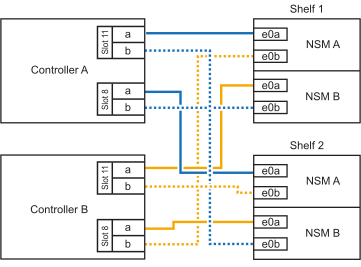

= Adición en caliente de una estantería - bandejas NS224
:allow-uri-read: 
:icons: font
:imagesdir: ../media/

[role="lead"]
Puede añadir en caliente una bandeja de unidades NS224 después de que su par de alta disponibilidad cumpla determinados requisitos y una vez completadas las tareas de preparación aplicables a su pareja de alta disponibilidad.

== Requisitos de una adición activa

Su par de alta disponibilidad debe cumplir determinados requisitos antes de añadir en caliente una bandeja de unidades NS224.

* El modelo y la versión de su plataforma de ONTAP deben ser compatibles con las bandejas NS224 y las unidades que se añaden en caliente.
+
https://hwu.netapp.com["Hardware Universe de NetApp"^]

* Debe tener el número y el tipo de cables correctos para conectar la bandeja.
+
https://hwu.netapp.com["Hardware Universe de NetApp"^]

* Su pareja de alta disponibilidad debe tener suficientes puertos Ethernet compatibles con RoCE para admitir el número de bandejas que añade en caliente.
+
Para cada bandeja que se añada en caliente, es necesario tener dos puertos compatibles con RoCE en cada controladora. Estos puertos pueden estar integrados en las controladoras, en tarjetas PCIe compatibles con roce, en una combinación de ambos o en módulos de I/o compatibles con roce, según lo admita el modelo de plataforma.

+
Si el par de alta disponibilidad no tiene suficientes puertos disponibles para roce y el modelo de plataforma admite el uso de tarjetas PCIe o módulos de I/o compatibles con roce, debe haber instalado las tarjetas adicionales o módulos de I/o en las ranuras de controladora correctas, como lo admite el modelo de plataforma.

+
** Identificar las ranuras de la controladora correctas para el modelo de plataforma.
+
https://hwu.netapp.com["Hardware Universe de NetApp"^]

** Consulte la documentación del modelo de su plataforma para obtener instrucciones de instalación de tarjetas PCIe o módulos de E/S.
+
https://docs.netapp.com/us-en/ontap-systems/index.html["Documentación de los sistemas de hardware de ONTAP"]

+
[NOTE]
====
Los puertos no dedicados compatibles con roce deben configurarse para uso del almacenamiento (no para uso de redes).

<<Prepare non-dedicated RoCE-capable ports for a hot-add>>

====

* Si tiene un par de alta disponibilidad A700 de AFF y está en caliente al añadir la bandeja de unidades inicial NS224 (no hay ninguna bandeja de unidades NS224 en su par de alta disponibilidad), debe haber instalado un módulo de volcado de núcleo (X9170A, SSD NVMe de 1 TB) en cada controladora para admitir volcados principales (almacenar archivos principales).
+
link:../fas9000/caching-module-and-core-dump-module-replace.html["Sustituya el módulo de almacenamiento en caché o añada/sustituya un módulo de volcado de memoria: A700 y FAS9000 de AFF"^]

* Su pareja de alta disponibilidad debe tener una cantidad inferior a la cantidad máxima de bandejas compatibles, al menos con la cantidad de bandejas que haya planificado añadir en caliente.
+
No puede haber superado el número máximo de bandejas compatibles con su pareja de alta disponibilidad después de añadir bandejas en activo.

+
https://hwu.netapp.com["Hardware Universe de NetApp"^]

* Si añade en caliente una bandeja a una pareja de alta disponibilidad que ya tiene una bandeja NS224, su par de alta disponibilidad no puede tener mensajes de error de cableado de almacenamiento y debe cablearse como alta disponibilidad multivía.
+
Puede ejecutar Active IQ Config Advisor para ver cualquier mensaje de error de cableado de almacenamiento y las acciones correctivas que debe tomar.

+
https://mysupport.netapp.com/site/tools/tool-eula/activeiq-configadvisor["Descargas de NetApp: Config Advisor"^]

* Necesita un clip de papel con un bolígrafo enderezado o con punta estrecha.
+
Para cambiar el ID de la bandeja, utilice el clip de papel o el bolígrafo para acceder al botón ID de la bandeja situado detrás del panel de visualización del operador (ODP).

== Consideraciones para una adición en caliente

Antes de añadir en caliente una bandeja de unidades NS224, debe familiarizarse con las prácticas recomendadas y los aspectos de este procedimiento.

* Si tiene un par de alta disponibilidad de ASA que admite bandejas NS224, puede utilizar este procedimiento.
* *Mejor práctica:* la mejor práctica es tener instalada la versión actual del paquete de cualificación de disco (DQP) antes de agregar en caliente una bandeja.
+
Si tiene instalada la versión actual del DQP, el sistema podrá reconocer y utilizar unidades recién cualificadas. Esto evita mensajes de eventos del sistema sobre la información no actualizada de la unidad y la prevención de la partición de unidades, ya que no se reconocen las unidades. El DQP también notifica el firmware de la unidad no actual.

+
https://mysupport.netapp.com/site/downloads/firmware/disk-drive-firmware/download/DISKQUAL/ALL/qual_devices.zip["Descargas de NetApp: Paquete de cualificación de disco"^]

* *Mejor práctica:* la mejor práctica es ejecutar Active IQ Config Advisor antes y después de añadir en caliente un estante.
+
Si se ejecuta Active IQ Config Advisor antes de añadir una bandeja en caliente, se obtiene un captura de snap de la conectividad Ethernet (ENET) de la bandeja existente, se comprueban las versiones de firmware del módulo de bandeja NVMe (NSM) y se puede verificar un ID de bandeja que ya se está usando en el par de alta disponibilidad. Si se ejecuta Active IQ Config Advisor después de añadir una bandeja en caliente, es posible verificar que las bandejas se hayan cableado correctamente y que los ID de bandeja sean únicos en el par de alta disponibilidad.

+
https://mysupport.netapp.com/site/tools/tool-eula/activeiq-configadvisor["Descargas de NetApp: Config Advisor"^]

* *Mejor práctica:* la práctica recomendada es tener versiones actuales del firmware del módulo de bandeja NVMe (NSM) y del firmware de unidades en el sistema antes de añadir una bandeja nueva.
+
https://mysupport.netapp.com/site/downloads/firmware/disk-shelf-firmware["Descargas de NetApp: Firmware de bandeja de discos"^]

+
https://mysupport.netapp.com/site/downloads/firmware/disk-drive-firmware["Descargas de NetApp: Firmware de la unidad de disco"^]

+

NOTE: No revierte el firmware a una versión que no admite la bandeja y sus componentes.

* Después de cablear una bandeja añadida en caliente, ONTAP reconoce la bandeja:
+
** La propiedad de la unidad se asigna si la asignación automática de unidad está habilitada.
** El firmware de la bandeja NSM y el de la unidad deben actualizarse automáticamente, si es necesario.
+

NOTE: Las actualizaciones de firmware pueden tardar hasta 30 minutos.

== Prepare una adición activa

Debe completar las tareas de preparación aplicables a su par de alta disponibilidad antes de añadir en caliente una bandeja de unidades NS224.

=== Prepare puertos Ethernet no dedicados compatibles con RoCE para una incorporación en caliente

Si la pareja de alta disponibilidad tiene puertos Ethernet no dedicados compatibles con RoCE que se utilizan para añadir en caliente una bandeja de unidades de NS224 TB, debe asegurarse de que los puertos estén configurados para el uso del almacenamiento (no se utiliza la conexión a redes).

.Antes de empezar
Debe haber cumplido los requisitos del sistema de almacenamiento, incluida la instalación de tarjetas PCIe adicionales de módulos de I/O compatibles con RoCE en cada controladora.

<<Requisitos de una adición activa>>

.Acerca de esta tarea
* En algunos modelos de plataforma, cuando se instala una tarjeta PCIe o un módulo I/o compatible con roce en una ranura compatible de una controladora, los puertos tienen la opción predeterminada automáticamente para el uso del almacenamiento (en lugar de las redes). Sin embargo, se recomienda completar este procedimiento para verificar que los puertos compatibles con roce se hayan configurado para el uso del almacenamiento.
* Si determina que los puertos no dedicados compatibles con roce de la pareja de alta disponibilidad no están configurados para su uso en el almacenamiento, se trata de un procedimiento no disruptivo para configurarlos.
+

NOTE: Si su par de alta disponibilidad está ejecutando una versión de ONTAP 9.6, debe reiniciar las controladoras, una a la vez.

+

NOTE: Si su pareja de alta disponibilidad ejecuta ONTAP 9.7 o una versión posterior, no necesita reiniciar las controladoras, a menos que una o ambas controladoras estén en modo de mantenimiento. En este procedimiento se asume que ninguna controladora está en modo de mantenimiento.

+

NOTE: Para cambiar los puertos de uso del almacenamiento a uso de redes, introduzca el comando, `storage port modify -node _node_name_ -port _port_name_ -mode network`.

.Pasos
. Inicie sesión en el clúster mediante SSH o el puerto de consola de serie.
. Compruebe si los puertos no dedicados del par de alta disponibilidad están configurados para el uso del almacenamiento: `storage port show`
+
Si su par de alta disponibilidad ejecuta ONTAP 9.8 o posterior, se muestran los puertos no dedicados `storage` en la `Mode` columna.

+
Si su par de alta disponibilidad ejecuta ONTAP 9.7 o 9.6, los puertos no dedicados se muestran `false` en la `Is Dedicated?` columna, también mostrar `enabled` en la `State` columna.

. Si los puertos no dedicados están configurados para el uso del almacenamiento, se realiza con este procedimiento.
+
De lo contrario, deberá configurar los puertos completando los pasos 4 a 7.

+
[NOTE]
====
Cuando los puertos no dedicados no están configurados para el uso del almacenamiento, el resultado del comando muestra lo siguiente:

Si su par de alta disponibilidad ejecuta ONTAP 9.8 o posterior, se muestran los puertos no dedicados `network` en la `Mode` columna.

Si su par de alta disponibilidad ejecuta ONTAP 9.7 o 9.6, los puertos no dedicados se muestran `false` en la `Is Dedicated?`` columna, también mostrar `disabled` en la `State` columna.

====
. Configure los puertos no dedicados para su uso del almacenamiento en uno de los módulos de la controladora:
+
Debe repetir el comando correspondiente para cada puerto que esté configurando.

+
[cols="1,3"]
|===
| Si su par de alta disponibilidad está ejecutando... | Realice lo siguiente... 

 a| 
ONTAP 9.8 o posterior
 a| 
`storage port modify -node _node_name_ -port _port_name_ -mode storage`

 a| 
ONTAP 9.7 o 9.6
 a| 
`storage port enable -node _node_name_ -port _port_name_`

|===
. Si su par de alta disponibilidad está ejecutando ONTAP 9,6, reinicie el módulo de controladora para que los cambios del puerto surtan efecto `system node reboot -node _node_name_ -reason _reason_for_the_reboot_`: .
+
De lo contrario, vaya al paso siguiente.

+

NOTE: El reinicio puede demorar hasta 15 minutos.

. Repita los pasos para el segundo módulo de controlador:
+
[cols="1,3"]
|===
| Si su par de alta disponibilidad está ejecutando... | Realice lo siguiente... 

 a| 
ONTAP 9.7 o posterior
 a| 
.. Repita el paso 4.
.. Vaya al paso 7.

 a| 
ONTAP 9.6
 a| 
.. Repita los pasos 4 y 5.
+

NOTE: La primera controladora ya debe haber completado el reinicio.

.. Vaya al paso 7.

|===
. Compruebe que los puertos no dedicados en ambos módulos de controladora están configurados para almacenamiento: `storage port show`
+
Puede introducir el comando en cualquier módulo de la controladora.

+
Si su par de alta disponibilidad ejecuta ONTAP 9.8 o posterior, se muestran los puertos no dedicados `storage` en la `Mode` columna.

+
Si su par de alta disponibilidad ejecuta ONTAP 9.7 o 9.6, los puertos no dedicados se muestran `false` en la `Is Dedicated?` columna, también mostrar `enabled` en la `State` columna.

=== Prepare la conectividad de bandejas existente antes de añadir bandejas adicionales en caliente

Antes de añadir bandejas adicionales en caliente, según el modelo de plataforma, es posible que deba volver a conectar los cables de una bandeja existente (después de haber instalado las tarjetas PCIe o módulos de I/O adicionales compatibles con RoCE) en dos conjuntos de puertos en ranuras diferentes para ofrecer resiliencia frente a fallo de ranura.

.Antes de empezar
* Debe haber cumplido los requisitos del sistema, incluida la instalación de tarjetas PCIe adicionales compatibles con RoCE o módulos de I/O en cada controladora.
+
<<Requisitos de una adición activa>>

* Debe haber verificado que los puertos no dedicados de las tarjetas PCIe compatibles con RoCE o los módulos de I/O instalados están configurados para uso del almacenamiento.
+
<<Prepare non-dedicated RoCE-capable ports for a hot-add>>

.Acerca de esta tarea
* La presentación de las conexiones de puertos es un procedimiento no disruptivo si su bandeja cuenta con conectividad de alta disponibilidad multivía.
* Es posible mover un cable cada vez para mantener siempre la conectividad con la bandeja durante este procedimiento.
+

NOTE: Mover un cable no requiere tiempo de espera entre desconectar el cable de un puerto y conectarlo a otro.

* Si cuenta con un par de alta disponibilidad AFF A1K y está agregando una tercera bandeja en caliente e instalando un tercer o cuarto módulo de I/O compatible con RoCE en cada controladora, la tercera bandeja solo se cableará a los tres o tres módulos de I/O en adelante. No es necesario volver a conectar ninguna bandeja existente.

.Pasos
. Vuelva a conectar las conexiones de la bandeja existente en dos conjuntos de puertos compatibles con RoCE en ranuras diferentes, según corresponda al modelo de plataforma.
+
[cols="1,3"]
|===
| Si dispone de una... | Realice lo siguiente... 

 a| 
Par de alta disponibilidad AFF A70 o AFF A90 y va a agregar en caliente una segunda bandeja
 a| 
Vuelva a conectar la primera bandeja de módulos I/O compatibles con RoCE:

NOTE: Los subpasos suponen que la bandeja existente se conecta mediante cable a un módulo de I/O compatible con RoCE en la ranura 11 de cada controladora.

.. En la controladora A, mueva el cable de la ranura 11, puerto b (e11b), a la ranura 8, puerto b (e8b).
.. Repita el mismo cable y mueva la controladora B.
+
[NOTE]
====
Si es necesario, puede consultar ilustraciones de cableado que muestran una bandeja única existente y la bandeja recabada, en una configuración de dos bandejas.

<<Conecte un cable de una bandeja de adición en caliente para un par de alta disponibilidad AFF A70 o AFF A90>>

====

 a| 
Par de alta disponibilidad A1K de AFF y están agregando en caliente una segunda bandeja
 a| 
Vuelva a conectar la primera bandeja de módulos I/O compatibles con RoCE:

NOTE: Los subpasos suponen que la bandeja existente se conecta mediante cable a un módulo de I/O compatible con RoCE en la ranura 11 de cada controladora.

.. En la controladora A, mueva el cable de la ranura 11, puerto b (e11b), a la ranura 10, puerto b (e10b).
.. Repita el mismo cable y mueva la controladora B.
+
[NOTE]
====
Si es necesario, puede consultar ilustraciones de cableado que muestran una bandeja única existente y la bandeja recabada, en una configuración de dos bandejas.

<<Conecte un cable de una bandeja de adición en caliente para un par de alta disponibilidad AFF A1K>>

====

 a| 
Par de alta disponibilidad A1K de AFF y está agregando en caliente una bandeja de cuatro bandejas
 a| 
Vuelva a conectar la tercera bandeja entre los módulos I/O con capacidad R0CE en la ranura 9 de cada controladora:

.. En la controladora A, mueva el cable de la ranura 9, puerto b (e9b), a la ranura 8, puerto b (e8b).
.. Repita el mismo cable y mueva la controladora B.
+
[NOTE]
====
Si es necesario, puede consultar ilustraciones de cableado que muestran una bandeja única existente y la bandeja recabada, en una configuración de dos bandejas.

<<Conecte un cable de una bandeja de adición en caliente para un par de alta disponibilidad AFF A1K>>

====

 a| 
Par de alta disponibilidad C400 de AFF y va a agregar una segunda bandeja en caliente
 a| 
Vuelva a conectar la primera bandeja entre ambos conjuntos de puertos compatibles con RoCE en cada controladora:

.. En el controlador A, mueva el cable de la ranura 4, puerto a (e4a), a la ranura 5, puerto b (e5b).
.. Repita el mismo cable y mueva la controladora B.
+
[NOTE]
====
Si es necesario, se pueden hacer referencia a las ilustraciones de cableado que muestran una única bandeja existente y la bandeja de doble bandeja.

<<Conecte un cable de una bandeja de adición en caliente para un par de alta disponibilidad AFF C400>>

====

 a| 
Par de alta disponibilidad AFF A800 o AFF C800 y va a agregar en caliente una segunda bandeja
 a| 
Vuelva a conectar la primera bandeja entre ambos conjuntos de puertos compatibles con RoCE en cada controladora:

NOTE: Los subpasos dan por sentado que la bandeja existente se cableó a tarjetas PCIe compatibles con roce en la ranura 5 de cada controladora.

.. En la controladora A, mueva el cable de la ranura 5, puerto b (e5b), a la ranura 3, puerto b (e3b).
.. Repita el mismo cable y mueva la controladora B.
+
[NOTE]
====
Si es necesario, se pueden hacer referencia a las ilustraciones de cableado que muestran una única bandeja existente y la bandeja de doble bandeja.

<<Conecte un cable de una bandeja de adición en caliente para un par de alta disponibilidad AFF A800 o AFF C800>>

====

 a| 
Par de alta disponibilidad A400 de AFF y va a agregar una segunda bandeja en caliente
 a| 
Vuelva a conectar la primera bandeja entre ambos conjuntos de puertos compatibles con RoCE en cada controladora:

.. En la controladora A, mueva el cable del puerto e0d a la ranura 5 puerto b (e5b).
.. Repita el mismo cable y mueva la controladora B.
+
[NOTE]
====
Si es necesario, se pueden hacer referencia a las ilustraciones de cableado que muestran una única bandeja existente y la bandeja de doble bandeja.

<<Conecte un cable de una bandeja de adición en caliente para un par de alta disponibilidad del A400 AFF>>

====

 a| 
Par de alta disponibilidad A700 de AFF y va a agregar una segunda bandeja en caliente
 a| 
Vuelva a conectar la primera bandeja entre ambos conjuntos de puertos compatibles con RoCE en cada controladora:

NOTE: Los subpasos dan por sentado que la bandeja existente se cableó a módulos de I/o compatibles con roce en la ranura 3 de cada controladora.

.. En la controladora A, mueva el cable de la ranura 3, puerto b (e3b), a la ranura 7, puerto b (e7b).
.. Repita el mismo cable y mueva la controladora B.
+
[NOTE]
====
Si es necesario, se pueden hacer referencia a las ilustraciones de cableado que muestran una única bandeja existente y la bandeja de doble bandeja.

<<Cablee una bandeja de adición en caliente para un par de alta disponibilidad A700 de AFF>>

====

|===
. Compruebe que la bandeja de dos bandejas se haya cableado correctamente.
+
Si se genera algún error de cableado, siga las acciones correctivas proporcionadas.

+
https://mysupport.netapp.com/site/tools/tool-eula/activeiq-configadvisor["Descargas de NetApp: Config Advisor"^]

=== Prepare la asignación manual de la propiedad de una unidad para una adición de activo

Si va a asignar manualmente la propiedad de una unidad para la bandeja de unidades NS224 que va a añadir en caliente, debe deshabilitar la asignación automática de unidades si está habilitada.

.Antes de empezar
Debe haber cumplido los requisitos del sistema.

<<Requisitos de una adición activa>>

.Acerca de esta tarea
Si no está seguro de si debe asignar manualmente propiedad de una unidad o desea comprender la asignación automática de las políticas de propiedad de unidades para el sistema de almacenamiento, consulte https://docs.netapp.com/us-en/ontap/disks-aggregates/disk-autoassignment-policy-concept.html["Acerca de la asignación automática de propiedad de disco"^]

.Pasos
. Compruebe si la asignación automática de unidades está habilitada: `storage disk option show`
+
Puede introducir el comando en cualquiera de los nodos.

+
Si la asignación automática de unidades está habilitada, el resultado se muestra `on` en `Auto Assign` la columna (en cada nodo).

. Si la asignación automática de unidades está habilitada, deshabilítela: `storage disk option modify -node _node_name_ -autoassign off`
+
Debe deshabilitar la asignación automática de unidades en ambos nodos.

== Instale una bandeja para una incorporación en caliente

La instalación de una bandeja NS224 nueva implica instalar la bandeja en un rack o armario, conectar los cables de alimentación (que enciende automáticamente la bandeja) y, a continuación, configurar el ID de bandeja.

.Antes de empezar
* Asegúrese de tener un clip de papel con un lado enderezado o un bolígrafo de punta estrecha.
+
Utilice el clip de papel o el bolígrafo para acceder al botón de ID de la bandeja situado detrás del panel de visualización del operador (ODP) durante el paso de ID de la bandeja de cambio.

.Pasos
. Instale el kit de montaje en raíl incluido con su bandeja mediante el folleto de instalación incluido en la caja del kit.
+

NOTE: No monte el estante con brida.

. Utilice el folleto de instalación para instalar y proteger la bandeja en los soportes de soporte, así como en el rack o armario.
+

NOTE: Un estante completamente cargado NS224 puede pesar hasta 30.29 kg (66.78 lbs) y requiere que dos personas levanten o usen un elevador hidráulico. Evite quitar los componentes de la bandeja (desde la parte delantera o trasera de la bandeja) para reducir el peso de la bandeja, ya que el peso de la bandeja se equilibrará.

. Conecte los cables de alimentación a la bandeja, fíjelos en su sitio con el retenedor del cable de alimentación si son fuentes de alimentación de CA o los dos tornillos de apriete manual si son fuentes de alimentación de CC y, a continuación, conecte los cables de alimentación a distintas fuentes de alimentación para obtener resistencia.
+
Una bandeja se enciende cuando está conectada a una fuente de alimentación; no tiene interruptores de alimentación. Cuando funciona correctamente, el LED bicolor de una fuente de alimentación se ilumina en verde.

. Establezca el ID de bandeja en un número único dentro de la pareja de alta disponibilidad:
+
Hay instrucciones más detalladas disponibles:

+
link:change-shelf-id.html["Cambiar un ID de bandeja - bandejas NS224"^]

+
.. Retire la tapa del extremo izquierdo y localice el orificio pequeño a la derecha de los LED.
.. Introduzca el extremo de un clip de papel o una herramienta similar en el orificio pequeño para llegar al botón de ID de la bandeja.
.. Mantenga pulsado el botón (hasta 15 segundos) hasta que el primer número de la pantalla digital parpadee y, a continuación, suelte el botón.
+

NOTE: Si el ID tarda más de 15 segundos en parpadear, mantenga pulsado el botón de nuevo y asegúrese de pulsarlo completamente.

.. Pulse y suelte el botón para avanzar el número hasta alcanzar el número deseado de 0 a 9.
.. Repita los subpasos 4c y 4d para establecer el segundo número del ID de la bandeja.
+
El número puede tardar hasta tres segundos (en lugar de 15 segundos) en parpadear.

.. Mantenga presionado el botón hasta que el segundo número deje de parpadear.
+
Después de unos cinco segundos, ambos números comienzan a parpadear y el LED ámbar del ODP se ilumina.

.. Apague y encienda la bandeja para que el ID de bandeja quede registrado.
+
Debe desconectar los dos cables de alimentación de la bandeja, esperar 10 segundos y, a continuación, volver a enchufarlos.

+
Cuando se restablece la alimentación a las fuentes de alimentación, sus LED bicolores se iluminan en verde.

== Conecte el cable de una bandeja a una incorporación en caliente

Conecte mediante cable cada bandeja NS224 que esté añadiendo en caliente de modo que cada bandeja tenga dos conexiones a cada controladora del par de alta disponibilidad.

=== Consideraciones a tener en cuenta cuando se realiza el cableado de un complemento activo

Familiarizarse con la orientación correcta de los conectores de cables y la ubicación y etiquetado de los puertos en los módulos de bandeja NSM de NS224 puede ser útil antes de cablear la bandeja añadida en caliente.

* Los cables se insertan con la lengüeta de extracción del conector hacia arriba.
+
Cuando se inserta correctamente un cable, éste hace clic en su lugar.

+
Después de conectar ambos extremos del cable, se encienden los LED LNK (verde) de la bandeja y el puerto de la controladora. Si un LED LNK de puerto no se ilumina, vuelva a colocar el cable.

+
image::../media/oie_cable_pull_tab_up.png[Conector de cable con lengüeta en la parte superior]

* Puede usar la siguiente ilustración para identificar físicamente los puertos NSM100, e0a y e0b de la bandeja.
+
Una bandeja NS224 contiene dos módulos NSM100. El módulo superior va en la ranura A (NSM A) y el módulo inferior va en la ranura B (NSM B).

+
Cada módulo de NSM100 incluye 2 puertos 100GbE QSFP28: e0a y e0b.

+
image::../media/drw_ns224_back_ports.png[NS224 NSM100 puertos del módulo e0a y e0b]

=== Conecte un cable de una bandeja de adición en caliente para un par de alta disponibilidad AFF A70 o AFF A90

Puede agregar en caliente hasta dos bandejas NS224 a un par de alta disponibilidad AFF A70 o AFF A90 cuando necesite almacenamiento adicional (a la bandeja interna).

.Antes de empezar
* Debe haber cumplido los requisitos del sistema de almacenamiento.

<<Requisitos de una adición activa>>

* Debe haber completado los procedimientos de preparación correspondientes.

<<Prepare una adición activa>>

* Debe haber instalado las bandejas, encendidas y configurado los ID de bandeja.

<<Instale una bandeja para una incorporación en caliente>>

.Acerca de esta tarea
* En este procedimiento se asume que su pareja de alta disponibilidad solo tiene almacenamiento interno (sin bandejas externas) y que se puede agregar en caliente hasta dos bandejas adicionales y dos módulos de I/O compatibles con RoCE en cada controladora.
* Este procedimiento aborda los siguientes escenarios de adición en caliente:
+
** Adición en caliente de la primera bandeja a una pareja de alta disponibilidad con un módulo I/O compatible con RoCE en cada controladora.
** Adición en caliente de la primera bandeja a una pareja de alta disponibilidad con dos módulos I/O compatibles con RoCE en cada controladora.
** Adición en caliente de la segunda bandeja a una pareja de alta disponibilidad con dos módulos I/O compatibles con RoCE en cada controladora.

.Pasos
. Si va a añadir en caliente una bandeja con un conjunto de puertos compatibles con RoCE (un módulo de I/O compatible con RoCE) en cada módulo de controladora, y esta es la única bandeja NS224 de la pareja de alta disponibilidad, complete los siguientes pasos secundarios.
+
De lo contrario, vaya al paso siguiente.

+

NOTE: En este paso se supone que se ha instalado el módulo de I/O compatible con RoCE en la ranura 11.

+
.. Conecte el cable de la bandeja NSM de Un puerto e0a a a la ranura de controladora A 11 puerto a (e11a).
.. Cable de la bandeja NSM Del puerto e0b a la ranura de la controladora B, puerto b (e11b) 11.
.. Conecte el puerto NSM B de la bandeja de cables e0a al puerto a de la ranura de la controladora B 11 (e11a).
.. Cable de la bandeja NSM B del puerto e0b a la ranura de la controladora A 11, puerto b (e11b).
+
En la siguiente ilustración, se muestra el cableado de una bandeja añadida en caliente mediante un módulo de I/o compatible con roce en cada módulo de la controladora:

+
image::../media/drw_ns224_vino_i_1shelf_1card_ieops-1639.svg[Cableado para AFF A70 o A90, con una bandeja y un módulo I/O.]

. Si va a añadir una o dos bandejas en caliente usando dos conjuntos de puertos compatibles con roce (dos módulos de I/o compatibles con roce) en cada módulo de la controladora, complete los subpasos aplicables.
+

NOTE: En este paso se supone que se han instalado los módulos I/O compatibles con RoCE en las ranuras 11 y 8.

+
[cols="1,3"]
|===
| Bandejas | Cableado 

 a| 
Bandeja 1
 a| 
.. Conecte El cable NSM de Un puerto e0a al puerto a de la ranura controladora A 11 (e11a).
.. Conecte el cable NSM del puerto e0b a la ranura de la controladora B 8 del puerto b (e8b).
.. Conecte el cable del puerto NSM B e0a al puerto a de la ranura de la controladora B de 11 puertos (e11a).
.. Conecte el cable del puerto e0b NSM B al puerto b (e8b) de la controladora A la ranura 8.
.. Si va a añadir una segunda estantería en caliente, complete los subpasos "Shelf 2"; en caso contrario, vaya al paso 3.

En la siguiente ilustración, se muestra el cableado para una bandeja añadida en caliente con dos módulos I/O compatibles con RoCE en cada módulo de controladora:

image::../media/drw_ns224_vino_i_1shelf_2cards_ieops-1640.svg[Cableado para AFF A70 o A90, con una bandeja y dos módulos IO]

 a| 
Estante 2
 a| 
.. Conecte El cable NSM de Un puerto e0a al puerto a de la ranura controladora A 8 (e8a).
.. Conecte el cable NSM del puerto e0b a la ranura de la controladora B 11 del puerto b (e11b).
.. Conecte el cable del puerto NSM B e0a al puerto a de la ranura de la controladora B de 8 puertos (e8a).
.. Conecte el cable del puerto e0b NSM B al puerto b (e11b) de la controladora A la ranura 11.
.. Vaya al paso 3.

En la siguiente ilustración, se muestra el cableado para dos bandejas añadidas en caliente mediante dos módulos I/O compatibles con RoCE en cada módulo de controladora:

|===
. Compruebe que la bandeja añadida en activo se haya cableado correctamente.
+
Si se genera algún error de cableado, siga las acciones correctivas proporcionadas.

+
https://mysupport.netapp.com/site/tools/tool-eula/activeiq-configadvisor["Descargas de NetApp: Config Advisor"^]

. Si se deshabilitó la asignación automática de unidades como parte de la preparación para este procedimiento, debe asignar manualmente la propiedad de la unidad y, después, volver a habilitar la asignación automática de unidades, si es necesario.
+
De lo contrario, ha finalizado este procedimiento.

+
<<Complete el hot-add>>

=== Conecte un cable de una bandeja de adición en caliente para un par de alta disponibilidad AFF A1K

Puede agregar en caliente hasta tres bandejas NS224 adicionales (para un total de cuatro bandejas) en una pareja de alta disponibilidad AFF A1K.

.Antes de empezar
* Debe haber cumplido los requisitos del sistema de almacenamiento.

<<Requisitos de una adición activa>>

* Debe haber completado los procedimientos de preparación correspondientes.

<<Prepare una adición activa>>

* Debe haber instalado las bandejas, encendidas y configurado los ID de bandeja.

<<Instale una bandeja para una incorporación en caliente>>

.Acerca de esta tarea
* En este procedimiento se asume que el par de alta disponibilidad tiene al menos una bandeja NS224 existente.
* Este procedimiento aborda los siguientes escenarios de adición en caliente:
+
** Adición en caliente de una segunda bandeja a una pareja de alta disponibilidad con dos módulos I/O compatibles con RoCE en cada controladora. (Instaló un segundo módulo de I/O y volvió a buscar la primera bandeja a ambos módulos de I/O o ya tenía la primera bandeja cableada a dos módulos de I/O. Conectará la segunda bandeja mediante cable a módulos de I/O).
** Adición en caliente de una tercera bandeja a una pareja de alta disponibilidad con tres módulos I/O compatibles con RoCE en cada controladora. (Ha instalado un tercer módulo de I/O y conectará la tercera bandeja únicamente al tercer módulo de I/O).
** Adición en caliente de una tercera bandeja a una pareja de alta disponibilidad con cuatro módulos de I/O compatibles con RoCE en cada controladora. (Ha instalado un tercer y cuarto módulo de E/S y conectará la tercera bandeja al tercer y cuarto módulo I/O).
** Adición en caliente de una cuarta bandeja a una pareja de alta disponibilidad con cuatro módulos I/O compatibles con RoCE en cada controladora. (Ha instalado un cuarto módulo de I/O y ha vuelto a buscar la tercera bandeja a los módulos de I/O del tercer y cuarto, o bien ya se ha cableado la tercera bandeja al tercer y cuarto módulo I/O. Conectará mediante cable la cuarta bandeja al tercer y cuarto módulo I/O.

.Pasos
. Si la bandeja NS224 que está agregando en caliente será la segunda bandeja NS224 del par de alta disponibilidad, complete los siguientes subpasos.
+
De lo contrario, vaya al paso siguiente.

+
.. Bandeja de cables NSM de un puerto e0a a a la ranura de controladora A 10 puertos a (e10a).
.. Cable de la bandeja NSM Del puerto e0b a la ranura de la controladora B, puerto b (e11b) 11.
.. Puerto e0a de la bandeja de cables NSM B a la ranura de la controladora B, puerto a 10 (e10a).
.. Cable de la bandeja NSM B del puerto e0b a la ranura de la controladora A 11, puerto b (e11b).
+
En la siguiente ilustración, se destaca el cableado de la segunda bandeja de la pareja de alta disponibilidad con dos módulos I/O compatibles con RoCE en cada controladora:

+
image::../media/drw_ns224_vino_m_2shelves_2cards_ieops-1642.svg[Cableado para AFF A1K con dos bandejas y dos módulos I/O.]

. Si la bandeja NS224 que desea añadir en caliente será la tercera bandeja NS224 del par de alta disponibilidad con tres módulos de I/O compatibles con RoCE en cada controladora, complete los siguientes pasos secundarios. De lo contrario, vaya al paso siguiente.
+
.. Conecte el puerto NSM de La bandeja de cables e0a al puerto a de la controladora A en la ranura 9 (e9a).
.. Conecte el cable del puerto NSM A e0b a la ranura de la controladora B, puerto b (e9b) de 9.
.. Conecte el puerto NSM B de la bandeja de cables e0a a la ranura de la controladora B, puerto a 9 (e9a).
.. Cable del puerto e0b NSM B a la ranura de la controladora A 9, puerto b (e9b).
+
En la siguiente ilustración se destaca el cableado de la tercera bandeja de la pareja de alta disponibilidad con tres módulos I/O compatibles con RoCE en cada controladora:

+
image::../media/drw_ns224_vino_m_3shelves_3cards_ieops-1643.svg[Cableado para AFF A1K con tres bandejas y tres módulos de I/O.]

. Si la bandeja NS224 que desea añadir en caliente será la tercera bandeja NS224 del par de alta disponibilidad con cuatro módulos de I/O compatibles con RoCE en cada controladora, complete los siguientes pasos secundarios. De lo contrario, vaya al paso siguiente.
+
.. Conecte el puerto NSM de La bandeja de cables e0a al puerto a de la controladora A en la ranura 9 (e9a).
.. Conecte el cable del puerto NSM A e0b a la ranura de la controladora B, puerto b (e8b) de 8.
.. Conecte el puerto NSM B de la bandeja de cables e0a a la ranura de la controladora B, puerto a 9 (e9a).
.. Cable del puerto e0b NSM B a la ranura de la controladora A 8, puerto b (e8b).
+
En la siguiente ilustración se destaca el cableado de la tercera bandeja de la pareja de alta disponibilidad con cuatro módulos I/O compatibles con RoCE en cada controladora:

+
image::../media/drw_ns224_vino_m_3shelves_4cards_ieops-1644.svg[Cableado para AFF A1K con tres bandejas y cuatro módulos de I/O.]

. Si la bandeja NS224 que desea añadir en caliente será la cuarta bandeja NS224 de la pareja de alta disponibilidad con cuatro módulos de I/O compatibles con RoCE en cada controladora, complete los siguientes pasos secundarios.
+
.. Conecte el puerto NSM de La bandeja de cables e0a al puerto a de la controladora A en la ranura 8 (e8a).
.. Conecte el cable del puerto NSM A e0b a la ranura de la controladora B, puerto b (e9b) de 9.
.. Conecte el puerto NSM B de la bandeja de cables e0a a la ranura de la controladora B, puerto a 8 (e8a).
.. Cable del puerto e0b NSM B a la ranura de la controladora A 9, puerto b (e9b).
+
En la siguiente ilustración se destaca el cableado de la cuarta bandeja de la pareja de alta disponibilidad con cuatro módulos I/O compatibles con RoCE en cada controladora:

+
image::../media/drw_ns224_vino_m_4shelves_4cards_ieops-1645.svg[Cableado para AFF A1K con cuatro bandejas y cuatro módulos de I/O.]

. Compruebe que la bandeja añadida en activo se haya cableado correctamente.
+
Si se genera algún error de cableado, siga las acciones correctivas proporcionadas.

+
https://mysupport.netapp.com/site/tools/tool-eula/activeiq-configadvisor["Descargas de NetApp: Config Advisor"^]

. Si se deshabilitó la asignación automática de unidades como parte de la preparación para este procedimiento, debe asignar manualmente la propiedad de la unidad y, después, volver a habilitar la asignación automática de unidades, si es necesario.
+
De lo contrario, ha finalizado este procedimiento.

+
<<Complete el hot-add>>

=== Conecte un cable de una bandeja de adición en caliente para un par de alta disponibilidad AFF A900

Cuando se necesita almacenamiento adicional, puede añadir hasta tres bandejas de unidades NS224 adicionales (con un total de cuatro bandejas) a un par de alta disponibilidad A900 de AFF.

.Antes de empezar
* Debe haber cumplido los requisitos del sistema.
+
<<Requisitos de una adición activa>>

* Debe haber completado los procedimientos de preparación correspondientes.
+
<<Prepare una adición activa>>

* Debe haber instalado las bandejas, encendidas y configurado los ID de bandeja.
+
<<Install a drive shelf for a hot-add>>

.Acerca de esta tarea
* En este procedimiento se asume que su par de alta disponibilidad tiene al menos una bandeja NS224 existente y que va a añadir hasta tres bandejas adicionales en caliente.
* Si su par de alta disponibilidad tiene solo una bandeja NS224 existente, en este procedimiento se asume que la bandeja se cableó en dos módulos I/o de 100 GbE compatibles con roce de cada controladora.

.Pasos
. Si la bandeja NS224 que está agregando en caliente será la segunda bandeja NS224 del par de alta disponibilidad, complete los siguientes subpasos.
+
De lo contrario, vaya al paso siguiente.

+
.. Bandeja de cables NSM de un puerto e0a a a la ranura de controladora A 10 puertos a (e10a).
.. Cable de la bandeja NSM Del puerto e0b a al puerto b de la ranura 2 de la controladora B (e2b).
.. Puerto e0a de la bandeja de cables NSM B a la ranura de la controladora B, puerto a 10 (e10a).
.. Cable del puerto e0b NSM B a la ranura 2 de la controladora a, puerto b (e2b).

+
En la siguiente ilustración, se muestra el cableado de la segunda bandeja (y la primera bandeja).

+
image::../media/drw_ns224_a900_2shelves.png[drw ns224 a900 2 estantes]

. Si la bandeja NS224 que está agregando en caliente será la tercera bandeja NS224 del par de alta disponibilidad, complete los siguientes subpasos.
+
De lo contrario, vaya al paso siguiente.

+
.. Conecte El puerto NSM de La bandeja de cables e0a al puerto a de la ranura 1 de la controladora (e1a).
.. Cable de la bandeja NSM Del puerto e0b a la ranura de la controladora B, puerto b (e11b) 11.
.. Conecte el puerto NSM B de la bandeja de cables e0a al puerto a de la ranura de la controladora B (e1a).
.. Cable de la bandeja NSM B del puerto e0b a la ranura de la controladora A 11, puerto b (e11b).
+
En la siguiente ilustración, se muestra el cableado de la tercera bandeja.

+
image::../media/drw_ns224_a900_3shelves.png[drw ns224 a900 3 estantes]

. Si la bandeja NS224 que está agregando en caliente será la cuarta bandeja NS224 del par de alta disponibilidad, complete los siguientes subpasos.
+
De lo contrario, vaya al paso siguiente.

+
.. Conecte el cable de la bandeja NSM de Un puerto e0a a a la ranura de controladora A 11 puerto a (e11a).
.. Conecte el cable del puerto NSM A e0b a la ranura de la controladora B del puerto b (e1b).
.. Conecte el puerto NSM B de la bandeja de cables e0a al puerto a de la ranura de la controladora B 11 (e11a).
.. Conecte el puerto e0b NSM B de la bandeja a la controladora, puerto b (e1b) de la ranura 1.
+
En la siguiente ilustración, se muestra el cableado de la cuarta bandeja.

+
image::../media/drw_ns224_a900_4shelves.png[drw ns224 a900 4estantes]

. Compruebe que la bandeja añadida en activo se haya cableado correctamente.
+
Si se genera algún error de cableado, siga las acciones correctivas proporcionadas.

+
https://mysupport.netapp.com/site/tools/tool-eula/activeiq-configadvisor["Descargas de NetApp: Config Advisor"]

. Si se deshabilitó la asignación automática de unidades como parte de la preparación para este procedimiento, debe asignar manualmente la propiedad de la unidad y, después, volver a habilitar la asignación automática de unidades, si es necesario.
+
De lo contrario, ha finalizado este procedimiento.

+
<<Complete el hot-add>>

=== Conecte un cable de una bandeja de adición en caliente para un par de alta disponibilidad AFF A250, AFF C250 o FAS500f

Cuando se necesite almacenamiento adicional, puede añadir en caliente una bandeja de unidades NS224 a un par de alta disponibilidad FAS500f o AFF A250.

.Antes de empezar
* Debe haber cumplido los requisitos del sistema.
+
<<Requisitos de una adición activa>>

* Debe haber completado los procedimientos de preparación correspondientes.
+
<<Prepare una adición activa>>

* Debe haber instalado las bandejas, encendidas y configurado los ID de bandeja.
+
<<Install a drive shelf for a hot-add>>

.Acerca de esta tarea
Una vez visto desde la parte posterior del chasis de la plataforma, el puerto para tarjetas compatible con roce de la izquierda es el puerto "a" (e1a) y el puerto de la derecha es el puerto "b" (e1b).

.Pasos
. Conecte los cables de las conexiones de la bandeja:
+
.. Conecte El puerto NSM de La bandeja de cables e0a al puerto a de la ranura 1 de la controladora (e1a).
.. Conecte el cable del puerto NSM A e0b a la ranura de la controladora B del puerto b (e1b).
.. Conecte el puerto NSM B de la bandeja de cables e0a al puerto a de la ranura de la controladora B (e1a).
.. Conecte el puerto e0b NSM B de la bandeja a la controladora, puerto b (e1b) de la ranura 1. + la siguiente ilustración muestra el cableado de las bandejas cuando se completa.
+
image::../media/drw_ns224_a250_c250_f500f_1shelf_IEOPS-963.svg[drw ns224 a250 c250 f500f 1 estante IEPOPS 963]

. Compruebe que la bandeja añadida en activo se haya cableado correctamente.
+
Si se genera algún error de cableado, siga las acciones correctivas proporcionadas.

+
https://mysupport.netapp.com/site/tools/tool-eula/activeiq-configadvisor["Descargas de NetApp: Config Advisor"^]

. Si se deshabilitó la asignación automática de unidades como parte de la preparación para este procedimiento, debe asignar manualmente la propiedad de la unidad y, después, volver a habilitar la asignación automática de unidades, si es necesario.
+
De lo contrario, ha finalizado este procedimiento.

+
<<Complete el hot-add>>

=== Cablee una bandeja de adición en caliente para un par de alta disponibilidad A700 de AFF

La forma en que se conecte la conexión de una bandeja de unidades NS224 en un par de alta disponibilidad A700 de AFF depende del número de bandejas que se añadan en caliente y del número de conjuntos de puertos compatibles con roce (uno o dos) que utilice en los módulos de la controladora.

.Antes de empezar
* Debe haber cumplido los requisitos del sistema.
+
<<Requisitos de una adición activa>>

* Debe haber completado los procedimientos de preparación correspondientes.
+
<<Prepare una adición activa>>

* Debe haber instalado las bandejas, encendidas y configurado los ID de bandeja.
+
<<Install a drive shelf for a hot-add>>

.Pasos
. Si va a añadir una bandeja en caliente que utiliza un conjunto de puertos compatibles con roce (un módulo de I/o compatible con roce) en cada módulo de controladora, y esta es la única bandeja NS224 del par de alta disponibilidad, complete los siguientes subpasos.
+
De lo contrario, vaya al paso siguiente.

+

NOTE: Este paso supone que instaló el módulo de I/o compatible con roce en la ranura 3, en lugar de la ranura 7, en cada módulo de la controladora.

+
.. Conecte El cable de la bandeja NSM de Un puerto e0a a a la controladora de una ranura 3 puerto a.
.. Cable de la bandeja NSM De un puerto e0b a la ranura de la controladora B 3, puerto b.
.. Conecte el puerto NSM B del puerto e0a al puerto de la ranura de la controladora B 3 a.
.. Cable de la bandeja NSM B del puerto e0b a la controladora a, ranura 3, puerto b.
+
En la siguiente ilustración, se muestra el cableado de una bandeja añadida en caliente mediante un módulo de I/o compatible con roce en cada módulo de la controladora:

+
image::../media/drw_ns224_a700_1shelf.png[Cableado de un par de alta disponibilidad a una bandeja de unidades única]

. Si va a añadir una o dos bandejas en caliente usando dos conjuntos de puertos compatibles con roce (dos módulos de I/o compatibles con roce) en cada módulo de la controladora, complete los subpasos aplicables.
+
[cols="1,3"]
|===
| Bandejas | Cableado 

 a| 
Bandeja 1
 a| 

NOTE: Estos subpasos suponen que se está comenzando el cableado por el cableado del puerto de la bandeja e0a al módulo de I/o compatible con roce en la ranura 3, en lugar de la ranura 7.

.. Conecte El cable NSM de Un puerto e0a al 3 puerto a. de La ranura A de la controladora
.. Conecte el cable NSM de un puerto e0b a la ranura de la controladora B 7, puerto b.
.. Conecte el cable del puerto NSM B e0a al puerto de la ranura de la controladora B 3 a.
.. Conecte el puerto e0b NSM B al puerto e0b de la controladora A la ranura 7, puerto b.
.. Si va a añadir una segunda estantería en caliente, complete los subpasos "Shelf 2"; en caso contrario, vaya al paso 3.

 a| 
Estante 2
 a| 

NOTE: Estos subpasos suponen que se está comenzando el cableado por el cableado del puerto de la bandeja e0a al módulo I/o compatible con roce en la ranura 7, en lugar de la ranura 3 (que se correlaciona con los subpasos de cableado de la bandeja 1).

.. Conecte El cable NSM de Un puerto e0a al 7 puerto a. de La ranura A de la controladora
.. Conecte el cable NSM de un puerto e0b a la ranura de la controladora B 3, puerto b.
.. Conecte el cable del puerto NSM B e0a al puerto de la ranura de la controladora B 7 a.
.. Conecte el puerto e0b NSM B al puerto e0b de la controladora A la ranura 3, puerto b.
.. Vaya al paso 3.

|===
+
En la siguiente ilustración, se muestra el cableado de la primera y segunda bandejas añadidas en caliente:

+
image::../media/drw_ns224_a700_2shelves.png[Cableado de una pareja de alta disponibilidad a dos bandejas de unidades]

. Compruebe que la bandeja añadida en activo se haya cableado correctamente.
+
Si se genera algún error de cableado, siga las acciones correctivas proporcionadas.

+
https://mysupport.netapp.com/site/tools/tool-eula/activeiq-configadvisor["Descargas de NetApp: Config Advisor"^]

. Si se deshabilitó la asignación automática de unidades como parte de la preparación para este procedimiento, debe asignar manualmente la propiedad de la unidad y, después, volver a habilitar la asignación automática de unidades, si es necesario.
+
De lo contrario, ha finalizado este procedimiento.

+
<<Complete el hot-add>>

=== Conecte un cable de una bandeja de adición en caliente para un par de alta disponibilidad AFF A800 o AFF C800

La forma en que se conecte la conexión de una bandeja de unidades NS224 en un par de alta disponibilidad AFF A800 o AFF C800 depende del número de bandejas que se añadan en caliente y del número de conjuntos de puertos compatibles con roce (uno o dos) que utilice en los módulos de la controladora.

.Antes de empezar
* Debe haber cumplido los requisitos del sistema.
+
<<Requisitos de una adición activa>>

* Debe haber completado los procedimientos de preparación correspondientes.
+
<<Prepare una adición activa>>

* Debe haber instalado las bandejas, encendidas y configurado los ID de bandeja.
+
<<Install a drive shelf for a hot-add>>

.Pasos
. Si va a añadir una bandeja en caliente que utiliza un conjunto de puertos compatibles con roce (una tarjeta PCIe compatible con roce) en cada módulo de controladora, y esta es la única bandeja NS224 del par de alta disponibilidad, complete los siguientes subpasos.
+
De lo contrario, vaya al paso siguiente.

+

NOTE: Este paso supone que se instaló la tarjeta PCIe compatible con roce en la ranura 5.

+
.. Conecte el puerto NSM de La bandeja de cables e0a al puerto a de la controladora A en la ranura 5 (e5a).
.. Conecte el cable del puerto NSM A e0b a la ranura de la controladora B, puerto b (e5b) de 5.
.. Conecte el puerto NSM B de la bandeja de cables e0a a la ranura de la controladora B, puerto a 5 (e5a).
.. Cable del puerto e0b NSM B a la ranura de la controladora A 5, puerto b (e5b).
+
En la siguiente ilustración, se muestra el cableado de una bandeja añadida en caliente mediante una tarjeta PCIe compatible con roce en cada módulo de controladora:

+
image::../media/drw_ns224_a800_c800_1shelf_IEOPS-964.svg[drw ns224 a800 c800 1 bandeja IEOPS 964]

. Si va a añadir una o dos bandejas en caliente usando dos conjuntos de puertos compatibles con roce (dos tarjetas PCIe compatibles con roce) en cada módulo de controladora, complete los subpasos aplicables.
+

NOTE: Este paso supone que instaló las tarjetas PCIe compatibles con roce en la ranura 5 y la ranura 3.

+
[cols="1,3"]
|===
| Bandejas | Cableado 

 a| 
Bandeja 1
 a| 

NOTE: Estos subpasos suponen que se está iniciando el cableado por el puerto de bandeja e0a a a a la tarjeta PCIe compatible con roce en la ranura 5, en lugar de la ranura 3.

.. Conecte El cable NSM de Un puerto e0a a al puerto a de la controladora A en la ranura 5 (e5a).
.. Conecte el cable NSM del puerto e0b 3 a la ranura de la controladora B del puerto b (e3b).
.. Conecte el cable del puerto NSM B e0a al puerto a de la ranura de la controladora B 5 (e5a).
.. Conecte el cable del puerto e0b NSM B al puerto b (e3b) de la controladora a y la ranura 3.
.. Si va a añadir una segunda estantería en caliente, complete los subpasos "Shelf 2"; en caso contrario, vaya al paso 3.

 a| 
Estante 2
 a| 

NOTE: En estos subpasos se asume que está comenzando el cableado por el puerto de bandeja e0a a a la tarjeta PCIe compatible con roce en la ranura 3, en lugar de la ranura 5 (que se correlaciona con los subpasos de cableado de la bandeja 1).

.. Conecte El cable NSM de Un puerto e0a al puerto a de la ranura controladora A 3 (e3a).
.. Conecte el cable NSM del puerto e0b a la ranura de la controladora B 5 del puerto b (e5b).
.. Conecte el cable del puerto NSM B e0a al puerto a de la ranura de la controladora B de 3 puertos (e3a).
.. Conecte el cable del puerto e0b NSM B al puerto b (e5b) de la controladora A la ranura 5.
.. Vaya al paso 3.

|===
+
En la siguiente ilustración, se muestra el cableado de dos bandejas añadidas en caliente:

+
image::../media/drw_ns224_a800_c800_2shelves_IEOPS-966.svg[drw ns224 a800 c800 2 bandejas IEOPS 966]

. Compruebe que la bandeja añadida en activo se haya cableado correctamente.
+
Si se genera algún error de cableado, siga las acciones correctivas proporcionadas.

+
https://mysupport.netapp.com/site/tools/tool-eula/activeiq-configadvisor["Descargas de NetApp: Config Advisor"^]

. Si se deshabilitó la asignación automática de unidades como parte de la preparación para este procedimiento, debe asignar manualmente la propiedad de la unidad y, después, volver a habilitar la asignación automática de unidades, si es necesario.
+
De lo contrario, ha finalizado este procedimiento.

+
<<Complete el hot-add>>

=== Conecte un cable de una bandeja de adición en caliente para un par de alta disponibilidad del A400 AFF

La forma en que se conecte la conexión de una bandeja de unidades NS224 en un par de alta disponibilidad de AFF A400 depende del número de bandejas que se añaden en caliente y la cantidad de conjuntos de puertos compatibles con roce (uno o dos) que se utilizan en los módulos de la controladora.

.Antes de empezar
* Debe haber cumplido los requisitos del sistema.
+
<<Requisitos de una adición activa>>

* Debe haber completado los procedimientos de preparación correspondientes.
+
<<Prepare una adición activa>>

* Debe haber instalado las bandejas, encendidas y configurado los ID de bandeja.
+
<<Install a drive shelf for a hot-add>>

.Pasos
. Si va a añadir una bandeja en caliente que utiliza un conjunto de puertos compatibles con roce (puertos internos compatibles con roce) en cada módulo de controladora, y esta es la única bandeja NS224 del par de alta disponibilidad, complete los siguientes subpasos.
+
De lo contrario, vaya al paso siguiente.

+
.. Conecte el cable de la bandeja NSM De Un puerto e0a al puerto e0c de la controladora A.
.. Cable de la bandeja NSM Del puerto e0b al puerto e0d de la controladora B.
.. Cable del puerto NSM B e0a al puerto e0c de la controladora B.
.. Conecte el cable del puerto e0b NSM B al puerto e0d de la controladora A.
+
En la siguiente ilustración, se muestra el cableado de una bandeja añadida en caliente mediante un conjunto de puertos compatibles con roce en cada módulo de controladora:

+
image::../media/drw_ns224_a400_1shelf.png[drw ns224 a400 1 estante]

. Si va a añadir una o dos bandejas que utilizan dos conjuntos de puertos compatibles con roce (puertos incorporados y compatibles con roce para tarjeta PCIe) en cada módulo de la controladora, complete los siguientes pasos.
+
[cols="1,3"]
|===
| Bandejas | Cableado 

 a| 
Bandeja 1
 a| 
.. Conecte El cable NSM de Un puerto e0a al puerto e0c de la controladora A.
.. Conecte el cable del puerto a e0b a la ranura 2 de la controladora B 5 (e5b).
.. Conecte el cable del puerto NSM B e0a al puerto e0c de la controladora B.
.. Conecte el cable del puerto e0b NSM B al puerto 2 de la ranura 5 de la controladora A (e5b).
.. Si va a añadir una segunda estantería en caliente, complete los subpasos "Shelf 2"; en caso contrario, vaya al paso 3.

 a| 
Estante 2
 a| 
.. Conecte El cable NSM de Un puerto e0a al puerto 1 de la ranura 5 De la controladora A (e5a).
.. Conecte el cable NSM del puerto e0b al puerto e0d de la controladora B.
.. Conecte el cable del puerto NSM B e0a al puerto 1 de la ranura de la controladora B 5 (e5a).
.. Conecte el cable del puerto e0b NSM B al puerto e0d de la controladora A.
.. Vaya al paso 3.

|===
+
En la siguiente ilustración, se muestra el cableado de dos bandejas añadidas en caliente:

+
image::../media/drw_ns224_a400_2shelves_IEOPS-983.svg[drw ns224 a400 2 bandejas IEPOPS 983]

. Compruebe que la bandeja añadida en activo se haya cableado correctamente.
+
Si se genera algún error de cableado, siga las acciones correctivas proporcionadas.

+
https://mysupport.netapp.com/site/tools/tool-eula/activeiq-configadvisor["Descargas de NetApp: Config Advisor"^]

. Si se deshabilitó la asignación automática de unidades como parte de la preparación para este procedimiento, debe asignar manualmente la propiedad de la unidad y volver a habilitar la asignación automática de unidades, si es necesario.
+
De lo contrario, ha finalizado este procedimiento.

+
<<Complete el hot-add>>

=== Conecte un cable de una bandeja de adición en caliente para un par de alta disponibilidad AFF C400

La forma en que se conecte la conexión de una bandeja de unidades NS224 en un par de alta disponibilidad AFF C400 depende del número de bandejas que se añadan en caliente y del número de conjuntos de puertos compatibles con roce (uno o dos) que utilice en los módulos de la controladora.

.Antes de empezar
* Debe haber cumplido los requisitos del sistema.
+
<<Requisitos de una adición activa>>

* Debe haber completado los procedimientos de preparación correspondientes.
+
<<Prepare una adición activa>>

* Debe haber instalado las bandejas, encendidas y configurado los ID de bandeja.
+
<<Install a drive shelf for a hot-add>>

.Pasos
. Si va a añadir una bandeja en caliente que utiliza un conjunto de puertos compatibles con roce en cada módulo de controladora, y esta es la única bandeja NS224 del par de alta disponibilidad, complete los siguientes subpasos.
+
De lo contrario, vaya al paso siguiente.

+
.. Bandeja de cables NSM de un puerto e0a a a la ranura de la controladora A 4, puerto 1 (e4a).
.. Cable de la bandeja NSM Del puerto e0b a a la ranura de la controladora B, puerto 4 (e4b).
.. Puerto NSM B de la bandeja de cables e0a a a la ranura del controlador B, puerto 4 (e4a).
.. Cable de la bandeja NSM B del puerto e0b a la ranura de la controladora A 4, puerto 2 (e4b).
+
En la siguiente ilustración, se muestra el cableado de una bandeja añadida en caliente mediante un conjunto de puertos compatibles con roce en cada módulo de controladora:

+
image::../media/drw_ns224_c400_1shelf_IEOPS-985.svg[drw ns224 c400 1 estante IEOPS 985]

. Si va a añadir una o dos bandejas en caliente utilizando dos conjuntos de puertos compatibles con roce en cada módulo de controladora, siga estos pasos.
+
[cols="1,3"]
|===
| Bandejas | Cableado 

 a| 
Bandeja 1
 a| 
.. Conecte el cable NSM del puerto e0a al puerto 1 de la ranura 4 Del controlador A (e4a).
.. Conecte el cable del puerto a e0b a la ranura 2 de la controladora B 5 (e5b).
.. Conecte el cable del puerto NSM B e0a al puerto de la controladora B, puerto 4 1 (e4a).
.. Conecte el cable del puerto e0b NSM B al puerto 2 de la ranura 5 de la controladora A (e5b).
.. Si va a añadir una segunda estantería en caliente, complete los subpasos "Shelf 2"; en caso contrario, vaya al paso 3.

 a| 
Estante 2
 a| 
.. Conecte El cable NSM de Un puerto e0a al puerto 1 de la ranura 5 De la controladora A (e5a).
.. Conecte el cable NSM del puerto e0b a la ranura del controlador B, puerto 4 (e4b).
.. Conecte el cable del puerto NSM B e0a al puerto 1 de la ranura de la controladora B 5 (e5a).
.. Conecte el cable del puerto e0b NSM B al puerto 2 de la ranura 4 de la controladora A (e4b).
.. Vaya al paso 3.

|===
+
En la siguiente ilustración, se muestra el cableado de dos bandejas añadidas en caliente:

+
image::../media/drw_ns224_c400_2shelves_IEOPS-984.svg[drw ns224 c400 2 estantes IEOPS 984]

. Compruebe que la bandeja añadida en activo se haya cableado correctamente.
+
Si se genera algún error de cableado, siga las acciones correctivas proporcionadas.

+
https://mysupport.netapp.com/site/tools/tool-eula/activeiq-configadvisor["Descargas de NetApp: Config Advisor"^]

. Si se deshabilitó la asignación automática de unidades como parte de la preparación para este procedimiento, debe asignar manualmente la propiedad de la unidad y volver a habilitar la asignación automática de unidades, si es necesario.
+
De lo contrario, ha finalizado este procedimiento.

+
<<Complete el hot-add>>

=== Conecte un cable de una bandeja de adición en caliente para un par de alta disponibilidad AFF A320

Usted conecta una segunda bandeja de unidades NS224 a un par de alta disponibilidad existente cuando se necesita almacenamiento adicional.

.Antes de empezar
* Debe haber cumplido los requisitos del sistema.
+
<<Requisitos de una adición activa>>

* Debe haber completado los procedimientos de preparación correspondientes.
+
<<Prepare una adición activa>>

* Debe haber instalado las bandejas, encendidas y configurado los ID de bandeja.
+
<<Install a drive shelf for a hot-add>>

.Acerca de esta tarea
En este procedimiento se asume que su par de alta disponibilidad de AFF A320 tiene una bandeja NS224 existente y que va a añadir en caliente una segunda bandeja.

.Pasos
. Conecte el cable de la bandeja a los módulos de la controladora.
+
.. Conecte El cable NSM de Un puerto e0a al puerto e0e de la controladora A.
.. Conecte el cable NSM del puerto e0b al puerto e0b de la controladora B.
.. Conecte el cable del puerto e0a NSM B al puerto e0e de la controladora B.
.. Conecte el cable del puerto e0b a el puerto e0b de la controladora a. + la siguiente ilustración muestra el cableado de la bandeja añadida en activo (bandeja 2):
+
image::../media/drw_ns224_a320_2shelves_direct_attached.png[drw ns224 a320 2 estantes de conexión directa]

. Compruebe que la bandeja añadida en activo se haya cableado correctamente.
+
Si se genera algún error de cableado, siga las acciones correctivas proporcionadas.

+
https://mysupport.netapp.com/site/tools/tool-eula/activeiq-configadvisor["Descargas de NetApp: Config Advisor"^]

. Si se deshabilitó la asignación automática de unidades como parte de la preparación para este procedimiento, debe asignar manualmente la propiedad de la unidad y volver a habilitar la asignación automática de unidades, si es necesario.
+
De lo contrario, ha finalizado este procedimiento.

+
<<Complete el hot-add>>

== Complete el hot-add

Si deshabilitó la asignación automática de unidades como parte de la preparación para la bandeja de unidades NS224 con adición de activos, debe asignar manualmente la propiedad de la unidad y, luego, volver a habilitar la asignación automática de unidades si es necesario.

.Antes de empezar
Debe haber cableado ya la bandeja según se indica para la pareja de alta disponibilidad.

<<Cable a drive shelf for a hot-add>>

.Pasos
. Mostrar todas las unidades sin propietario: `storage disk show -container-type unassigned`
+
Puede introducir el comando en cualquier módulo de la controladora.

. Asigne cada unidad: `storage disk assign -disk disk_name -owner owner_name`
+
Puede introducir el comando en cualquier módulo de la controladora.

+
Puede utilizar el carácter comodín para asignar más de una unidad a la vez.

. Vuelva a habilitar la asignación automática de unidades si es necesario: `storage disk option modify -node node_name -autoassign on`
+
Debe volver a habilitar la asignación automática de unidades en ambos módulos de la controladora.

