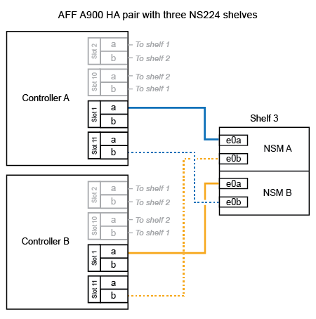
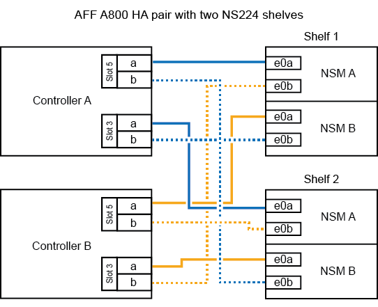
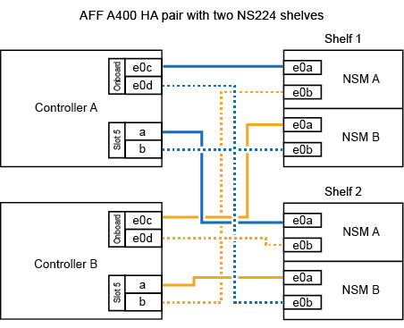

= Adición en caliente de una estantería - bandejas NS224
:allow-uri-read: 
:icons: font
:imagesdir: ../media/

[role="lead"]
Puede añadir en caliente una bandeja de unidades NS224 después de que su par de alta disponibilidad cumpla determinados requisitos y una vez completadas las tareas de preparación aplicables a su pareja de alta disponibilidad.

== Requisitos de una adición activa

[role="lead"]
Su par de alta disponibilidad debe cumplir determinados requisitos antes de añadir en caliente una bandeja de unidades NS224.

* El modelo y la versión de su plataforma de ONTAP deben ser compatibles con las bandejas NS224 y las unidades que se añaden en caliente.
+
https://hwu.netapp.com["Hardware Universe de NetApp"^]

* Debe tener el número y el tipo de cables correctos para conectar la bandeja.
+
https://hwu.netapp.com["Hardware Universe de NetApp"^]

* Una pareja de alta disponibilidad debe tener suficientes puertos disponibles compatibles con roce para admitir la cantidad de bandejas que va a añadir en caliente.
+
Para cada bandeja que se va a añadir en caliente, se necesitan al menos dos puertos compatibles con roce en cada controladora. Estos puertos pueden estar integrados en las controladoras, en tarjetas PCIe compatibles con roce, en una combinación de ambos o en módulos de I/o compatibles con roce, según lo admita el modelo de plataforma.

+
Si el par de alta disponibilidad no tiene suficientes puertos disponibles para roce y el modelo de plataforma admite el uso de tarjetas PCIe o módulos de I/o compatibles con roce, debe haber instalado las tarjetas adicionales o módulos de I/o en las ranuras de controladora correctas, como lo admite el modelo de plataforma.

+
https://hwu.netapp.com["Hardware Universe de NetApp"^]

+
[NOTE]
====
Los puertos no dedicados compatibles con roce deben configurarse para uso del almacenamiento (no para uso de redes).

<<Prepare puertos no dedicados compatibles con roce para una adición en caliente>>

====
* Si tiene un par de alta disponibilidad A700 de AFF y está en caliente al añadir la bandeja de unidades inicial NS224 (no hay ninguna bandeja de unidades NS224 en su par de alta disponibilidad), debe haber instalado un módulo de volcado de núcleo (X9170A, SSD NVMe de 1 TB) en cada controladora para admitir volcados principales (almacenar archivos principales).
+
link:../fas9000/caching-module-and-core-dump-module-replace.html["Sustituya el módulo de almacenamiento en caché o añada/sustituya un módulo de volcado de memoria: A700 y FAS9000 de AFF"^]

* Su pareja de alta disponibilidad debe tener una cantidad inferior a la cantidad máxima de bandejas compatibles, al menos con la cantidad de bandejas que haya planificado añadir en caliente.
+
No puede haber superado el número máximo de bandejas compatibles con su pareja de alta disponibilidad después de añadir bandejas en activo.

+
https://hwu.netapp.com["Hardware Universe de NetApp"^]

* Si añade en caliente una bandeja a una pareja de alta disponibilidad que ya tiene una bandeja NS224, su par de alta disponibilidad no puede tener mensajes de error de cableado de almacenamiento y debe cablearse como alta disponibilidad multivía.
+
Puede ejecutar Active IQ Config Advisor para ver cualquier mensaje de error de cableado de almacenamiento y las acciones correctivas que debe tomar.

+
https://mysupport.netapp.com/site/tools/tool-eula/activeiq-configadvisor["Descargas de NetApp: Config Advisor"^]

* Necesita un clip de papel con un bolígrafo enderezado o con punta estrecha.
+
Para cambiar el ID de la bandeja, utilice el clip de papel o el bolígrafo para acceder al botón ID de la bandeja situado detrás del panel de visualización del operador (ODP).

== Consideraciones para una adición en caliente

[role="lead"]
Antes de añadir en caliente una bandeja de unidades NS224, debe familiarizarse con las prácticas recomendadas y los aspectos de este procedimiento.

* Si tiene un par de alta disponibilidad de ASA que admite bandejas NS224, puede utilizar este procedimiento.
* *Mejor práctica:* la mejor práctica es tener instalada la versión actual del paquete de cualificación de disco (DQP) antes de agregar en caliente una bandeja.
+
Si tiene instalada la versión actual del DQP, el sistema podrá reconocer y utilizar unidades recién cualificadas. Esto evita mensajes de eventos del sistema sobre la información no actualizada de la unidad y la prevención de la partición de unidades, ya que no se reconocen las unidades. El DQP también notifica el firmware de la unidad no actual.

+
https://mysupport.netapp.com/site/downloads/firmware/disk-drive-firmware/download/DISKQUAL/ALL/qual_devices.zip["Descargas de NetApp: Paquete de cualificación de disco"^]

* *Mejor práctica:* la mejor práctica es ejecutar Active IQ Config Advisor antes y después de añadir en caliente un estante.
+
Si se ejecuta Active IQ Config Advisor antes de añadir una bandeja en caliente, se obtiene un captura de snap de la conectividad Ethernet (ENET) de la bandeja existente, se comprueban las versiones de firmware del módulo de bandeja NVMe (NSM) y se puede verificar un ID de bandeja que ya se está usando en el par de alta disponibilidad. Si se ejecuta Active IQ Config Advisor después de añadir una bandeja en caliente, es posible verificar que las bandejas se hayan cableado correctamente y que los ID de bandeja sean únicos en el par de alta disponibilidad.

+
https://mysupport.netapp.com/site/tools/tool-eula/activeiq-configadvisor["Descargas de NetApp: Config Advisor"^]

* *Mejor práctica:* la práctica recomendada es tener versiones actuales del firmware del módulo de bandeja NVMe (NSM) y del firmware de unidades en el sistema antes de añadir una bandeja nueva.
+
https://mysupport.netapp.com/site/downloads/firmware/disk-shelf-firmware["Descargas de NetApp: Firmware de bandeja de discos"^]

+
https://mysupport.netapp.com/site/downloads/firmware/disk-drive-firmware["Descargas de NetApp: Firmware de la unidad de disco"^]

+

NOTE: No revierte el firmware a una versión que no admite la bandeja y sus componentes.

* Después de cablear una bandeja añadida en caliente, ONTAP reconoce la bandeja:
+
** La propiedad de la unidad se asigna si la asignación automática de unidad está habilitada.
** El firmware de la bandeja NSM y el de la unidad deben actualizarse automáticamente, si es necesario.
+

NOTE: Las actualizaciones de firmware pueden tardar hasta 30 minutos.

== Prepare una adición activa

[role="lead"]
Debe completar las tareas de preparación aplicables a su par de alta disponibilidad antes de añadir en caliente una bandeja de unidades NS224.

=== Prepare puertos no dedicados compatibles con roce para una adición en caliente

Si el par de alta disponibilidad tiene puertos no dedicados compatibles con roce que utiliza para añadir en caliente una bandeja de unidades NS224, debe asegurarse de que los puertos estén configurados para almacenamiento (no para uso en red). En función del modelo de plataforma existente, los puertos compatibles con roce se encuentran integrados, en tarjetas PCIe compatibles con roce, en una combinación de ambos o en módulos de I/o compatibles con roce.

.Antes de empezar
Debe haber cumplido los requisitos del sistema.

<<Requisitos de una adición activa>>

.Acerca de esta tarea
* En algunos modelos de plataforma, cuando se instala una tarjeta PCIe o un módulo I/o compatible con roce en una ranura compatible de una controladora, los puertos tienen la opción predeterminada automáticamente para el uso del almacenamiento (en lugar de las redes). Sin embargo, se recomienda completar este procedimiento para verificar que los puertos compatibles con roce se hayan configurado para el uso del almacenamiento.
* Si determina que los puertos no dedicados compatibles con roce de la pareja de alta disponibilidad no están configurados para su uso en el almacenamiento, se trata de un procedimiento no disruptivo para configurarlos.
+

NOTE: Si su par de alta disponibilidad está ejecutando una versión de ONTAP 9.6, debe reiniciar las controladoras, una a la vez.

+

NOTE: Si su pareja de alta disponibilidad ejecuta ONTAP 9.7 o una versión posterior, no necesita reiniciar las controladoras, a menos que una o ambas controladoras estén en modo de mantenimiento. En este procedimiento se asume que ninguna controladora está en modo de mantenimiento.

.Pasos
. Compruebe si los puertos no dedicados del par de alta disponibilidad están configurados para el uso del almacenamiento: `storage port show`
+
Puede introducir el comando en cualquier módulo de la controladora.

+
Si su par de alta disponibilidad ejecuta ONTAP 9.8 o posterior, se muestran los puertos no dedicados `storage` en la `Mode` columna.

+
Si su par de alta disponibilidad ejecuta ONTAP 9.7 o 9.6, los puertos no dedicados se muestran `false` en la `Is Dedicated?` columna, también mostrar `enabled` en la `State` columna.

. Si los puertos no dedicados están configurados para el uso del almacenamiento, se realiza con este procedimiento.
+
De lo contrario, deberá configurar los puertos completando los pasos 3 a 6.

+
[NOTE]
====
Cuando los puertos no dedicados no están configurados para el uso del almacenamiento, el resultado del comando muestra lo siguiente:

Si su par de alta disponibilidad ejecuta ONTAP 9.8 o posterior, se muestran los puertos no dedicados `network` en la `Mode` columna.

Si su par de alta disponibilidad ejecuta ONTAP 9.7 o 9.6, los puertos no dedicados se muestran `false` en la `Is Dedicated?`` columna, también mostrar `disabled` en la `State` columna.

====
. Configure los puertos no dedicados para su uso del almacenamiento en uno de los módulos de la controladora:
+
Debe repetir el comando correspondiente para cada puerto que esté configurando.

+
[cols="1,3"]
|===
| Si su par de alta disponibilidad está ejecutando... | Realice lo siguiente... 

 a| 
ONTAP 9.8 o posterior
 a| 
`storage port modify -node node name -port port name -mode storage`

 a| 
ONTAP 9.7 o 9.6
 a| 
`storage port enable -node node name -port port name`

|===
. Si su par de alta disponibilidad ejecuta ONTAP 9.6, reinicie el módulo de la controladora para que los cambios en el puerto tengan efecto: `system node reboot -node node name -reason reason for the reboot`
+
De lo contrario, vaya al paso siguiente.

+

NOTE: El reinicio puede demorar hasta 15 minutos.

. Repita los pasos para el segundo módulo de controlador:
+
[cols="1,3"]
|===
| Si su par de alta disponibilidad está ejecutando... | Realice lo siguiente... 

 a| 
ONTAP 9.7 o posterior
 a| 
.. Repita el paso 3.
.. Vaya al paso 6.

 a| 
ONTAP 9.6
 a| 
.. Repita los pasos 3 y 4.
+

NOTE: La primera controladora ya debe haber completado el reinicio.

.. Vaya al paso 6.

|===
. Compruebe que los puertos no dedicados en ambos módulos de controladora están configurados para almacenamiento: `storage port show`
+
Puede introducir el comando en cualquier módulo de la controladora.

+
Si su par de alta disponibilidad ejecuta ONTAP 9.8 o posterior, se muestran los puertos no dedicados `storage` en la `Mode` columna.

+
Si su par de alta disponibilidad ejecuta ONTAP 9.7 o 9.6, los puertos no dedicados se muestran `false` en la `Is Dedicated?` columna, también mostrar `enabled` en la `State` columna.

=== Prepare un par de alta disponibilidad A700, AFF A800 o AFF A400 de AFF para añadir en caliente una segunda bandeja

Si tiene un par de alta disponibilidad A700, AFF A800 o AFF A400 de AFF con una bandeja de unidades NS224 cableada a un conjunto de puertos compatibles con roce en cada controladora, debe volver a instalar la bandeja (después de haber instalado las tarjetas PCIe o módulos de I/o adicionales compatibles con roce) en los dos conjuntos de puertos de cada controladora, antes de añadir la segunda bandeja en activo.

.Antes de empezar
* Debe haber cumplido los requisitos del sistema.
+
<<Requisitos de una adición activa>>

* Debe haber habilitado los puertos en las tarjetas PCIe compatibles con roce o los módulos de I/o instalados.
+
<<Prepare puertos no dedicados compatibles con roce para una adición en caliente>>

.Acerca de esta tarea
* La presentación de las conexiones de puertos es un procedimiento no disruptivo si su bandeja cuenta con conectividad de alta disponibilidad multivía.
+
Podrá reconectar la primera bandeja en ambos conjuntos de puertos de cada controladora para que cuando la segunda bandeja en activo, ambas bandejas tengan una conectividad más resiliente.

* Puede mover un cable a la vez para mantener la conectividad a la bandeja en todo momento durante este procedimiento.

.Pasos
. Reconectar las conexiones de la bandeja existente en ambos conjuntos de puertos en cada controladora, según corresponda al modelo de plataforma.
+

NOTE: Mover un cable no requiere tiempo de espera entre desconectar el cable de un puerto y conectarlo a otro.

+
[cols="1,3"]
|===
| Si dispone de una... | Realice lo siguiente... 

 a| 
Par de alta disponibilidad A700 de AFF
 a| 

NOTE: Los subpasos dan por sentado que la bandeja existente se cableó a módulos de I/o compatibles con roce en la ranura 3 de cada controladora.

[NOTE]
====
Si es necesario, se pueden hacer referencia a las ilustraciones de cableado que muestran una única bandeja existente y la bandeja de doble bandeja.

<<Cablee una bandeja de adición en caliente para un par de alta disponibilidad A700 de AFF>>

====
.. En la controladora A, mueva el cable de la ranura 3, puerto b (e3b), a la ranura 7, puerto b (e7b).
.. Repita el mismo cable y mueva la controladora B.

 a| 
Par de alta disponibilidad A800 de AFF
 a| 

NOTE: Los subpasos dan por sentado que la bandeja existente se cableó a tarjetas PCIe compatibles con roce en la ranura 5 de cada controladora.

[NOTE]
====
Si es necesario, se pueden hacer referencia a las ilustraciones de cableado que muestran una única bandeja existente y la bandeja de doble bandeja.

<<Conecte un cable de una bandeja de adición en caliente para un par de alta disponibilidad A800 de AFF>>

====
.. En la controladora A, mueva el cable de la ranura 5, puerto b (e5b), a la ranura 3, puerto b (e3b).
.. Repita el mismo cable y mueva la controladora B.

 a| 
Par de alta disponibilidad del A400 de AFF
 a| 
[NOTE]
====
Si es necesario, se pueden hacer referencia a las ilustraciones de cableado que muestran una única bandeja existente y la bandeja de doble bandeja.

<<Conecte un cable de una bandeja de adición en caliente para un par de alta disponibilidad del A400 AFF>>

====
.. En la controladora A, mueva el cable del puerto e0d a la ranura 5 puerto b (e5b).
.. Repita el mismo cable y mueva la controladora B.

|===
. Compruebe que la bandeja de dos bandejas se haya cableado correctamente.
+
Si se genera algún error de cableado, siga las acciones correctivas proporcionadas.

+
https://mysupport.netapp.com/site/tools/tool-eula/activeiq-configadvisor["Descargas de NetApp: Config Advisor"^]

=== Prepare la asignación manual de la propiedad de una unidad para una adición de activo

Si va a asignar manualmente la propiedad de una unidad para la bandeja de unidades NS224 que va a añadir en caliente, debe deshabilitar la asignación automática de unidades si está habilitada.

.Antes de empezar
Debe haber cumplido los requisitos del sistema.

<<Requisitos de una adición activa>>

.Acerca de esta tarea
Debe asignar manualmente la propiedad de una unidad si las unidades de la bandeja son propiedad de ambos módulos de controladora en la pareja de alta disponibilidad.

.Pasos
. Compruebe si la asignación automática de unidades está habilitada: `storage disk option show`
+
Puede introducir el comando en cualquier módulo de la controladora.

+
Si la asignación automática de unidades está activada, la salida muestra `on` en la `Auto Assign` (para cada módulo del controlador).

. Si la asignación automática de unidades está habilitada, deshabilítela: `storage disk option modify -node node_name -autoassign off`
+
Debe deshabilitar la asignación automática de unidades en ambos módulos de la controladora.

== Instale una bandeja de unidades para añadir datos en caliente

[role="lead"]
La instalación de una bandeja de unidades nueva NS224 implica la instalación de la bandeja en un rack o armario, la conexión de los cables de alimentación (que enciende automáticamente la bandeja) y luego la configuración del ID de bandeja.

.Antes de empezar
* Debe haber cumplido los requisitos del sistema.
+
<<Requisitos de una adición activa>>

* Debe haber completado los procedimientos de preparación correspondientes.
+
<<Prepare una adición activa>>

.Pasos
. Instale el kit de montaje en raíl incluido con su bandeja mediante el folleto de instalación incluido en la caja del kit.
+

NOTE: No monte el estante con brida.

. Utilice el folleto de instalación para instalar y proteger la bandeja en los soportes de soporte, así como en el rack o armario.
+

NOTE: Un estante completamente cargado NS224 puede pesar hasta 30.29 kg (66.78 lbs) y requiere que dos personas levanten o usen un elevador hidráulico. Evite quitar los componentes de la bandeja (desde la parte delantera o trasera de la bandeja) para reducir el peso de la bandeja, ya que el peso de la bandeja se equilibrará.

. Conecte los cables de alimentación a la bandeja, fíjelos con el retenedor del cable de alimentación y, a continuación, conecte los cables de alimentación a distintas fuentes de alimentación para obtener flexibilidad.
+
Una bandeja se enciende cuando está conectada a una fuente de alimentación; no tiene interruptores de alimentación. Cuando funciona correctamente, el LED bicolor de una fuente de alimentación se ilumina en verde.

. Establezca el ID de bandeja en un número único dentro de la pareja de alta disponibilidad:
+
Hay instrucciones más detalladas disponibles:

+
link:change-shelf-id.html["Cambiar un ID de bandeja - bandejas NS224"^]

+
.. Retire la tapa del extremo izquierdo y localice el orificio pequeño a la derecha de los LED.
.. Introduzca el extremo de un clip de papel o una herramienta similar en el orificio pequeño para llegar al botón de ID de la bandeja.
.. Mantenga pulsado el botón (hasta 15 segundos) hasta que el primer número de la pantalla digital parpadee y, a continuación, suelte el botón.
+

NOTE: Si el ID tarda más de 15 segundos en parpadear, mantenga pulsado el botón de nuevo y asegúrese de pulsarlo completamente.

.. Pulse y suelte el botón para avanzar el número hasta alcanzar el número deseado de 0 a 9.
.. Repita los subpasos 4c y 4d para establecer el segundo número del ID de la bandeja.
+
El número puede tardar hasta tres segundos (en lugar de 15 segundos) en parpadear.

.. Mantenga presionado el botón hasta que el segundo número deje de parpadear.
+
Después de unos cinco segundos, ambos números comienzan a parpadear y el LED ámbar del ODP se ilumina.

.. Apague y encienda la bandeja para que el ID de bandeja quede registrado.
+
Debe desconectar los dos cables de alimentación de la bandeja, esperar 10 segundos y, a continuación, volver a enchufarlos.

+
Cuando se restablece la alimentación a las fuentes de alimentación, sus LED bicolores se iluminan en verde.

== Conecte mediante cable una bandeja de unidades para una función de adición de activo

[role="lead"]
Conecte los cables de cada bandeja de unidades NS224 se añadirá en caliente de modo que cada bandeja tenga dos conexiones a cada módulo de controladora en el par de alta disponibilidad. En función del número de bandejas que se añadan en caliente y el modelo de plataforma, se utilizarán puertos compatibles con roce en las controladoras, en tarjetas PCIe compatibles con roce, una combinación de ambos o en módulos de I/o compatibles con roce.

=== Consideraciones a tener en cuenta cuando se realiza el cableado de un complemento activo

Familiarizarse con la orientación correcta del conector del cable, así como la ubicación y el etiquetado de los puertos en los módulos de la bandeja de unidades NSM NS224 puede ser útil antes de conectar el cableado de la bandeja añadida en caliente.

* Los cables se insertan con la lengüeta de extracción del conector hacia arriba.
+
Cuando se inserta correctamente un cable, éste hace clic en su lugar.

+
Después de conectar ambos extremos del cable, se encienden los LED LNK (verde) de la bandeja y el puerto de la controladora. Si un LED LNK de puerto no se ilumina, vuelva a colocar el cable.

+
image::../media/oie_cable_pull_tab_up.png[lengüeta para tirar del cable de la oie]

* Se puede utilizar la siguiente ilustración para identificar físicamente los puertos NSM de la bandeja, e0a y e0b:
+
image::../media/drw_ns224_back_ports.png[puertos de respaldo drw ns224]

=== Conecte un cable de una bandeja de adición en caliente para un par de alta disponibilidad AFF A900

Cuando se necesita almacenamiento adicional, puede añadir hasta tres bandejas de unidades NS224 adicionales (con un total de cuatro bandejas) a un par de alta disponibilidad A900 de AFF.

.Antes de empezar
* Debe haber cumplido los requisitos del sistema.
+
<<Requisitos de una adición activa>>

* Debe haber completado los procedimientos de preparación correspondientes.
+
<<Prepare una adición activa>>

* Debe haber instalado las bandejas, encendidas y configurado los ID de bandeja.
+
<<Instale una bandeja de unidades para añadir datos en caliente>>

.Acerca de esta tarea
* En este procedimiento se asume que su par de alta disponibilidad tiene al menos una bandeja NS224 existente y que va a añadir hasta tres bandejas adicionales en caliente.
* Si su par de alta disponibilidad tiene solo una bandeja NS224 existente, en este procedimiento se asume que la bandeja se cableó en dos módulos I/o de 100 GbE compatibles con roce de cada controladora.

.Pasos
. Si la bandeja NS224 que está agregando en caliente será la segunda bandeja NS224 del par de alta disponibilidad, complete los siguientes subpasos.
+
De lo contrario, vaya al paso siguiente.

+
.. Bandeja de cables NSM de un puerto e0a a a la ranura de controladora A 10 puertos a (e10a).
.. Cable de la bandeja NSM Del puerto e0b a al puerto b de la ranura 2 de la controladora B (e2b).
.. Puerto e0a de la bandeja de cables NSM B a la ranura de la controladora B, puerto a 10 (e10a).
.. Cable del puerto e0b NSM B a la ranura 2 de la controladora a, puerto b (e2b).

+
En la siguiente ilustración, se muestra el cableado de la segunda bandeja (y la primera bandeja).

+
image::../media/drw_ns224_a900_2shelves.png[drw ns224 a900 2 estantes]

. Si la bandeja NS224 que está agregando en caliente será la tercera bandeja NS224 del par de alta disponibilidad, complete los siguientes subpasos.
+
De lo contrario, vaya al paso siguiente.

+
.. Conecte El puerto NSM de La bandeja de cables e0a al puerto a de la ranura 1 de la controladora (e1a).
.. Cable de la bandeja NSM Del puerto e0b a la ranura de la controladora B, puerto b (e11b) 11.
.. Conecte el puerto NSM B de la bandeja de cables e0a al puerto a de la ranura de la controladora B (e1a).
.. Cable de la bandeja NSM B del puerto e0b a la ranura de la controladora A 11, puerto b (e11b).
+
En la siguiente ilustración, se muestra el cableado de la tercera bandeja.

+

. Si la bandeja NS224 que está agregando en caliente será la cuarta bandeja NS224 del par de alta disponibilidad, complete los siguientes subpasos.
+
De lo contrario, vaya al paso siguiente.

+
.. Conecte el cable de la bandeja NSM de Un puerto e0a a a la ranura de controladora A 11 puerto a (e11a).
.. Conecte el cable del puerto NSM A e0b a la ranura de la controladora B del puerto b (e1b).
.. Conecte el puerto NSM B de la bandeja de cables e0a al puerto a de la ranura de la controladora B 11 (e11a).
.. Conecte el puerto e0b NSM B de la bandeja a la controladora, puerto b (e1b) de la ranura 1.
+
En la siguiente ilustración, se muestra el cableado de la cuarta bandeja.

+
image::../media/drw_ns224_a900_4shelves.png[drw ns224 a900 4estantes]

. Compruebe que la bandeja añadida en activo se haya cableado correctamente.
+
Si se genera algún error de cableado, siga las acciones correctivas proporcionadas.

+
https://mysupport.netapp.com/site/tools/tool-eula/activeiq-configadvisor["Descargas de NetApp: Config Advisor"]

. Si se deshabilitó la asignación automática de unidades como parte de la preparación para este procedimiento, debe asignar manualmente la propiedad de la unidad y, después, volver a habilitar la asignación automática de unidades, si es necesario.
+
De lo contrario, ha finalizado este procedimiento.

+
<<Complete el hot-add>>

=== Conecte un cable de una bandeja de adición en caliente para un par de alta disponibilidad FAS500f o AFF A250

[role="lead"]
Cuando se necesite almacenamiento adicional, puede añadir en caliente una bandeja de unidades NS224 a un par de alta disponibilidad FAS500f o AFF A250.

.Antes de empezar
* Debe haber cumplido los requisitos del sistema.
+
<<Requisitos de una adición activa>>

* Debe haber completado los procedimientos de preparación correspondientes.
+
<<Prepare una adición activa>>

* Debe haber instalado las bandejas, encendidas y configurado los ID de bandeja.
+
<<Instale una bandeja de unidades para añadir datos en caliente>>

.Acerca de esta tarea
Una vez visto desde la parte posterior del chasis de la plataforma, el puerto para tarjetas compatible con roce de la izquierda es el puerto "a" (e1a) y el puerto de la derecha es el puerto "b" (e1b).

.Pasos
. Conecte los cables de las conexiones de la bandeja:
+
.. Conecte El puerto NSM de La bandeja de cables e0a al puerto a de la ranura 1 de la controladora (e1a).
.. Conecte el cable del puerto NSM A e0b a la ranura de la controladora B del puerto b (e1b).
.. Conecte el puerto NSM B de la bandeja de cables e0a al puerto a de la ranura de la controladora B (e1a).
.. Conecte el puerto e0b NSM B de la bandeja a la controladora, puerto b (e1b) de la ranura 1. + la siguiente ilustración muestra el cableado de las bandejas cuando se completa.
+
image::../media/drw_ns224_aff250_fas500f_1shelf.png[drw ns224 aff250 fas500f 1 estante]

. Compruebe que la bandeja añadida en activo se haya cableado correctamente.
+
Si se genera algún error de cableado, siga las acciones correctivas proporcionadas.

+
https://mysupport.netapp.com/site/tools/tool-eula/activeiq-configadvisor["Descargas de NetApp: Config Advisor"^]

. Si se deshabilitó la asignación automática de unidades como parte de la preparación para este procedimiento, debe asignar manualmente la propiedad de la unidad y, después, volver a habilitar la asignación automática de unidades, si es necesario.
+
De lo contrario, ha finalizado este procedimiento.

+
<<Complete el hot-add>>

=== Cablee una bandeja de adición en caliente para un par de alta disponibilidad A700 de AFF

La forma en que se conecta una bandeja de unidades NS224 en un par de alta disponibilidad A700 de AFF depende del número de bandejas que se añadan en caliente y del número de conjuntos de puertos compatibles con roce (uno o dos) que utilice en los módulos de controladoras.

.Antes de empezar
* Debe haber cumplido los requisitos del sistema.
+
<<Requisitos de una adición activa>>

* Debe haber completado los procedimientos de preparación correspondientes.
+
<<Prepare una adición activa>>

* Debe haber instalado las bandejas, encendidas y configurado los ID de bandeja.
+
<<Instale una bandeja de unidades para añadir datos en caliente>>

.Pasos
. Si va a añadir una bandeja en caliente que utiliza un conjunto de puertos compatibles con roce (un módulo de I/o compatible con roce) en cada módulo de controladora, y esta es la única bandeja NS224 del par de alta disponibilidad, complete los siguientes subpasos.
+
De lo contrario, vaya al paso siguiente.

+

NOTE: Este paso supone que instaló el módulo de I/o compatible con roce en la ranura 3, en lugar de la ranura 7, en cada módulo de la controladora.

+
.. Conecte El cable de la bandeja NSM de Un puerto e0a a a la controladora de una ranura 3 puerto a.
.. Cable de la bandeja NSM De un puerto e0b a la ranura de la controladora B 3, puerto b.
.. Conecte el puerto NSM B del puerto e0a al puerto de la ranura de la controladora B 3 a.
.. Cable de la bandeja NSM B del puerto e0b a la controladora a, ranura 3, puerto b.
+
En la siguiente ilustración, se muestra el cableado de una bandeja añadida en caliente mediante un módulo de I/o compatible con roce en cada módulo de la controladora:

+
image::../media/drw_ns224_a700_1shelf.png[drw ns224 a700 1estantería]

. Si va a añadir una o dos bandejas en caliente usando dos conjuntos de puertos compatibles con roce (dos módulos de I/o compatibles con roce) en cada módulo de la controladora, complete los subpasos aplicables.
+
[cols="1,3"]
|===
| Bandejas | Cableado 

 a| 
Bandeja 1
 a| 

NOTE: Estos subpasos suponen que se está comenzando el cableado por el cableado del puerto de la bandeja e0a al módulo de I/o compatible con roce en la ranura 3, en lugar de la ranura 7.

.. Conecte El cable NSM de Un puerto e0a al 3 puerto a. de La ranura A de la controladora
.. Conecte el cable NSM de un puerto e0b a la ranura de la controladora B 7, puerto b.
.. Conecte el cable del puerto NSM B e0a al puerto de la ranura de la controladora B 3 a.
.. Conecte el puerto e0b NSM B al puerto e0b de la controladora A la ranura 7, puerto b.
.. Si va a añadir una segunda estantería en caliente, complete los subpasos "Shelf 2"; en caso contrario, vaya al paso 3.

 a| 
Estante 2
 a| 

NOTE: Estos subpasos suponen que se está comenzando el cableado por el cableado del puerto de la bandeja e0a al módulo I/o compatible con roce en la ranura 7, en lugar de la ranura 3 (que se correlaciona con los subpasos de cableado de la bandeja 1).

.. Conecte El cable NSM de Un puerto e0a al 7 puerto a. de La ranura A de la controladora
.. Conecte el cable NSM de un puerto e0b a la ranura de la controladora B 3, puerto b.
.. Conecte el cable del puerto NSM B e0a al puerto de la ranura de la controladora B 7 a.
.. Conecte el puerto e0b NSM B al puerto e0b de la controladora A la ranura 3, puerto b.
.. Vaya al paso 3.

|===
+
En la siguiente ilustración, se muestra el cableado de la primera y segunda bandejas añadidas en caliente:

+
image::../media/drw_ns224_a700_2shelves.png[drw ns224 a700 2 estantes]

. Compruebe que la bandeja añadida en activo se haya cableado correctamente.
+
Si se genera algún error de cableado, siga las acciones correctivas proporcionadas.

+
https://mysupport.netapp.com/site/tools/tool-eula/activeiq-configadvisor["Descargas de NetApp: Config Advisor"^]

. Si se deshabilitó la asignación automática de unidades como parte de la preparación para este procedimiento, debe asignar manualmente la propiedad de la unidad y, después, volver a habilitar la asignación automática de unidades, si es necesario.
+
De lo contrario, ha finalizado este procedimiento.

+
<<Complete el hot-add>>

=== Conecte un cable de una bandeja de adición en caliente para un par de alta disponibilidad A800 de AFF

La forma en que se conecte la conexión de una bandeja de unidades NS224 en un par de alta disponibilidad AFF A800 depende del número de bandejas que se añadan en caliente y del número de conjuntos de puertos compatibles con roce (uno o dos) que utilice en los módulos de las controladoras.

.Antes de empezar
* Debe haber cumplido los requisitos del sistema.
+
<<Requisitos de una adición activa>>

* Debe haber completado los procedimientos de preparación correspondientes.
+
<<Prepare una adición activa>>

* Debe haber instalado las bandejas, encendidas y configurado los ID de bandeja.
+
<<Instale una bandeja de unidades para añadir datos en caliente>>

.Pasos
. Si va a añadir una bandeja en caliente que utiliza un conjunto de puertos compatibles con roce (una tarjeta PCIe compatible con roce) en cada módulo de controladora, y esta es la única bandeja NS224 del par de alta disponibilidad, complete los siguientes subpasos.
+
De lo contrario, vaya al paso siguiente.

+

NOTE: Este paso supone que se instaló la tarjeta PCIe compatible con roce en la ranura 5.

+
.. Conecte El cable de la bandeja NSM de Un puerto e0a a a la controladora de una ranura 5 puerto a.
.. Cable de la bandeja NSM De un puerto e0b a la ranura de la controladora B 5, puerto b.
.. Conecte el puerto NSM B del puerto e0a al puerto de la ranura de la controladora B 5 a.
.. Cable de la bandeja NSM B del puerto e0b a la controladora a, ranura 5, puerto b.
+
En la siguiente ilustración, se muestra el cableado de una bandeja añadida en caliente mediante una tarjeta PCIe compatible con roce en cada módulo de controladora:

+
image::../media/drw_ns224_a800_1shelf.png[1 bandeja drw ns224 a800]

. Si va a añadir una o dos bandejas en caliente usando dos conjuntos de puertos compatibles con roce (dos tarjetas PCIe compatibles con roce) en cada módulo de controladora, complete los subpasos aplicables.
+

NOTE: Este paso supone que instaló las tarjetas PCIe compatibles con roce en la ranura 5 y la ranura 3.

+
[cols="1,3"]
|===
| Bandejas | Cableado 

 a| 
Bandeja 1
 a| 

NOTE: Estos subpasos suponen que se está iniciando el cableado por el puerto de bandeja e0a a a a la tarjeta PCIe compatible con roce en la ranura 5, en lugar de la ranura 3.

.. Conecte El cable NSM de Un puerto e0a al 5 puerto a. de La ranura A de la controladora
.. Conecte el cable NSM de un puerto e0b a la ranura de la controladora B 3, puerto b.
.. Conecte el cable del puerto NSM B e0a al puerto de la ranura de la controladora B 5 a.
.. Conecte el puerto e0b NSM B al puerto e0b de la controladora A la ranura 3, puerto b.
.. Si va a añadir una segunda estantería en caliente, complete los subpasos "Shelf 2"; en caso contrario, vaya al paso 3.

 a| 
Estante 2
 a| 

NOTE: En estos subpasos se asume que está comenzando el cableado por el puerto de bandeja e0a a a la tarjeta PCIe compatible con roce en la ranura 3, en lugar de la ranura 5 (que se correlaciona con los subpasos de cableado de la bandeja 1).

.. Conecte El cable NSM de Un puerto e0a al 3 puerto a. de La ranura A de la controladora
.. Conecte el cable NSM de un puerto e0b a la ranura de la controladora B 5, puerto b.
.. Conecte el cable del puerto NSM B e0a al puerto de la ranura de la controladora B 3 a.
.. Conecte el puerto e0b NSM B al puerto e0b de la controladora A la ranura 5, puerto b.
.. Vaya al paso 3.

|===
+
En la siguiente ilustración, se muestra el cableado de dos bandejas añadidas en caliente:

+

. Compruebe que la bandeja añadida en activo se haya cableado correctamente.
+
Si se genera algún error de cableado, siga las acciones correctivas proporcionadas.

+
https://mysupport.netapp.com/site/tools/tool-eula/activeiq-configadvisor["Descargas de NetApp: Config Advisor"^]

. Si se deshabilitó la asignación automática de unidades como parte de la preparación para este procedimiento, debe asignar manualmente la propiedad de la unidad y, después, volver a habilitar la asignación automática de unidades, si es necesario.
+
De lo contrario, ha finalizado este procedimiento.

+
<<Complete el hot-add>>

=== Conecte un cable de una bandeja de adición en caliente para un par de alta disponibilidad del A400 AFF

La forma en que se conecta una bandeja de unidades NS224 en un par de alta disponibilidad de AFF A400 depende del número de bandejas que se añaden en caliente y la cantidad de conjuntos de puertos compatibles con roce (uno o dos) que se utilizan en los módulos de controladoras.

.Antes de empezar
* Debe haber cumplido los requisitos del sistema.
+
<<Requisitos de una adición activa>>

* Debe haber completado los procedimientos de preparación correspondientes.
+
<<Prepare una adición activa>>

* Debe haber instalado las bandejas, encendidas y configurado los ID de bandeja.
+
<<Instale una bandeja de unidades para añadir datos en caliente>>

.Pasos
. Si va a añadir una bandeja en caliente que utiliza un conjunto de puertos compatibles con roce (puertos internos compatibles con roce) en cada módulo de controladora, y esta es la única bandeja NS224 del par de alta disponibilidad, complete los siguientes subpasos.
+
De lo contrario, vaya al paso siguiente.

+
.. Conecte el cable de la bandeja NSM De Un puerto e0a al puerto e0c de la controladora A.
.. Cable de la bandeja NSM Del puerto e0b al puerto e0d de la controladora B.
.. Cable del puerto NSM B e0a al puerto e0c de la controladora B.
.. Conecte el cable del puerto e0b NSM B al puerto e0d de la controladora A.
+
En la siguiente ilustración, se muestra el cableado de una bandeja añadida en caliente mediante un conjunto de puertos compatibles con roce en cada módulo de controladora:

+
image::../media/drw_ns224_a400_1shelf.png[drw ns224 a400 1 estante]

. Si va a añadir una o dos bandejas que utilizan dos conjuntos de puertos compatibles con roce (puertos incorporados y compatibles con roce para tarjeta PCIe) en cada módulo de la controladora, complete los siguientes pasos.
+
[cols="1,3"]
|===
| Bandejas | Cableado 

 a| 
Bandeja 1
 a| 
.. Conecte El cable NSM de Un puerto e0a al puerto e0c de la controladora A.
.. Conecte el cable NSM de un puerto e0b a la ranura de la controladora B 5, puerto b.
.. Conecte el cable del puerto NSM B e0a al puerto e0c de la controladora B.
.. Conecte el puerto e0b NSM B al puerto e0b de la controladora A la ranura 5, puerto b.
.. Si va a añadir una segunda estantería en caliente, complete los subpasos "Shelf 2"; en caso contrario, vaya al paso 3.

 a| 
Estante 2
 a| 
.. Conecte El cable NSM de Un puerto e0a al 5 puerto a. de La ranura A de la controladora
.. Conecte el cable NSM del puerto e0b al puerto e0d de la controladora B.
.. Conecte el cable del puerto NSM B e0a al puerto de la ranura de la controladora B 5 a.
.. Conecte el cable del puerto e0b NSM B al puerto e0d de la controladora A.
.. Vaya al paso 3.

|===
+
En la siguiente ilustración, se muestra el cableado de dos bandejas añadidas en caliente:

+

. Compruebe que la bandeja añadida en activo se haya cableado correctamente.
+
Si se genera algún error de cableado, siga las acciones correctivas proporcionadas.

+
https://mysupport.netapp.com/site/tools/tool-eula/activeiq-configadvisor["Descargas de NetApp: Config Advisor"^]

. Si se deshabilitó la asignación automática de unidades como parte de la preparación para este procedimiento, debe asignar manualmente la propiedad de la unidad y volver a habilitar la asignación automática de unidades, si es necesario.
+
De lo contrario, ha finalizado este procedimiento.

+
<<Complete el hot-add>>

=== Conecte un cable de una bandeja de adición en caliente para un par de alta disponibilidad AFF A320

Usted conecta una segunda bandeja de unidades NS224 a un par de alta disponibilidad existente cuando se necesita almacenamiento adicional.

.Antes de empezar
* Debe haber cumplido los requisitos del sistema.
+
<<Requisitos de una adición activa>>

* Debe haber completado los procedimientos de preparación correspondientes.
+
<<Prepare una adición activa>>

* Debe haber instalado las bandejas, encendidas y configurado los ID de bandeja.
+
<<Instale una bandeja de unidades para añadir datos en caliente>>

.Acerca de esta tarea
En este procedimiento se asume que su par de alta disponibilidad de AFF A320 tiene una bandeja NS224 existente y que va a añadir en caliente una segunda bandeja.

.Pasos
. Conecte el cable de la bandeja a los módulos de la controladora.
+
.. Conecte El cable NSM de Un puerto e0a al puerto e0e de la controladora A.
.. Conecte el cable NSM del puerto e0b al puerto e0b de la controladora B.
.. Conecte el cable del puerto e0a NSM B al puerto e0e de la controladora B.
.. Conecte el cable del puerto e0b a el puerto e0b de la controladora a. + la siguiente ilustración muestra el cableado de la bandeja añadida en activo (bandeja 2):
+
image::../media/drw_ns224_a320_2shelves_direct_attached.png[drw ns224 a320 2 estantes de conexión directa]

. Compruebe que la bandeja añadida en activo se haya cableado correctamente.
+
Si se genera algún error de cableado, siga las acciones correctivas proporcionadas.

+
https://mysupport.netapp.com/site/tools/tool-eula/activeiq-configadvisor["Descargas de NetApp: Config Advisor"^]

. Si se deshabilitó la asignación automática de unidades como parte de la preparación para este procedimiento, debe asignar manualmente la propiedad de la unidad y volver a habilitar la asignación automática de unidades, si es necesario.
+
De lo contrario, ha finalizado este procedimiento.

+
<<Complete el hot-add>>

== Complete el hot-add

[role="lead"]
Si deshabilitó la asignación automática de unidades como parte de la preparación para la bandeja de unidades NS224 con adición de activos, debe asignar manualmente la propiedad de la unidad y, luego, volver a habilitar la asignación automática de unidades si es necesario.

.Antes de empezar
Debe haber cableado ya la bandeja según se indica para la pareja de alta disponibilidad.

<<Conecte mediante cable una bandeja de unidades para una función de adición de activo>>

.Pasos
. Mostrar todas las unidades sin propietario: `storage disk show -container-type unassigned`
+
Puede introducir el comando en cualquier módulo de la controladora.

. Asigne cada unidad: `storage disk assign -disk disk_name -owner owner_name`
+
Puede introducir el comando en cualquier módulo de la controladora.

+
Puede utilizar el carácter comodín para asignar más de una unidad a la vez.

. Vuelva a habilitar la asignación automática de unidades si es necesario: `storage disk option modify -node node_name -autoassign on`
+
Debe volver a habilitar la asignación automática de unidades en ambos módulos de la controladora.

