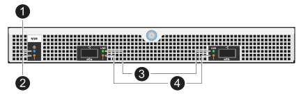

= Supervise los LED de la bandeja de unidades: NS224 bandejas
:allow-uri-read: 
:icons: font
:firstname: both:imagesdir: ../media/
:author: both:imagesdir: ../media/
:authorinitials: b
:authors: both:imagesdir: ../media/

[role="lead"]
Para supervisar el estado de la bandeja de unidades, conozca las condiciones de ubicación y estado de las LED de los componentes de la bandeja de unidades.

* Los LED de ubicación (azules), en el panel de visualización del operador (ODP) de una bandeja y ambos módulos NSM, se pueden activar para ayudar a localizar físicamente la bandeja que necesita mantenimiento: `storage shelf location-led modify -shelf-name _shelf_name_ -led-status on`
+
Si no conoce la `_shelf_name_` de la bandeja afectada, ejecute el `storage shelf show` comando.

+
Los LED de ubicación permanecen encendidos durante 30 minutos. Puede desactivarlos introduciendo el mismo comando, pero mediante el `off` opción.

* Un estado de LED puede ser:
+
** Encendido: La iluminación LED es continua/constante
** Apagado: El LED no está iluminado
** Parpadeo: El LED se enciende y se apaga a intervalos variables dependiendo del estado de la FRU
** Cualquier estado: El LED puede estar encendido, apagado o parpadeo.

== Indicadores LED del panel del operador

Los LED del panel de visualización frontal del operador (ODP) de la bandeja de unidades indican si la bandeja de unidades funciona con normalidad o si existen problemas con el hardware.

En la siguiente ilustración y tabla se describen los tres LED del ODP:

image::../media/drw_ns224_odp_leds_IEOPS-1262.svg[led odp drw ns224 IEOPS 1262]

[cols="1,2,1,5"]
|===
| Icono DE LED | Nombre y color DEL LED | Estado | Descripción 

 a| 
image:../media/drw_sas_power_icon.png[""]
 a| 
Alimentación (verde)
 a| 
Encendido
 a| 
Una o varias fuentes de alimentación suministran alimentación a la bandeja de unidades.

 a| 
image:../media/drw_sas_fault_icon.png[""]
 a| 
Atención (ámbar)
 a| 
Encendido
 a| 
* Se produjo un error con la función de una de más FRU de bandeja.
+
Compruebe los mensajes de eventos para determinar la acción correctiva que se debe realizar.

* Si el ID de bandeja de dos dígitos también parpadea, el ID de bandeja está en estado pendiente.
+
Apague y encienda la bandeja de unidades del ID de bandeja que se vea afectado.

 a| 
image:../media/drw_sas3_location_icon.gif[""]
 a| 
Ubicación (azul)
 a| 
Encendido
 a| 
El administrador del sistema activó esta función LED.

|===

== LED del módulo NSM

Los LED de un módulo NSM indican si el módulo funciona con normalidad, si está listo para el tráfico de I/O y si hay algún problema con el hardware.

En la ilustración y las siguientes tablas se describen los LED de módulo NSM asociados con la función de un módulo y la función de cada puerto NVMe en un módulo.

[cols="1,1,2,4"]
|===
| Llame | Icono DE LED | Color | Descripción 

 a| 
image:../media/legend_icon_01.png["Número de llamada 1"]
 a| 
image:../media/drw_sas3_location_icon.gif[""]
 a| 
Azul
 a| 
Módulo NSM: Ubicación

 a| 
image:../media/legend_icon_02.png["Número de llamada 2"]
 a| 
image:../media/drw_sas_fault_icon.png[""]
 a| 
Ámbar
 a| 
Módulo NSM: Atención

 a| 
image:../media/legend_icon_03.png["Número de llamada 3"]
 a| 
LNK
 a| 
Verde
 a| 
Puerto/enlace NVMe: Estado

 a| 
image:../media/legend_icon_04.png["Número de llamada 4"]
 a| 
image:../media/drw_sas_fault_icon.png[""]
 a| 
Ámbar
 a| 
Puerto/enlace NVMe: Atención

|===
[cols="2,1,1,1"]
|===
| Estado | Atención NSM (ámbar) | Puerto LNK (verde) | Atención del puerto (ámbar) 

 a| 
NSM normal
 a| 
Apagado
 a| 
Cualquier estado
 a| 
Apagado

 a| 
Fallo de NSM
 a| 
Encendido
 a| 
Cualquier estado
 a| 
Cualquier estado

 a| 
Error de NSM VPD
 a| 
Encendido
 a| 
Cualquier estado
 a| 
Cualquier estado

 a| 
No hay conexión de puerto de host
 a| 
Cualquier estado
 a| 
Apagado
 a| 
Apagado

 a| 
Enlace de conexión del puerto de host activo
 a| 
Cualquier estado
 a| 
Activa/parpadea con la actividad
 a| 
Cualquier estado

 a| 
Conexión del puerto de host con el fallo
 a| 
Encendido
 a| 
Encendido/apagado si todos los carriles tienen fallos
 a| 
Encendido

 a| 
Arranque del BIOS desde la imagen del BIOS después del encendido
 a| 
Parpadeo
 a| 
Cualquier estado
 a| 
Cualquier estado

|===

== Indicadores LED del sistema de alimentación

Los LED de una fuente de alimentación de CA o CC indican si la fuente de alimentación funciona con normalidad o si hay problemas de hardware.

En la ilustración y las tablas siguientes se describe el LED de una fuente de alimentación. (La ilustración es una fuente de alimentación de CA; sin embargo, la ubicación de los LED es la misma en la fuente de alimentación de CC):

image::../media/drw_ns224_psu_leds_IEOPS-1261.svg[led de fuente de alimentación drw ns224 IEOPS 1261]

[cols="1,4"]
|===
| Llame | Descripción 

 a| 
image:../media/legend_icon_01.png["Número de llamada 1"]
 a| 
El LED bicolor indica la alimentación/actividad cuando está en verde y un fallo en ámbar.

|===
[cols="2,1,1"]
|===
| Estado | Potencia/actividad (verde) | Atención (ámbar) 

 a| 
No hay alimentación de CA/CC en la carcasa
 a| 
Apagado
 a| 
Apagado

 a| 
No hay alimentación de CA/CC a la fuente de alimentación
 a| 
Apagado
 a| 
Encendido

 a| 
Alimentación de CA/CC encendida, pero la fuente de alimentación no está en el compartimento
 a| 
Parpadeo
 a| 
Apagado

 a| 
La fuente de alimentación funciona correctamente
 a| 
Encendido
 a| 
Apagado

 a| 
Fallo de PSU
 a| 
Apagado
 a| 
Encendido

 a| 
Fallo del ventilador
 a| 
Apagado
 a| 
Encendido

 a| 
Modo de actualización del firmware
 a| 
Parpadeo
 a| 
Apagado

|===

== LED de unidad

Los LED de una unidad NVMe indican si funciona normalmente o si hay problemas con el hardware.

En la ilustración y las siguientes tablas se describen los dos LED de una unidad NVMe:

image::../media/drw_ns224_drive_leds_IEOPS-1263.svg[led de unidad drw ns224 IEOPS 1263]

[cols="1,2,2"]
|===
| Llame | Nombre DEL LED | Color 

 a| 
image:../media/legend_icon_01.png["Número de llamada 1"]
 a| 
Atención
 a| 
Ámbar

 a| 
image:../media/legend_icon_02.png["Número de llamada 2"]
 a| 
Alimentación/actividad
 a| 
Verde

|===
[cols="2,1,1,1"]
|===
| Estado | Alimentación/actividad (verde) | Atención (ámbar) | LED ODP asociado 

 a| 
Unidad instalada y operativa
 a| 
Activa/parpadea con la actividad
 a| 
Cualquier estado
 a| 
N.A.

 a| 
Fallo de una unidad
 a| 
Activa/parpadea con la actividad
 a| 
Encendido
 a| 
Atención (ámbar)

 a| 
Juego de identificación de dispositivo SES
 a| 
Activa/parpadea con la actividad
 a| 
Parpadea
 a| 
La atención (ámbar) está desactivada

 a| 
Bit de fallo del dispositivo SES establecido
 a| 
Activa/parpadea con la actividad
 a| 
Encendido
 a| 
Atención (ámbar)

 a| 
Fallo del circuito de control de alimentación
 a| 
Apagado
 a| 
Cualquier estado
 a| 
Atención (ámbar)

|===