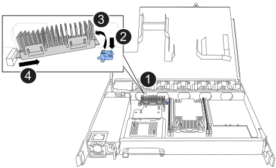

= Reemplace el soporte de arranque - bandejas NS224
:allow-uri-read: 
:icons: font
:imagesdir: ../media/

[role="lead"]
Es posible sustituir un medio de arranque con fallos en una bandeja NS224. El reemplazo de los medios de arranque puede realizarse de forma no disruptiva, mientras la bandeja de unidades está encendida y las operaciones de I/o están en curso.

.Antes de empezar
* *NS224 Solo con NSM100 módulos*: Su par de alta disponibilidad ya debe estar ejecutando ONTAP 9,7 o posterior, que tiene la versión mínima admitida del firmware NSM.
+
Puede introducir el `storage shelf show -module` Comando en la consola de cualquiera de las controladoras para verificar la versión del firmware NSM de la bandeja.

+
[NOTE]
====
Si la bandeja no ejecuta la versión de firmware NSM 0111 o posterior, no puede sustituir el medio de arranque, debe sustituir el NSM.

link:service-replace-nsm100.html["Reemplace una bandeja NSM: NS224"^]

====
* *NS224 con NSM100 módulos solamente*: Necesitas un destornillador Phillips #1.
+
El tornillo utilizado para fijar el soporte del maletero a la placa requiere un destornillador Phillips número 1; con un tipo diferente de destornillador se puede pelar el tornillo.

* El NSM del partner de la bandeja debe estar en funcionamiento y cableado correctamente para que la bandeja mantenga la conectividad al quitar el NSM con la FRU con errores (NSM de destino).
+
https://mysupport.netapp.com/site/tools/tool-eula/activeiq-configadvisor["Descargas de NetApp: Config Advisor"^]

* Todos los demás componentes del sistema deben funcionar correctamente.

.Acerca de esta tarea
* Después de sustituir el medio de arranque, la imagen de arranque del partner NSM de la bandeja se copia automáticamente al medio de arranque de reemplazo.
+
Esto puede tardar hasta cinco minutos.

* Permita al menos 70 segundos entre la eliminación y la instalación del módulo de bandeja de NVMe (NSM).
+
Esto le da tiempo suficiente para que ONTAP procese el evento de eliminación de NSM.

* Si es necesario, puede encender los LED de ubicación (azul) de la bandeja para ayudar a localizar físicamente la bandeja afectada: `storage shelf location-led modify -shelf-name _shelf_name_ -led-status on`
+
Si no conoce la `_shelf_name_` de la bandeja afectada, ejecute el `storage shelf show` comando.

+
Una bandeja tiene tres LED de ubicación: Uno en el panel de visualización del operador y otro en cada NSM. Los LED de ubicación permanecen encendidos durante 30 minutos. Puede desactivarlos introduciendo el mismo comando, pero usando la `off` opción.

* Tras sustituir el soporte de arranque, puede devolver la pieza con error a NetApp tal como se describe en las instrucciones de la RMA que se suministran con el kit.
+
Si necesita el número de la RMA o ayuda adicional con el procedimiento de reemplazo, póngase en contacto con el soporte técnico en https://mysupport.netapp.com/site/global/dashboard["Soporte de NetApp"^], 888-463-8277 (América del Norte), 00-800-44-638277 (Europa), o +800-800-80-800 (Asia/Pacífico).

[role="tabbed-block"]
====
.NSM100 módulos
--
Puede utilizar la animación siguiente o los pasos escritos para reemplazar el soporte de arranque.

.Sustituya el soporte de arranque de la bandeja NS224
video::20ed85f9-1f80-4e0e-9219-ab4600070d8a[panopto]
.Pasos
. Asegúrese de que tanto los NSM de la bandeja ejecuten la misma versión de firmware: Versión 0200 o posterior.
. Puesta a tierra apropiadamente usted mismo.
. Desconecte el cableado del NSM que contiene la FRU que desea reemplazar:
+
.. Desconecte el cable de alimentación de la fuente de alimentación abriendo el retenedor del cable de alimentación si es una fuente de alimentación de CA, o desenroscando los dos tornillos si es una fuente de alimentación de CC y, a continuación, desenchufe el cable de alimentación de la fuente de alimentación.
+
Las fuentes de alimentación no tienen un switch de alimentación.

.. Desconecte el cableado de almacenamiento de los puertos NSM.
+
Anote los puertos NSM a los que está conectado cada cable. Vuelva a conectar los cables a los mismos puertos cuando vuelva a insertar el NSM, más adelante en este procedimiento.

. Quite el NSM de la bandeja:
+
.. Enrolle los dedos índice a través de los orificios de los dedos de los mecanismos de enclavamiento a ambos lados del NSM.
+

NOTE: Si va a retirar el NSM inferior y si el riel inferior está obstruyendo el acceso a los mecanismos de enclavamiento, coloque los dedos índice a través de los orificios de los dedos desde el interior (cruzando los brazos).

.. Con los pulgares, presione y sostenga las lengüetas naranjas en la parte superior de los mecanismos de bloqueo.
+
Los mecanismos de bloqueo se elevan, borrando los pasadores de cierre de la bandeja.

.. Tire suavemente hasta que el NSM esté cerca de un tercio de la salida del estante, sujete los lados del NSM con ambas manos para soportar su peso y luego colóquelo en una superficie plana y estable.
+
Cuando comience a tirar, los brazos del mecanismo de bloqueo se extienden desde el NSM y se bloquean en su posición completamente extendida.

. Afloje el tornillo de mariposa de la cubierta NSM y abra la cubierta.
. Localice físicamente el medio de arranque con errores.
+
El soporte de arranque se encuentra a lo largo de la pared del chasis de la bandeja frente a la fuente de alimentación.

. Sustituya el soporte de arranque:
+
.. Con el destornillador Phillips número 1, retire con cuidado el tornillo que fija el extremo inferior (con muescas) del soporte del maletero a la placa.
.. Retire el soporte del maletero girando ligeramente el extremo ranurado hacia arriba y, a continuación, tirando suavemente de él hacia usted hasta que salga del zócalo.
+
Puede sujetar el soporte del maletero colocando el pulgar y el índice en los bordes laterales, en el extremo con muescas

.. Desembale el soporte del maletero de la bolsa antiestática.
.. Inserte el soporte de la funda de repuesto empujándolo suavemente en el zócalo hasta que quede asentado completamente en el zócalo.
+
Puede sujetar el soporte del maletero colocando el pulgar y el índice en los bordes laterales, en el extremo con muescas Asegúrese de que el lado con el disipador de calor está hacia arriba.

+
Cuando está correctamente asentado, y cuando se deja salir del soporte de la funda, el extremo ranurado del soporte de la funda está inclinado hacia arriba, lejos de la placa, porque aún no está fijado con el tornillo.

.. Sujete con cuidado el extremo ranurado del soporte del maletero mientras inserta y apriete el tornillo con el destornillador para fijar el soporte del maletero en su lugar.
+

NOTE: Apriete el tornillo lo suficiente como para sujetar el soporte del maletero firmemente en su lugar, pero no lo apriete en exceso.

. Cierre la cubierta NSM y, a continuación, apriete el tornillo de mariposa.
. Vuelva a insertar el NSM en la bandeja:
+
.. Asegúrese de que los brazos del mecanismo de bloqueo están bloqueados en la posición completamente extendida.
.. Usando ambas manos, deslice suavemente el NSM en el estante hasta que el peso del NSM quede completamente soportado por el estante.
.. Empuje el NSM en la bandeja hasta que se detenga (aproximadamente media pulgada desde la parte posterior de la bandeja).
+
Puede colocar los pulgares en las lengüetas naranjas de la parte frontal de cada bucle de dedo (de los brazos del mecanismo de bloqueo) para empujar el NSM.

.. Enrolle los dedos índice a través de los orificios de los dedos de los mecanismos de enclavamiento a ambos lados del NSM.
+

NOTE: Si está insertando el NSM inferior, y si el riel inferior está obstruyendo el acceso a los mecanismos de enclavamiento, coloque los dedos índice a través de los orificios de los dedos desde el interior (cruzando los brazos).

.. Con los pulgares, presione y sostenga las lengüetas naranjas en la parte superior de los mecanismos de bloqueo.
.. Empuje suavemente hacia adelante para que los pestillos queden sobre el tope.
.. Suelte los pulgares de la parte superior de los mecanismos de bloqueo y, a continuación, siga presionando hasta que los mecanismos de bloqueo encajen en su lugar.
+
El NSM debe insertarse completamente en la bandeja y alinearse con los bordes de la bandeja.

. Vuelva a conectar el cableado al NSM:
+
.. Vuelva a conectar el cableado de almacenamiento a los mismos dos puertos NSM.
+
Los cables se insertan con la lengüeta de extracción del conector hacia arriba. Cuando se inserta correctamente un cable, éste hace clic en su lugar.

.. Vuelva a conectar el cable de alimentación a la fuente de alimentación y, a continuación, asegure el cable de alimentación con el retenedor del cable de alimentación si es una fuente de alimentación de CA, o apriete los dos tornillos de palomilla si es una fuente de alimentación de CC.
+
Cuando funciona correctamente, el LED bicolor de una fuente de alimentación se ilumina en verde.

+
Además, se iluminan los LED LNK (verde) del puerto NSM. Si un LED LNK no se ilumina, vuelva a colocar el cable.

. Compruebe que los LED de atención (ámbar) del NSM que contienen el soporte de arranque fallido y el panel de visualización del operador de la bandeja ya no están encendidos.
+
Puede tardar entre 5 y 10 minutos en que se aptotal los LED de atención. Esta es la cantidad de tiempo que tarda el NSM en reiniciarse y en completarse la copia de imagen de medios de arranque.

+
Si los LED de fallo permanecen encendidos, es posible que el soporte de arranque no se encuentre correctamente o que haya otro problema y deberá ponerse en contacto con el soporte técnico para obtener ayuda.

. Compruebe que el NSM se ha cableado correctamente ejecutando Active IQ Config Advisor.
+
Si se genera algún error de cableado, siga las acciones correctivas proporcionadas.

+
https://mysupport.netapp.com/site/tools/tool-eula/activeiq-configadvisor["Descargas de NetApp: Config Advisor"^]

--
.NSM100B módulos
--
Puede utilizar los siguientes pasos para reemplazar el soporte de arranque fallido.

.Pasos
. Puesta a tierra apropiadamente usted mismo.
. Desconecte el cableado del NSM que contiene la FRU que desea reemplazar:
+
.. Desconecte el cable de alimentación de la fuente de alimentación abriendo el retenedor del cable de alimentación si es una fuente de alimentación de CA, o desenroscando los dos tornillos si es una fuente de alimentación de CC y, a continuación, desenchufe el cable de alimentación de la fuente de alimentación.
+
Las fuentes de alimentación no tienen un switch de alimentación.

.. Desconecte el cableado de almacenamiento de los puertos NSM.
+
Anote los puertos NSM a los que está conectado cada cable. Vuelva a conectar los cables a los mismos puertos cuando vuelva a insertar el NSM, más adelante en este procedimiento.

. Retire la NSM:
+
image::../media/drw_g_and_t_handles_remove_ieops-1837.svg[Quite el NSM.]

+
[cols="1,4"]
|===

 a| 
image::../media/icon_round_1.png[Número de llamada 1]
 a| 
En ambos extremos del NSM, empuje las lengüetas de bloqueo verticales hacia afuera para liberar las asas.

 a| 
image::../media/icon_round_2.png[Número de llamada 2]
 a| 
** Tire de las asas hacia usted para retirar el NSM del plano medio.
+
A medida que tira, las asas se extienden hacia fuera de la bandeja. Cuando sientas algo de resistencia, sigue tirando.

** Deslice el NSM hacia fuera del estante y colóquelo en una superficie plana y estable.
+
Asegúrese de apoyar la parte inferior del NSM a medida que lo desliza fuera de la bandeja.

 a| 
image::../media/icon_round_3.png[Número de llamada 3]
 a| 
Gire las asas en posición vertical (junto a las pestañas) para alejarlas.

|===
. Abra la cubierta NSM girando el tornillo de mariposa hacia la izquierda para aflojarla y, a continuación, abra la cubierta.
. Localice físicamente el medio de arranque con errores.
. Retire el soporte de arranque:
+

+
[cols="1,4"]
|===

 a| 
image::../media/icon_round_1.png[Número de llamada 1]
 a| 
Ubicación del soporte de arranque

 a| 
image::../media/icon_round_2.png[Número de llamada 2]
 a| 
Presione la pestaña azul hacia abajo para soltar el extremo derecho del soporte de arranque.

 a| 
image::../media/icon_round_3.png[Número de llamada 3]
 a| 
Levante el extremo derecho del soporte de arranque en un ángulo ligero para conseguir un buen agarre a lo largo de los laterales del soporte de arranque.

 a| 
image::../media/icon_round_4.png[Número de llamada 4]
 a| 
Tire suavemente del extremo izquierdo del soporte de arranque para extraerlo de su toma.

|===
. Instale el soporte de arranque de repuesto:
+
.. Alinee los bordes del soporte del maletero con el alojamiento del zócalo y, a continuación, empújelo suavemente en el zócalo.
.. Gire el soporte de arranque hacia abajo hacia el botón de bloqueo.
.. Pulse el botón de bloqueo, gire el soporte del maletero completamente hacia abajo y, a continuación, suelte el botón de bloqueo.

. Cierre la cubierta NSM y, a continuación, apriete el tornillo de mariposa.
. Inserte el NSM en la bandeja:
+
image::../media/drw_g_and_t_handles_reinstall_ieops-1838.svg[Sustituya la NSM.]

+
[cols="1,4"]
|===

 a| 
image::../media/icon_round_1.png[Número de llamada 1]
 a| 
Si ha girado las asas NSM en posición vertical (junto a las pestañas) para alejarlas mientras ha reparado el NSM, gírelas hacia abajo hasta la posición horizontal.

 a| 
image::../media/icon_round_2.png[Número de llamada 2]
 a| 
Alinee la parte posterior del NSM con la abertura de la bandeja y, a continuación, empuje suavemente el NSM con las asas hasta que quede completamente asentado.

 a| 
image::../media/icon_round_3.png[Número de llamada 3]
 a| 
Gire las asas hasta la posición vertical y bloquéelas en su lugar con las lengüetas.

|===
. Vuelva a conectar el cableado al NSM:
+
.. Vuelva a conectar el cableado de almacenamiento a los mismos dos puertos NSM.
+
Los cables se insertan con la lengüeta de extracción del conector hacia arriba. Cuando se inserta correctamente un cable, éste hace clic en su lugar.

.. Vuelva a conectar el cable de alimentación a la fuente de alimentación y, a continuación, asegure el cable de alimentación con el retenedor del cable de alimentación si es una fuente de alimentación de CA, o apriete los dos tornillos de palomilla si es una fuente de alimentación de CC.
+
Cuando funciona correctamente, el LED bicolor de una fuente de alimentación se ilumina en verde.

+
Además, se iluminan los LED LNK (verde) del puerto NSM. Si un LED LNK no se ilumina, vuelva a colocar el cable.

. Compruebe que los LED de atención (ámbar) del NSM que contienen el soporte de arranque fallido y el panel de visualización del operador de la bandeja ya no están encendidos.
+
Puede tardar entre 5 y 10 minutos en que se aptotal los LED de atención. Esta es la cantidad de tiempo que tarda el NSM en reiniciarse y en completarse la copia de imagen de medios de arranque.

+
Si los LED de fallo permanecen encendidos, es posible que el soporte de arranque no se encuentre correctamente o que haya otro problema y deberá ponerse en contacto con el soporte técnico para obtener ayuda.

. Compruebe que el NSM se ha cableado correctamente ejecutando Active IQ Config Advisor.
+
Si se genera algún error de cableado, siga las acciones correctivas proporcionadas.

+
https://mysupport.netapp.com/site/tools/tool-eula/activeiq-configadvisor["Descargas de NetApp: Config Advisor"^]

--
====