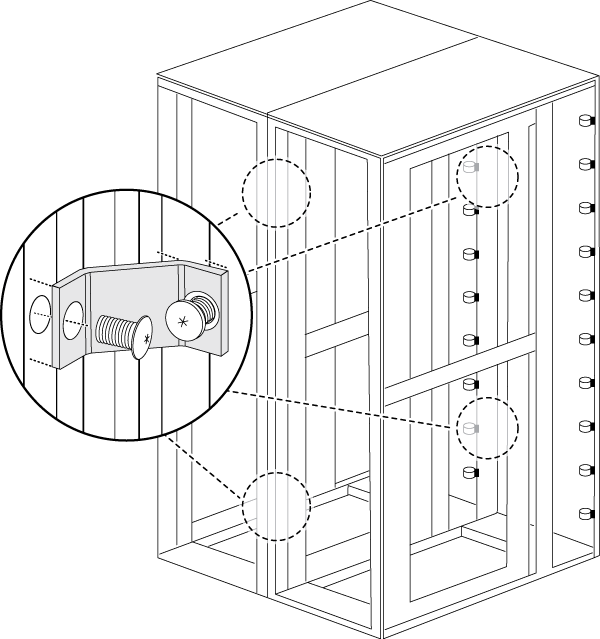

= Instale el kit de interconexión del armario
:allow-uri-read: 
:icons: font
:imagesdir: ../media/

[role="lead"]
Puede conectar los armarios de sistema juntos utilizando el kit de interconexión del armario opcional. Se recomienda instalar el kit para evitar que los armarios se separen y dañen los cables del sistema.

. Cierre los armarios del sistema.
+
Los armarios deben organizarse de forma similar a la siguiente ilustración, con el armario con los módulos de controladora del centro y los armarios con bandejas de discos adicionales en ambos lados. Los lados de los armarios deben estar cerca, pero no es necesario tocarse todavía.

+
image::../media/drw_fcc_cabinet_ordering.png[La ilustración se describe en el texto circundante.]

. Si va a instalar el kit de interconexión con los paneles laterales en, vuelva a instalar los paneles laterales que se retiraron durante el desembalaje:
+
.. Levante el panel lateral, inclinándolo unos 15 grados de distancia de la parte inferior del armario del sistema y, a continuación, cuelgue sobre el borde de la parte superior del bastidor del armario del sistema.
.. Empuje suavemente el panel lateral contra el bastidor del armario y, a continuación, bloquéelo con la llave.
.. Repita estos subpasos para los paneles laterales restantes.

. Si va a instalar el kit de interconexión con los paneles laterales quitados, quite la puerta frontal cuyas bisagras están en el borde donde se encuentran los armarios:
+
.. Desbloquee y abra la puerta delantera que se está quitando.
.. Utilice la siguiente ilustración como referencia para desconectar la alimentación del bisel iluminado:
+
image::../media/drw_sys_cab_remove_brimstone_back_banel.png[Cómo desconectar la alimentación del marco iluminado]

+
|===

 a| 
image:../media/legend_icon_01.png["Número de llamada 1"]

 a| 
Placa de circuitos y cable del bisel iluminado

 a| 
image:../media/legend_icon_02.png["Número de llamada 2"]

 a| 
Panel posterior y tornillos de mariposa

|===
.. Utilice la siguiente ilustración como referencia para extraer la puerta delantera:
+
image::../media/drw_sys_cab_front_door_daiginjo.png[Cómo retirar la puerta delantera]

+
|===

 a| 
image:../media/legend_icon_01.png["Número de llamada 1"]

 a| 
Cable de conexión a tierra de la puerta

 a| 
image:../media/legend_icon_02.png["Número de llamada 2"]

 a| 
Bisagra superior puerta

 a| 
image:../media/legend_icon_03.png["Número de llamada 3"]

 a| 
Pasador de bisagra

|===
+
Asegúrese de colocar las puertas retiradas en un lugar seguro para que no se dañen accidentalmente.

. Retire la puerta trasera cuyas bisagras están en el borde donde se encuentran los armarios:
+
.. Desbloquee y abra la puerta trasera que va a extraer.
.. Levante el pasador de la bisagra superior hasta que salga de la parte inferior de la bisagra.
.. Incline suavemente la parte superior de la puerta para separarla del bastidor del armario del sistema y, a continuación, suelte el pasador de bisagra.
.. Levante la puerta de la bisagra inferior y, a continuación, coloque la puerta a un lado.

. Mueva los armarios del sistema completamente juntos y, a continuación, alinéelos y nivelos ajustando los cuatro pies de nivelación en la parte inferior de los armarios del sistema.
. Instale los soportes de interconexión.
+
** Utilice la siguiente ilustración como referencia si va a instalar los soportes de interconexión con los paneles laterales del armario del sistema, según se recomienda: image:../media/drw_syscab_interconnect_bracket_side_panels_on.gif["Cómo instalar los soportes de interconexión con los paneles laterales del armario del sistema en"]

+
|===

 a| 
image:../media/legend_icon_01.png["Número de llamada 1"]

 a| 
Remaches de plástico a presión en la parte superior del armario del sistema

 a| 
image:../media/legend_icon_02.png["Número de llamada 2"]

 a| 
Soporte de interconexión superior

 a| 
image:../media/legend_icon_03.png["Número de llamada 3"]

 a| 
Soporte de interconexión inferior

|===
+
** Utilice la siguiente ilustración como referencia si va a instalar los soportes de interconexión con los paneles laterales del armario del sistema apagados: 

. Repita el proceso para los armarios de sistema restantes.
. Apriete todos los tornillos del soporte de interconexión.

