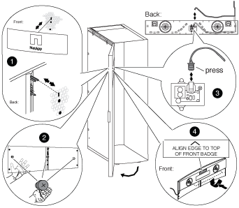

= Vuelva a instalar la puerta y el símbolo iluminado
:allow-uri-read: 
:icons: font
:imagesdir: ../media/

[role="lead"]
Después de mover la fuente de alimentación y los componentes al otro lado del armario del sistema y mover las bisagras y el cierre de bloqueo, debe volver a instalar la puerta del armario del sistema y la placa de identificación iluminada y, a continuación, volver a conectar la placa de identificación a la fuente de alimentación.

== Vuelva a instalar la puerta del armario del sistema

Después de invertir la bisagra de la puerta y el pestillo de la puerta, debe volver a instalar el cable de conexión a tierra y el conjunto de orejetas y el cable, y la puerta frontal del armario del sistema antes de volver a instalar la placa de identificación iluminada.

. Gire la puerta 180 grados.
. Alinee la parte inferior de la puerta con el poste inferior de la bisagra y, a continuación, coloque la parte inferior de la puerta en el poste de la bisagra.
. Levante el pasador de la bisagra superior para que salga de la carcasa de la bisagra.
. Incline la parte superior de la puerta hacia el alojamiento de la bisagra de forma que el pasador de bisagra y la bisagra de la puerta estén alineados y suelte el pasador de bisagra.
+
Asegúrese de que el pasador de bisagra esté completamente asentado a través de la bisagra de la puerta y de la parte inferior de la carcasa de la bisagra de la puerta.

. Vuelva a colocar el conjunto de cable y terminal de conexión a tierra en el bastidor del armario del sistema en el mismo lado de la puerta delantera recién invertida y vuelva a instalar la lengüeta de conexión a tierra con la pala en la parte superior de la puerta del armario del sistema.
. Vuelva a conectar el cable de conexión a tierra a la pala del conjunto de la lengüeta de conexión a tierra de la puerta del armario del sistema.
. Vuelva a instalar los paneles laterales o los soportes de interconexión, según corresponda:
+
** Si el armario del sistema no está conectado a otro armario del sistema, vuelva a instalar los paneles laterales.
** Si el armario del sistema está conectado a otro armario del sistema con un kit de interconexión, vuelva a instalar los soportes de interconexión.

== Vuelva a instalar el indicador luminoso

Una vez instalada la puerta del armario del sistema, deberá instalar el distintivo iluminado para completar el proceso de inversión de la puerta y, a continuación, cerrar y bloquear la puerta delantera.

. Con la siguiente ilustración como referencia, vuelva a instalar el distintivo iluminado en la puerta frontal del armario del sistema:
+

. Cierre y bloquee la puerta delantera.

