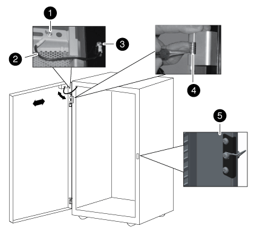

= Invierta la bisagra de la puerta y el pestillo de la cerradura
:allow-uri-read: 
:icons: font
:imagesdir: ../media/

[role="lead"]
Al invertir la puerta del armario del sistema, debe mover la bisagra y el cierre de la puerta del armario del sistema a la parte delantera del armario del sistema en posición vertical.

Necesita las siguientes herramientas:

* Destornillador Phillips
* Llave Allen de 5 mm; se recomienda una llave Allen magnética
* Alicates de punta de aguja
* Escalerilla de forma que pueda acceder fácilmente a los tornillos Allen en la bisagra superior
+
.. Retire los tornillos que fijan la bisagra superior del bastidor del armario del sistema y coloque los tornillos y la bisagra a un lado.
+

NOTE: Tenga cuidado al retirar los tornillos Allen para evitar dejarlos caer en el bastidor del armario. Los tornillos Allen de repuesto se suministran en el kit de repuestos que se suministra con el armario del sistema.

.. Retire los tornillos que fijan la bisagra inferior del bastidor del armario del sistema y coloque los tornillos y la bisagra a un lado.
+

+
|===

 a| 
image:../media/icon_round_1.png["Número de llamada 1"]

 a| 
Tornillo de conexión a tierra de la puerta con horquilla de cable de conexión a tierra

 a| 
image:../media/icon_round_2.png["Número de llamada 2"]

 a| 
Cable de conexión a tierra

 a| 
image:../media/icon_round_3.png["Número de llamada 3"]

 a| 
Terminal del cable de conexión a tierra del bastidor

 a| 
image:../media/icon_round_4.png["Número de llamada 4"]

 a| 
Bisagra superior de la puerta delantera con pasador de bisagra sujetada por la abrazadera de sujeción

 a| 
image:../media/icon_round_5.png["Número de llamada 5"]

 a| 
Cierre de bloqueo

|===
.. Invertir el pasador de bisagra de la bisagra superior:
+
... Levante el pasador de la bisagra y exponga la abrazadera de retención en el eje del pasador de la bisagra.
... Con ayuda de los alicates de punta de aguja, retirar suavemente la abrazadera de sujeción del eje del pasador de bisagra y separarla.
... Deslice el pasador de la bisagra y el resorte para sacarlo del cuerpo de la bisagra.
... Gire la bisagra de forma que los orificios de rosca estén orientados hacia el lado opuesto de la bisagra y, a continuación, instale el pasador de bisagra y el resorte de nuevo en la bisagra.
... Instale la abrazadera de sujeción de la bisagra en el pasador de la bisagra.
+
Asegúrese de empujar la abrazadera de sujeción completamente en el pasador de la bisagra.

.. Vuelva a instalar las bisagras:
+
... Inserte el tornillo Allen superior a través del armario del sistema en posición vertical, alineándolo con el orificio roscado superior de la bisagra superior y, a continuación, apriete parcialmente el tornillo Allen.
+
No apriete completamente el tornillo hasta que haya instalado el segundo tornillo Allen.

... Inserte el tornillo Allen inferior a través del armario del sistema en posición vertical, alineándolo con el orificio roscado inferior de la bisagra superior y, a continuación, apriete parcialmente el tornillo Allen.
... Apriete los tornillos Allen superior e inferior.
... Repita estos pasos para la bisagra inferior.

.. Retire los tornillos del pestillo de bloqueo y, a continuación, mueva el pestillo de bloqueo hacia arriba en el armario del sistema lateral delantero opuesto.
.. Gire el enganche 180 grados y, a continuación, fíjelo al armario del sistema en posición vertical.

