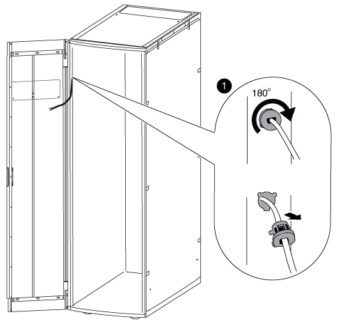

= Mueva la fuente de alimentación y el cableado de la insignia
:allow-uri-read: 
:icons: font
:imagesdir: ../media/

[role="lead"]
Antes de invertir la puerta y volver a instalar la placa de identificación iluminada, debe desplazar la fuente de alimentación y el cableado de la placa de identificación iluminada al lado opuesto del bastidor del armario del sistema.

Debe haber quitado la puerta del armario del sistema y los paneles laterales.

Debe mover la fuente de alimentación, el cable de alimentación y el conducto de cableado de la placa de identificación iluminada al lado opuesto del armario del sistema al invertir la puerta del armario del sistema. El conjunto está diseñado de forma que el cable que va a la placa esté en el lateral del armario donde está instalada la bisagra de la puerta.

. Abra el clip de sujeción del cable de alimentación y, a continuación, desconecte el cable de alimentación de la fuente de alimentación.
. Retire la carcasa de la fuente de alimentación y la fuente de alimentación, con la ilustración como referencia:
+
image::../media/drw_sys_cab_bezel_psu_remove_ozeki.gif[la fuente de alimentación del marco de la cabina drw sys quita ozeki]

+
.. Levante el pasador de retención de la carcasa de la fuente de alimentación y, a continuación, retire la cubierta de la carcasa girándola hacia abajo y levántela de la carcasa de la fuente de alimentación trasera.
+

NOTE: La fuente de alimentación está conectada a la carcasa de la fuente de alimentación con un parche de gancho y bucle.

.. Desconecte la fuente de alimentación del cable del indicador luminoso y, a continuación, coloque la cubierta de la fuente de alimentación y de la fuente de alimentación en un lateral.
.. Retire los tornillos de la parte superior e inferior de la carcasa de la fuente de alimentación que está conectada al bastidor del armario del sistema y, a continuación, extraiga la carcasa de la fuente de alimentación.

. Instale la fuente de alimentación y la carcasa de la fuente de alimentación en el lado opuesto del armario del sistema:
+
.. Coloque los dos orificios de tornillo situados uno al lado del otro en el bastidor del armario y, a continuación, fije la parte superior de la carcasa de la fuente de alimentación a la parte inferior de los dos orificios de tornillo.
+

NOTE: Es posible que deba retirar la correa de retención del cable inferior, si la hay.

.. Fije la parte inferior de la carcasa de la fuente de alimentación al bastidor del armario del sistema.
.. Instale la cubierta de la fuente de alimentación y la fuente de alimentación alineando los ganchos de la cubierta con la fuente de alimentación hacia atrás, tirando del émbolo hacia arriba en la cubierta, girando el émbolo hacia arriba y soltando el émbolo.

. Retire el conducto de la fuente de alimentación del bisel quitando las abrazaderas de retención del conducto de las abrazaderas de retención y, a continuación, deslice el conducto fuera del cable de alimentación.
+
Mantenga las abrazaderas de retención y los tornillos para instalar el conducto en el lado opuesto del armario.

+
image::../media/drw_sys_cab_bezel_power_conduit_ozeki.gif[marco de la cabina drw sys, conducto de alimentación, ozeki]

. Mueva el cable de alimentación de la placa a la otra parte del armario:
+

+
.. Gire el retenedor del cable de goma del armario en posición vertical 180° hacia la derecha, retírelo del bastidor del armario del sistema y, a continuación, tire suavemente del cable para extraerlo del armario del sistema.
.. Mueva el cable hacia el otro lado del armario y, a continuación, enrosca completamente a través del orificio cerca de la parte superior del armario en posición vertical.
.. Alinee el retenedor del cable de caucho con el orificio del bastidor, empújelo hasta que alcance y, a continuación, gire el retenedor del cable 180° hacia la izquierda para fijarlo.
.. Lleve el cable a lo largo del bastidor del armario hacia la parte posterior del armario.

. Vuelva a instalar el conducto del cable:
+
.. Deslice el conducto sobre el cable de alimentación de la PDU y pase el conducto a lo largo del bastidor del armario del sistema hasta la PDU.
.. Instale las abrazaderas de retención del conducto del otro lado del armario sobre el conducto para fijarlo al bastidor del armario.

. Vuelva a enchufar el cable de identificación a la fuente de alimentación, pero no vuelva a conectar la fuente de alimentación.

