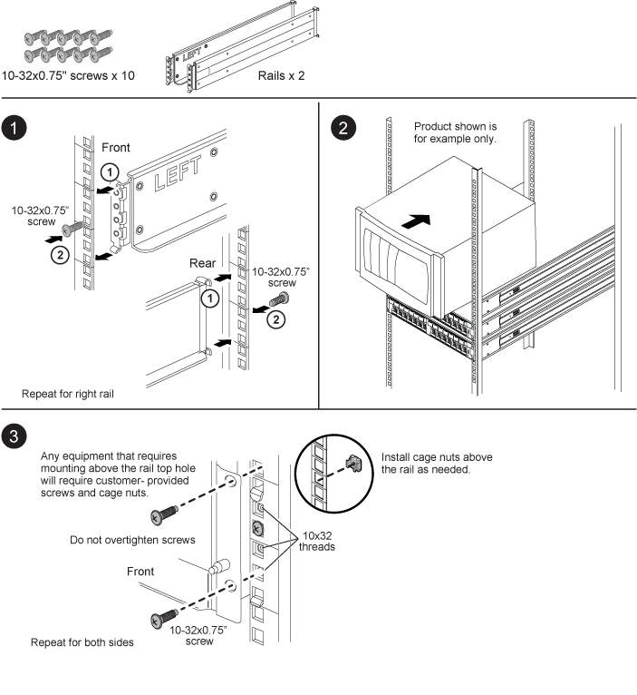

= Instrucciones de instalación del kit SuperRail
:allow-uri-read: 
:icons: font
:imagesdir: ../media/

[role="lead"]
El SuperRail se puede instalar en un rack estándar de cuatro postes de orificio cuadrado o en un rack estándar de cuatro postes de orificio redondo mediante los soportes adaptadores de orificio redondo a cuadrado.

NOTE: La profundidad mínima entre los puntos de conexión delanteros y traseros para la instalación de SuperRail es de 24 pulgadas y mientras que la profundidad máxima es de 32 pulgadas.

== Instalación de SuperRail en bastidor de cuatro postes con orificio cuadrado

== Instalación de SuperRail en bastidor de cuatro postes de orificio redondo

image::../media/drw_superrail_round_hole_four_post_kit_re_release.png[Cómo instalar SuperRail en un rack de cuatro postes de orificio redondo]
