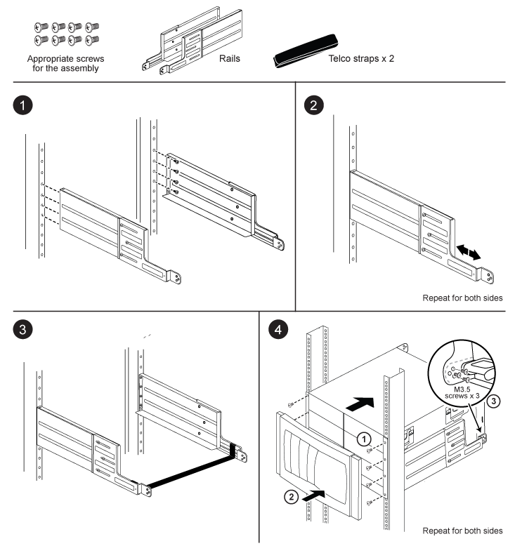

= Instrucciones de instalación del kit de rieles de soporte de dos parantes: A700 y FAS9000 de AFF
:allow-uri-read: 
:icons: font
:imagesdir: ../media/

[role="lead"]
Existen dos kits de guías de soporte de dos parantes que se pueden utilizar con los sistemas FAS9000 y A700 de AFF. Un kit le permite montar el sistema al ras en el rack de dos postes, y el otro kit le permite montar el sistema a la mitad en el rack de dos postes.

== Instale el kit de rieles de montaje medio de dos postes

image::../media/drw_telco_mid_mount_1.png[Cómo instalar el kit de raíl de montaje hasta la mitad de dos postes]

== Instale el kit de raíl de montaje empotrado de dos postes

