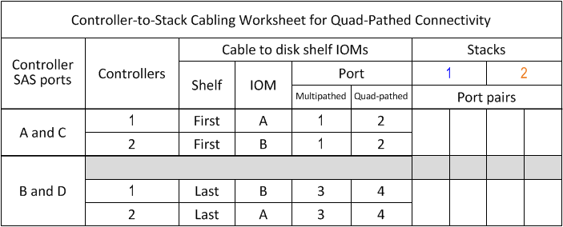

= Plantilla de hoja de trabajo para el cableado de controladora a pila para la conectividad de cuatro rutas: Bandejas con módulos IOM12/IOM12B
:allow-uri-read: 
:icons: font
:imagesdir: ../media/

[role="lead"]
Al completar la plantilla de hoja de cálculo, puede definir los pares de puertos SAS de controladoras que puede utilizar para cablear los controladores a las pilas de bandejas de discos con módulos IOM12/IOM12B para lograr conectividad con cuatro rutas en una configuración de par de alta disponibilidad o de controlador individual. También puede usar la hoja de datos completada para caminar por el cableado de las conexiones de cuatro rutas para la configuración.

.Acerca de su tarea
* Este procedimiento y la plantilla de la hoja de trabajo son aplicables a la conectividad de cuatro rutas para una configuración de alta disponibilidad de cuatro rutas o de cuatro rutas con una o varias pilas.
+
Se proporcionan ejemplos de hojas de trabajo completadas para configuraciones de ruta cuádruple de alta disponibilidad y ruta cuádruple.

+
En la hoja de trabajo se utiliza una configuración con dos HBA SAS de cuatro puertos y dos pilas de bandejas de discos con módulos IOM12/IOM12B.

* La plantilla de hoja de cálculo permite hasta dos pilas; si es necesario, debe agregar más columnas.
* La conectividad de cuatro rutas para las conexiones entre el controlador y el bloque consta de dos conjuntos de cables multipathed: El primer conjunto de cables se denomina "multipathed"; el segundo conjunto de cables se denomina "quad-pathed".
+
El segundo conjunto de cables se denomina «quad-pathed», ya que al completar este conjunto de cables se proporciona la conectividad de cuatro rutas desde una controladora a una pila en una configuración de par de alta disponibilidad o de una sola controladora.

* Los puertos IOM 1 y 3 de la bandeja de discos siempre se utilizan para cableado multivía y los puertos IOM 2 y 4 siempre se utilizan para cableado de ruta cuádruple, como lo designan los encabezados de columna de la hoja de datos.
* En los ejemplos de la hoja de datos, los pares de puertos se designan para cableado multivía o cableado de cuatro rutas en la pila correspondiente.
+
Cada par de puertos designado para el cableado con múltiples pathed está rodeado por un óvalo que es el color asociado con la pila a la que se cableó. Cada par de puertos designado para el cableado con cuatro pathed está rodeado por un rectángulo que es el color asociado con la pila a la que se conecta por cable. La pila 1 está asociada con el color azul; la pila 2 está asociada con el color naranja.

* Si es necesario, puede consultar link:install-cabling-rules.html["Reglas y conceptos del cableado SAS"] para obtener información acerca de la convención de numeración de ranuras de controladoras, la conectividad de bandeja a bandeja y la conectividad de controladora a bandeja (incluido el uso de parejas de puertos).
* Si es necesario, después de completar la hoja de cálculo, puede hacer referencia a link:install-cabling-worksheets-how-to-read-quadpath.html["Cómo leer una hoja de cálculo para cablear las conexiones de controladora a pila para la conectividad con cuatro rutas"].

.Pasos
. En los cuadros situados encima de los cuadros grises, enumere todos los puertos SAS A del sistema y, a continuación, todos los puertos SAS C del sistema en secuencia de ranuras (0, 1, 2, 3, etc.).
+
Por ejemplo: 1a, 2a, 1c, 2c

. En los cuadros grises, enumere todos los puertos SAS B del sistema y, a continuación, todos los puertos SAS D del sistema en secuencia de ranuras (0, 1, 2, 3, etc.).
+
Por ejemplo: 1b, 2b, 1d, 2d

. En los cuadros que aparecen debajo de los cuadros grises, vuelva a escribir la lista de puertos D y B para que el primer puerto de la lista se mueva al final de la lista.
+
Por ejemplo: 2b, 1d, 2d, 1b

. Identifique los dos conjuntos de pares de puertos que se conectarán a la pila 1 dibujando un óvalo alrededor del primer conjunto de pares de puertos y un rectángulo alrededor del segundo conjunto de pares de puertos.
+
Ambos conjuntos de cables son necesarios para obtener una conectividad de cuatro rutas desde cada controladora a la pila 1 en el par de alta disponibilidad o en la configuración de una sola controladora.

+
En el siguiente ejemplo se utiliza el par de puertos 1a/2b para el cableado multipathed y el par de puertos 2a/1d para el cableado de cuatro pathed a la pila 1.

+
image::../media/drw_worksheet_qpha_slots_1_and_2_two_4porthbas_two_stacks_set1_circled_nau.gif[Hoja de datos para el cableado de alta disponibilidad de ruta cuádruple que muestra los pares de puertos conectados a la pila 1]

. Identifique los dos conjuntos de pares de puertos que se conectarán a la pila 2 dibujando un óvalo alrededor del primer conjunto de pares de puertos y un rectángulo alrededor del segundo conjunto de pares de puertos.
+
Ambos conjuntos de cables son necesarios para obtener una conectividad de cuatro rutas desde cada controladora a la pila 1 en el par de alta disponibilidad o en la configuración de una sola controladora.

+
En el siguiente ejemplo se utiliza el par de puertos 1c/2d para el cableado multivía y el par de puertos 2c/1b para el cableado de cuatro rutas a la pila 2.

+
image::../media/drw_worksheet_qpha_slots_1_and_2_two_4porthbas_two_stacks_nau.gif[Hoja de datos para el cableado de alta disponibilidad de ruta cuádruple que muestra los pares de puertos conectados a la pila 2]

. Si tiene una configuración de ruta cuádruple (controladora individual), vaya a la información de la controladora 2; solo se necesita la información de la controladora 1 para conectar las conexiones de la controladora a la pila.
+
El ejemplo siguiente muestra que se ha cruzado la información de la controladora 2.

+
image::../media/drw_worksheet_qp_slots_1_and_2_two_4porthbas_two_stacks_nau.gif[Hoja de datos sobre el cableado de controladora individual de ruta cuádruple donde se muestran los pares de puertos conectados a la pila 1 y 2]

