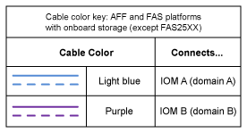
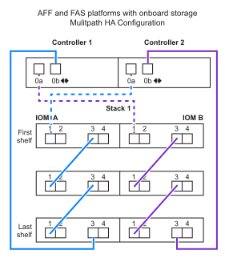

= Hojas de trabajo de cableado para bandejas DS212C, DS224C o DS460C con plataformas de almacenamiento internas
:allow-uri-read: 
:icons: font
:imagesdir: ../media/

[role="lead"]
Puedes usar las hojas de trabajo de cableado de controlador a pila ya completadas y los ejemplos de cableado para conectar plataformas con almacenamiento interno. Esto aplica a los shelves con módulos IOM12, IOM12B o IOM12C.

* Si es necesario, puede consultar link:install-cabling-rules.html["Reglas y conceptos del cableado SAS"] para obtener información sobre las configuraciones compatibles, la conectividad de bandeja a bandeja y la conectividad de controladora a bandeja.
* Los ejemplos de cableado muestran los cables de la controladora a la pila como sólidos o discontinuos para distinguir las conexiones de los puertos 0b/0b1 del controlador de las conexiones de los puertos 0A del controlador.
+
image::../media/drw_fas2600_controller_to_stack_cable_type_key_IEOPS-947.svg[Llave de tipo de cable para plataformas con almacenamiento integrado]

* Los ejemplos de cableado muestran conexiones de controladora a pila y conexiones de bandeja a bandeja en dos colores diferentes para distinguir la conectividad a través de IOM A (dominio A) e IOM B (dominio B).
+

== Plataforma FAS2820 en una configuración de alta disponibilidad multivía sin bandejas externas

El siguiente ejemplo muestra que no es necesario ningún cableado para adquirir conectividad de alta disponibilidad multivía:

image::../media/drw_fas2800_noshelf_mpha_IEOPS-954.svg[Alta disponibilidad multivía de FAS2820 sin bandejas externas]

== Plataforma FAS2820 en una configuración de alta disponibilidad de tres vías sin bandejas externas

En el siguiente ejemplo de cableado se muestra el cableado necesario entre las dos controladoras para lograr una conectividad de tres rutas:

image::../media/drw_fas2800_noshelf_tpha_IEOPS-955.svg[Fas2800 Ejemplo de cableado de alta disponibilidad de triple ruta sin bandejas externas]

== Plataforma FAS2820 en una configuración de alta disponibilidad de tres rutas con una pila de varias bandejas

La siguiente hoja de datos y ejemplo de cableado utiliza el par de puertos 0A/0b1:

image::../media/drw_fas2800_worksheet_IEOPS-948.svg[FAS2820 Hoja de datos para el cableado de alta disponibilidad de tres rutas que muestra los pares de puertos para la pila 1]

image::../media/drw_fas2800_withshelves_tpha_IEOPS-949.svg[Ejemplo de cableado de alta disponibilidad de tres rutas de FAS2820 a una pila]

== Plataformas con almacenamiento interno en una configuración de alta disponibilidad multivía con una pila de varias bandejas

En el siguiente ejemplo de hoja de datos y cableado se utiliza la pareja de puertos 0a/0b:

NOTE: Esta sección no se aplica a los sistemas FAS2820.

image::../media/drw_fas2600_mpha_worksheet_IEOPS-1255.svg[Hoja de cálculo de cableado de alta disponibilidad multivía para plataformas con almacenamiento interno y una pila]

