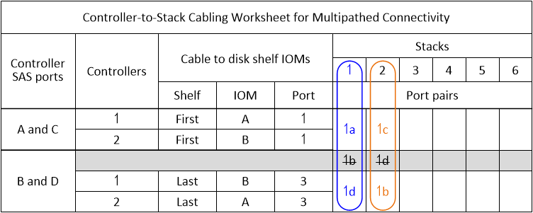

= Hojas de trabajo para el cableado de controladora a pila y ejemplos de cableado para configuraciones de alta disponibilidad multivía: Bandejas con módulos IOM12/IOM12B
:allow-uri-read: 
:icons: font
:imagesdir: ../media/

[role="lead"]
Puede utilizar las hojas de datos de cableado entre controladoras y pilas y ejemplos de cableado para cablear el par de alta disponibilidad como configuración de alta disponibilidad multivía.

NOTE: Esta información se aplica a plataformas sin almacenamiento interno.

* Si es necesario, puede consultar link:install-cabling-rules.html["Reglas y conceptos del cableado SAS"] para obtener información sobre las configuraciones compatibles, la convención de numeración de ranuras de la controladora, la conectividad de bandeja a bandeja y la conectividad de controladora a bandeja (incluido el uso de pares de puertos).
* Si es necesario, puede consultar link:install-cabling-worksheets-how-to-read-multipath.html["Cómo leer una hoja de cálculo para cablear las conexiones entre la controladora y la pila para la conectividad multivía"].
* Los ejemplos de cableado muestran cables de controladora a pila como sólidos o discontinuas para distinguir las conexiones de los puertos C y de la controladora a de las conexiones de los puertos D y B.
+
image::../media/drw_controller_to_stack_cable_type_key.gif[Clave de tipo de cable de configuración de alta disponibilidad multivía]

* Los cables de los ejemplos de cableado y sus pares de puertos correspondientes en las hojas de trabajo están codificados con colores para distinguir la conectividad con cada pila del par de alta disponibilidad.
+
image::../media/drw_controller_to_stack_cable_color_key_non2600_4stackcolors.gif[Clave de color del cable de configuración de alta disponibilidad multivía]

* Las hojas de datos y los ejemplos de cableado muestran parejas de puertos de cableado en el orden en que se enumeran en la hoja de cálculo.

== Hojas de datos de cableado entre controladora y pila y ejemplos de cableado para configuraciones de alta disponibilidad multivía con HBA SAS de cuatro puertos

Puede utilizar las hojas de datos de cableado de controladora a pila completadas y ejemplos de cableado para cablear las configuraciones de alta disponibilidad multivía comunes que tienen HBA SAS de cuatro puertos. Estas controladoras no cuentan con puertos SAS integrados.

=== Alta disponibilidad multivía con un HBA SAS de cuatro puertos y una pila de una sola bandeja

En el siguiente ejemplo de hoja de datos y cableado se utiliza el par de puertos 1a/1d:

image::../media/drw_worksheet_mpha_slot_1_one_4porthba_one_singleshelf_stack.gif[Hoja de cálculo de cableado de alta disponibilidad multivía para un HBA SAS de puerto cuádruple y una pila de bandeja única]

image::../media/drw_mpha_slot_1_one_4porthba_one_singleshelf_stack.gif[Ejemplo de cableado de alta disponibilidad multivía para un HBA SAS de puerto cuádruple y una pila de bandeja única]

=== Alta disponibilidad multivía con un HBA SAS de cuatro puertos y dos pilas de una sola bandeja

En el siguiente ejemplo de hoja de datos y cableado se utilizan las parejas de puertos 1a/1d y 1c/1b:

image::../media/drw_mpha_slot_1_one_4porthba_two_singleshelf_stacks.gif[Ejemplo de cableado de alta disponibilidad multivía para un HBA SAS de puerto cuádruple y dos pilas de bandejas individuales]

=== Alta disponibilidad multivía con dos HBA SAS de cuatro puertos y dos pilas de varias bandejas

Hay cuatro pares de puertos disponibles para esta configuración: 1a/2b, 2a/1d, 1c/2d y 2c/1b. Puede cablear las parejas de puertos en el orden en el que se identifican (aparecen en la hoja de datos) o bien conectar todas las demás parejas de puertos (omitir parejas de puertos).

NOTE: Si tiene más pares de puertos de los que necesita para conectar las pilas en el sistema, la práctica recomendada es omitir los pares de puertos para optimizar los puertos SAS en el sistema. Al optimizar los puertos SAS, optimiza el rendimiento del sistema.

En el siguiente ejemplo de hoja de cálculo y cableado se muestran los pares de puertos que se están utilizando en el orden en que se enumeran en la hoja de cálculo: 1a/2b, 2a/1d, 1c/2d y 2c/1b.

image::../media/drw_worksheet_mpha_slots_1_and_2_two_4porthbas_two_stacks.gif[Hoja de cálculo de cableado de alta disponibilidad multivía para dos HBA SAS de cuádruple puerto y dos pilas de varias bandejas]

image::../media/drw_mpha_slots_1_and_2_4porthbas_4_stacks.gif[Ejemplo de cableado de alta disponibilidad multivía para dos HBA SAS de cuádruple puerto y dos pilas de varias bandejas]

En el siguiente ejemplo de hoja de cálculo y cableado se muestran los pares de puertos que se omiten para utilizarlos entre sí en la lista: 1a/2b y 1c/2d.

NOTE: Si posteriormente se agrega una tercera pila, se utiliza el par de puertos que se omitió.

image::../media/drw_worksheet_mpha_slots_1_and_2_two_4porthbas_two_stacks_skipped.gif[Hoja de cálculo de cableado de alta disponibilidad multivía para dos HBA SAS de cuádruple puerto y dos pilas de bandejas múltiples mediante pares de puertos omitidos]

image::../media/drw_mpha_slots_1_and_2_two_4porthbas_two_stacks_skipped.gif[Ejemplo de cableado de alta disponibilidad multivía para dos HBA SAS de cuádruple puerto y dos pilas de bandejas múltiples mediante pares de puertos omitidos]

== Hojas de trabajo de cableado entre controladora y pila y ejemplos de cableado para configuraciones de alta disponibilidad multivía con cuatro puertos SAS integrados

Puede utilizar las hojas de datos de cableado completadas de controladora a pila y ejemplos de cableado para cablear las configuraciones comunes de alta disponibilidad multivía que tienen cuatro puertos SAS incorporados.

=== Alta disponibilidad multivía con cuatro puertos SAS integrados y una pila de bandeja única

En el siguiente ejemplo de hoja de datos y cableado se utiliza el par de puertos 0a/0d:

image::../media/drw_worksheet_mpha_slot_0_4ports_one_singleshelf_stack.gif[Hoja de cálculo del cableado de alta disponibilidad multivía para cuatro puertos incorporados y una única pila de bandeja]

image::../media/drw_mpha_slot_0_4ports_one_singleshelf_stack.gif[Ejemplo de cableado de alta disponibilidad multivía para cuatro puertos incorporados y una única pila de bandeja]

=== Alta disponibilidad multivía con cuatro puertos SAS integrados y dos pilas de bandeja única

En el siguiente ejemplo de hoja de datos y cableado se utilizan los pares de puertos 0a/0d y 0c/0b:

image::../media/drw_worksheet_mpha_slot_0_4ports_two_singleshelf_stacks.gif[Hoja de cálculo para el cableado de alta disponibilidad multivía para cuatro puertos incorporados y dos pilas de bandeja única]

image::../media/drw_mpha_slot_0_4ports_two_singleshelf_stacks.gif[Ejemplo de cableado de alta disponibilidad multivía para cuatro puertos incorporados y dos pilas de bandeja única]

=== Alta disponibilidad multivía con cuatro puertos SAS integrados, un HBA SAS de cuatro puertos y dos pilas de varias bandejas

Hay cuatro parejas de puertos disponibles para esta configuración: 0a/1b, 1a/0d, 0c/1d y 1c/0b. Puede cablear las parejas de puertos en el orden en el que se identifican (aparecen en la hoja de datos) o bien conectar todas las demás parejas de puertos (omitir parejas de puertos).

NOTE: Si tiene más pares de puertos de los que necesita para conectar las pilas en el sistema, la práctica recomendada es omitir los pares de puertos para optimizar los puertos SAS en el sistema. Al optimizar los puertos SAS, optimiza el rendimiento del sistema.

En el siguiente ejemplo de hoja de datos y cableado se muestran las parejas de puertos que se están utilizando en el orden en que se enumeran en la hoja de cálculo: 0a/1b, 1a/0d, 0c/1d y 1c/0b.

image::../media/drw_worksheet_mpha_slots_0_and_1_8ports_4stacks.gif[Hoja de datos de cableado de alta disponibilidad multivía para cuatro puertos SAS internos, un HBA SAS de cuatro puertos y dos pilas de múltiples bandejas]

image::../media/drw_mpha_slots_0_and_1_8ports_4_stacks.gif[Ejemplo de cableado de alta disponibilidad multivía para cuatro puertos SAS integrados un HBA SAS de cuatro puertos y dos pilas de varias bandejas]

En el siguiente ejemplo de hoja de datos y cableado se muestran las parejas de puertos que se están omitando para utilizarlo entre sí de la lista: 0a/1b y 0c/1d.

NOTE: Si posteriormente se agrega una tercera pila, se utiliza el par de puertos que se omitió.

image::../media/drw_worksheet_mpha_slots_0_and_1_8ports_two_stacks_skipped.gif[Hoja de datos de cableado de alta disponibilidad multivía para cuatro puertos incorporados Un HBA SAS de cuádruple puerto y dos pilas de bandejas múltiples mediante pares de puertos omitidos]

image::../media/drw_mpha_slots_0_and_1_8ports_two_stacks_skipped.gif[Ejemplo de cableado de alta disponibilidad multivía para cuatro puertos incorporados Un HBA SAS de cuádruple puerto y dos pilas de bandejas múltiples mediante pares de puertos omitidos]
