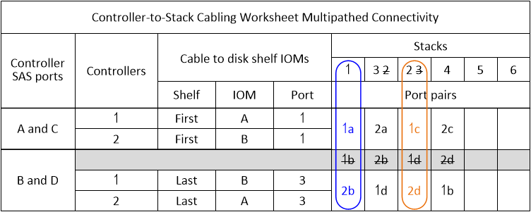

= Cómo leer una hoja de cálculo para cablear conexiones de controlador a pila para conectividad multitrayecto: DS212C, DS224C o DS460C
:allow-uri-read: 
:icons: font
:imagesdir: ../media/

[role="lead"]
Puede utilizar este ejemplo como guía para leer y aplicar una hoja de trabajo completada para cablear las conexiones de controladora a pila para las bandejas de discos con módulos IOM12/IOM12B para la conectividad multipathed.

.Antes de empezar
Si tiene una plataforma con almacenamiento interno, use la siguiente hoja de trabajo:

link:install-cabling-worksheets-examples-fas2600.html["Hojas de trabajo para el cableado entre controladora y pila y ejemplos de cableado para las plataformas con almacenamiento interno"]

.Acerca de esta tarea
* Este procedimiento hace referencia al siguiente ejemplo de hoja de datos y cableado para mostrar cómo leer una hoja de datos para cablear las conexiones de la controladora a la pila.
+
La configuración utilizada en este ejemplo es una configuración de alta disponibilidad multivía con dos HBA SAS de cuatro puertos (ocho puertos SAS) en cada controladora y dos pilas de bandejas de discos con módulos IOM12/IOM12B. Las parejas de puertos se cablean omitiendo cada otro par de puertos de la hoja de cálculo.

+

NOTE: Si tiene más pares de puertos de los que necesita para conectar las pilas en el sistema, la práctica recomendada es omitir los pares de puertos para optimizar los puertos SAS en el sistema. Al optimizar los puertos SAS, optimiza el rendimiento del sistema.

* Si tiene una configuración de controladora única, omita los pasos b y d para cableado a una segunda controladora.
* Si es necesario, puede consultar link:install-cabling-rules.html["Reglas y conceptos del cableado SAS"] para obtener información acerca de la convención de numeración de ranuras de controladoras, la conectividad de bandeja a bandeja y la conectividad de controladora a bandeja (incluido el uso de parejas de puertos).

Los pares de puertos se cablean con cada par de puertos de la hoja de trabajo: 1a/2b y 1c/2d.

image::../media/drw_mpha_slots_1_and_2_two_4porthbas_two_stacks_skipped.gif[Ejemplo de cableado para conectividad multivía mediante pares de puertos omitidos]

.Pasos
. Pareja de puertos de cable 1a/2b en cada controladora a la pila 1:
+
.. Conecte el puerto 1a del controlador 1 a la pila 1, primer puerto IOM a de la bandeja 1.
.. Conecte el cable de la controladora 2 al puerto 1a a la pila 1, primer puerto IOM B de la bandeja 1.
.. Conecte el puerto 2b de la controladora 1 a la pila 1, último puerto IOM B 3 de la bandeja.
.. Conecte el puerto 2b de la controladora 2 a la pila 1, último puerto IOM a de la bandeja 3.

. Par de puertos de cable 1c/2d en cada controladora a la pila 2:
+
.. Conecte el cable de la controladora 1 al puerto 1c a la pila 2, primero a el puerto 1 de IOM de la bandeja.
.. Conecte el cable de la controladora 2 al puerto 1c a la pila 2, el primer puerto 1 de IOM B de la bandeja.
.. Conecte el cable del controlador 1, puerto 2d a la pila 2, último puerto IOM B 3 de la bandeja.
.. Conecte el cable del controlador 2, puerto 2d a la pila 2, último puerto IOM a de la bandeja 3.

