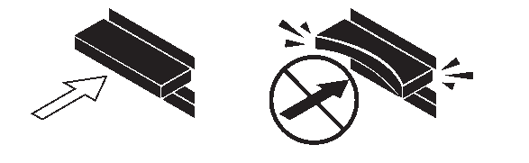

= Instalación y cableado de estantes: DS212C, DS224C o DS460C
:allow-uri-read: 
:icons: font
:imagesdir: ../media/

[role="lead"]
Si su nuevo sistema, una pareja de alta disponibilidad o una configuración de controladora única, no viene instalada en un armario, puede instalar y cablear las bandejas de discos de un rack.

.Acerca de esta tarea
* Las bandejas de discos con módulos IOM12/IOM12B se envían con ID de bandeja predefinidos en 00.
+

NOTE: Si tiene una pareja de alta disponibilidad con al menos dos pilas, la bandeja de discos que contiene los agregados raíz de la segunda pila tiene un ID de bandeja predefinido en 10.

+
Debe definir ID de bandeja para que sean únicos en las configuraciones de par de alta disponibilidad o de controladora única. Puede establecer ID de bandeja manualmente o tener asignados automáticamente a todas las bandejas de discos en el par de alta disponibilidad o en la configuración de una sola controladora por medio de un comando en modo de mantenimiento. Se proporcionan instrucciones para ambos métodos.

* Puede identificar los estantes de discos que contienen los agregados raíz mediante las etiquetas en la caja del estante de discos y en el chasis del estante de discos.
+
Las etiquetas muestran el número de pila; por ejemplo, *bucle o pila #: 1* y *bucle o pila #: 2*. Las bandejas de discos que no contienen los agregados raíz solo muestran el número de serie de la bandeja de discos en las etiquetas.

* Si durante la configuración del sistema no se configura para usar la asignación automática de propiedad del disco, deberá asignarla manualmente.
* La ruta de control alternativa en banda (IBACP) se activa automáticamente.
+
IBACP no es compatible con las configuraciones de alta disponibilidad o de ruta única.

.Antes de empezar
Debe cumplir ciertos requisitos y familiarizarse con las mejores prácticas y consideraciones para este procedimiento antes de instalar y cablear los estantes de discos.

* Obtenga las instrucciones de instalación y configuración para su modelo de plataforma.
+
Las instrucciones de instalación y configuración describen el procedimiento completo para la instalación, configuración y configuración de su sistema. Utilice este procedimiento junto con las instrucciones de instalación y configuración de la plataforma únicamente si necesita información detallada sobre la instalación o el cableado de las bandejas de discos a su sistema de almacenamiento.

+
Las instrucciones de instalación y configuración se pueden encontrar navegando a su plataforma en el link:../index.html["Documentación de los sistemas AFF y FAS"] .

* Las bandejas de discos y las controladoras no deben estar encendidas en este momento.
* *Mejor práctica*: Asegúrese de que su sistema pueda reconocer y utilizar las unidades de disco recién calificadas  https://mysupport.netapp.com/site/downloads/firmware/disk-drive-firmware/download/DISKQUAL/ALL/qual_devices.zip["descargando la versión actual del Paquete de Calificación de Disco (DQP)"^] .
+
Esto le permite evitar mensajes de eventos del sistema sobre información de disco inactualizada. También evita la posible interrupción de la partición del disco debido a que no se reconocen las unidades. El DQP le notifica sobre el firmware de la unidad de disco inactualizado.

* *Mejor práctica*: Verifique que las conexiones SAS estén cableadas correctamente y que los IDS de estante sean únicos dentro del par HA o la configuración de un solo controlador.  https://mysupport.netapp.com/site/tools["Descargar y ejecutar Config Advisor"^] después de una nueva instalación del sistema.
+
Si se genera algún error de cableado SAS o ID de bandeja duplicado, siga las acciones correctivas proporcionadas.

+
Se necesita acceso a la red para descargar Config Advisor.

* Familiarícese con las consideraciones para manipular correctamente los cables SAS:
+
** Si utiliza cables ópticos mini-SAS HD SAS, debe haber cumplido las reglas de link:install-cabling-rules.html#mini-sas-hd-sas-optical-cable-rules["Reglas de cable óptico SAS HD Mini-SAS"].
** Inspeccione visualmente el puerto SAS para comprobar la orientación correcta del conector antes de enchufarlo.
+
Los conectores del cable SAS están codificados. Cuando se orienta correctamente a un puerto SAS, el conector hace clic en su lugar y si la bandeja de discos se enciende en ese momento, el LED LNK de puerto SAS de la bandeja de discos se ilumina en verde. En el caso de las bandejas de discos, inserte un conector de cable SAS con la pestaña extraíble orientada hacia abajo (en la parte inferior del conector).

+
En el caso de las controladoras, la orientación de los puertos SAS puede variar en función del modelo de plataforma. Por lo tanto, la orientación correcta del conector del cable SAS varía.

** Para evitar un rendimiento degradado, no gire, pliegue, pellizque ni pellizque los cables.
+
Los cables tienen un radio de pliegue mínimo. Las especificaciones del fabricante del cable definen el radio de pliegue mínimo; sin embargo, una guía general para el radio de pliegue mínimo es 10 veces el diámetro del cable.

** *Mejor práctica*: Use envolturas de velcro en lugar de bridas para agrupar y asegurar los cables del sistema y así permitir ajustes más fáciles de los cables.

* Familiarícese con las consideraciones para manipular correctamente las unidades DS460C:
+
** Las unidades se agrupan por separado del chasis de la bandeja.
+
Debe realizar un inventario de las unidades junto con el resto del equipo del sistema recibido.

** Después de desempaquetar las unidades, debería guardar el material de embalaje para usarlo en el futuro.
+

CAUTION: *Posible pérdida de acceso a los datos:* Si en el futuro, es posible mover la bandeja a una parte diferente del centro de datos o transportar la bandeja a una ubicación diferente, es necesario quitar las unidades de los cajones de unidades para evitar posibles daños en los cajones y las unidades.

+

NOTE: Mantenga las unidades de disco en su bolsa ESD hasta que esté listo para instalarlas.

** Cuando manipule las unidades, utilice siempre una muñequera ESD conectada a tierra a una superficie sin pintar en el chasis del gabinete de almacenamiento para evitar descargas estáticas.
+
Si no hay ninguna correa de mano disponible, toque una superficie sin pintar en el chasis de la caja de almacenamiento antes de manejar la unidad de disco.

== Paso 1: Instalar estantes de discos para una nueva instalación del sistema

Las bandejas de discos se instalan en un rack utilizando los kits de montaje en rack que se incluyen con las bandejas de discos.

. Instale el kit de montaje en rack (para instalaciones de rack de dos o cuatro parantes) que se incluye con la bandeja de discos mediante el folleto de instalación incluido con el kit.
+

NOTE: Si va a instalar varias bandejas de discos, debe instalarlas desde la parte inferior a la parte superior del rack para lograr la mejor estabilidad.

+

CAUTION: No monte la bandeja de discos en un rack de tipo telco; el peso de la bandeja de discos puede hacer que se desplome en el rack por su propio peso.

. Instale y asegure la bandeja de discos en los soportes de soporte y el rack mediante el folleto de instalación incluido con el kit.
+
Para que una bandeja de discos sea más ligera y fácil de maniobrar, quite las fuentes de alimentación y los módulos de I/o (IOM).

+

CAUTION: Aunque las unidades de los estantes DS460C se empaquetan por separado, lo que los hace más ligeros, un estante DS460C vacío pesa aproximadamente 60 kg (132 lb). Se recomienda utilizar un elevador mecánico o cuatro personas usando las asas para moverlo con seguridad.

+
El envío del DS460C incluye cuatro asas de elevación desmontables (dos para cada lado). Para usarlas, instálelas insertando las pestañas en las ranuras laterales del estante y empujando hacia arriba hasta que encajen. A continuación, al deslizar el estante del disco sobre los rieles, retire las asas una a una utilizando el pestillo. La siguiente ilustración muestra cómo instalar una asa de elevación.

+
image::../media/drw_ds460c_handles.gif[Instalación de las asas de elevación]

. Vuelva a instalar todas las fuentes de alimentación y los IOM que quitó antes de instalar la bandeja de discos en el rack.
. Si va a instalar un estante de discos DS460C, instale las unidades en sus respectivos cajones. De lo contrario, continúe con el siguiente paso.
+
[NOTE]
====
Utilice siempre una muñequera ESD conectada a una superficie sin pintar en el chasis de la caja de almacenamiento para evitar descargas estáticas.

Si no hay ninguna correa de mano disponible, toque una superficie sin pintar en el chasis de la caja de almacenamiento antes de manejar la unidad de disco.

====
+
Si compró un estante parcialmente poblado, lo que significa que el estante tiene menos de las 60 unidades que admite, instale las unidades en cada cajón de la siguiente manera:

+
** Instale las primeras cuatro unidades en las ranuras delanteras (0, 3, 6 y 9).
+

NOTE: *Riesgo de avería del equipo:* para permitir un flujo de aire adecuado y evitar el sobrecalentamiento, instale siempre las cuatro primeras unidades en las ranuras delanteras (0, 3, 6 y 9).

** Para las unidades restantes, distribuirlas de manera uniforme en cada cajón.
+
En la siguiente ilustración, se muestra el número de las unidades de 0 a 11 en cada cajón de unidades de la bandeja.

+
image::../media/dwg_trafford_drawer_with_hdds_callouts.gif[Numeración de unidades]

+
... Abra el cajón superior de la bandeja.
... Retire una unidad de su bolsa ESD.
... Levante la palanca de leva de la transmisión hasta la posición vertical.
... Alinee los dos botones elevados de cada lado del portador de unidades con el espacio correspondiente del canal de la unidad en el cajón de la unidad.
+
image::../media/28_dwg_e2860_de460c_drive_cru.gif[Ubicación de los botones levantados en la unidad]

+
[cols="10,90"]
|===

 a| 
image:../media/icon_round_1.png["Número de llamada 1"]
 a| 
Botón elevado en el lado derecho del portador de la unidad

|===
... Baje la unidad en línea recta hacia abajo y, a continuación, gire la palanca de leva hacia abajo hasta que la unidad encaje en su lugar bajo el pestillo de liberación naranja.
... Repita los mismos pasos anteriores para cada unidad del cajón.
+
Debe asegurarse de que las ranuras 0, 3, 6 y 9 de cada cajón contengan unidades.

... Empuje con cuidado el cajón de la unidad de nuevo dentro de la carcasa.
+

+

CAUTION: *Posible pérdida de acceso a datos:* nunca cierre el cajón. Empuje el cajón lentamente para evitar que el cajón se arreste y cause daños a la matriz de almacenamiento.

... Cierre el cajón de mando empujando ambas palancas hacia el centro.
... Repita estos pasos para cada cajón de la bandeja de discos.
... Conecte el panel frontal.

. Si va a añadir varias bandejas de discos, repita este procedimiento para cada bandeja de discos que esté instalando.

NOTE: No encienda las bandejas de discos en este momento.

== Paso 2: Estantes de discos de cables para la instalación de un nuevo sistema

Se cablean las conexiones SAS de la bandeja de discos--de la bandeja a la bandeja (según corresponda) y de la controladora a la bandeja- para establecer la conectividad del almacenamiento del sistema.

.Acerca de esta tarea
Después de conectar las bandejas de discos, encender las bandejas, establecer los ID de bandeja y completar la configuración y la configuración del sistema.

.Antes de empezar
Debe haber cumplido los siguientes requisitos e instalado los estantes de discos en el rack.

* Debe tener las instrucciones de instalación y configuración para su modelo de plataforma.
+
Las instrucciones de instalación y configuración describen el procedimiento completo para la instalación, configuración y configuración de su sistema. Utilice este procedimiento junto con las instrucciones de instalación y configuración de la plataforma únicamente si necesita información detallada sobre la instalación o el cableado de las bandejas de discos a su sistema de almacenamiento.

+
Las instrucciones de instalación y configuración se pueden encontrar navegando a su plataforma en el link:../index.html["Documentación de los sistemas AFF y FAS"] .

* Las bandejas de discos y las controladoras no deben estar encendidas en este momento.
* Si utiliza cables ópticos mini-SAS HD SAS, debe haber cumplido las reglas de link:install-cabling-rules.html#mini-sas-hd-sas-optical-cable-rules["Reglas de cable óptico SAS HD Mini-SAS"].

.Pasos
. Conecte mediante cable las conexiones de bandeja a bandeja dentro de cada pila si la pila tiene más de una bandeja de discos; de lo contrario, vaya al siguiente paso:
+
Si desea una explicación detallada y ejemplos del cableado «estándar» de las bandejas a bandejas y del cableado «de doble ancho», consulte link:install-cabling-rules.html#shelf-to-shelf-connection-rules["reglas de conexión entre bandejas"].

+
[cols="2*"]
|===
| Si... | Realice lo siguiente... 

 a| 
Está realizando el cableado de una configuración de alta disponibilidad multivía, alta disponibilidad multivía, alta disponibilidad de una única vía o única ruta
 a| 
Conecte mediante cable las conexiones de bandeja a bandeja como conectividad «estándar» (utilizando los puertos IOM 3 y 1):

.. Comenzando por la primera bandeja lógica de la pila, conecte el puerto IOM A 3 al puerto IOM A 1 de la siguiente bandeja hasta que cada IOM A de la pila esté conectado.
.. Repita el subpaso a para el IOM B.
.. Repita los subpasos a y b para cada pila.

 a| 
Es el cableado de una configuración de alta disponibilidad o de cuatro rutas
 a| 
Conecte el cable de las conexiones de bandeja a bandeja como conectividad «doble ancho»: Conecte la conectividad estándar mediante los puertos IOM 3 y 1 y, posteriormente, la conectividad de doble ancho mediante los puertos IOM 4 y 2.

.. Comenzando por la primera bandeja lógica de la pila, conecte el puerto IOM A 3 al puerto IOM A 1 de la siguiente bandeja hasta que cada IOM A de la pila esté conectado.
.. Comenzando por la primera bandeja lógica de la pila, conecte el puerto IOM A 4 al puerto IOM A 2 de la siguiente bandeja hasta que cada IOM A de la pila esté conectado.
.. Repita los subpasos a y b para IOM B.
.. Repita los subpasos a a c para cada pila.

|===
. Identifique los pares de puertos SAS de controladora que se pueden utilizar para cablear las conexiones de la controladora a la pila.
+
.. Revise las hojas de datos de cableado entre la controladora y los ejemplos de cableado para ver si existe una hoja de cálculo completada para la configuración.
+
link:install-cabling-worksheets-examples-fas2600.html["Hojas de trabajo para el cableado entre controladora y pila y ejemplos de cableado para las plataformas con almacenamiento interno"]

+
link:install-cabling-worksheets-examples-multipath.html["Hojas de trabajo de cableado de controladora a pila y ejemplos de cableado para configuraciones de alta disponibilidad multivía"]

+
link:install-worksheets-examples-quadpath.html["Hoja de datos de cableado de controladora a pila y ejemplo de cableado para una configuración de alta disponibilidad de ruta cuádruple con dos HBA SAS de cuatro puertos"]

.. El siguiente paso depende de si existe una hoja de trabajo completada para su configuración:
+
[cols="2*"]
|===
| Si... | Realice lo siguiente... 

 a| 
Hay una hoja de datos completada para la configuración
 a| 
Vaya al paso siguiente.

Utiliza la hoja de trabajo rellenada existente.

 a| 
No hay ninguna hoja de datos completa para su configuración
 a| 
Rellene la plantilla de hoja de datos de cableado entre la controladora y la pila que corresponda:

link:install-cabling-worksheet-template-multipath.html["Plantilla de hoja de cálculo de cableado de controladora a pila para conectividad multivía"]

link:install-cabling-worksheet-template-quadpath.html["Plantilla de hoja de trabajo para el cableado entre la controladora y la pila para la conectividad con cuatro rutas"]

|===

. Conecte las conexiones entre la controladora y la pila mediante la hoja de datos completada.
+
Si es necesario, encontrará instrucciones para leer una hoja de datos para cablear las conexiones de la controladora a la pila:

+
link:install-cabling-worksheets-how-to-read-multipath.html["Cómo leer una hoja de cálculo para cablear las conexiones entre la controladora y la pila para la conectividad multivía"]

+
link:install-cabling-worksheets-how-to-read-quadpath.html["Cómo leer una hoja de cálculo para cablear las conexiones de controladora a pila para la conectividad con cuatro rutas"]

. Conecte las fuentes de alimentación a cada bandeja de discos:
+
.. Conecte primero los cables de alimentación a las bandejas de discos, fijándolos en su sitio con el retenedor del cable de alimentación y, a continuación, conecte los cables de alimentación a distintas fuentes de alimentación para obtener resistencia.
.. Encienda las fuentes de alimentación de cada bandeja de discos y espere a que las unidades de discos se activen.

. Establezca los ID de bandeja y complete la configuración del sistema:
+
Debe establecer ID de bandeja para que sean únicos en el par de alta disponibilidad o en la configuración de una única controladora, incluida la bandeja de discos interna de los sistemas aplicables.

+
[cols="2*"]
|===
| Si... | Realice lo siguiente... 

 a| 
Los ID de bandeja se configuran manualmente
 a| 
.. Acceda al botón de ID de la bandeja detrás de la tapa final izquierda.
.. Cambie el ID de bandeja por un ID único (de 00 a 99).
.. Apague y encienda la bandeja de discos para que el ID de bandeja quede registrado.
+
Espere al menos 10 segundos antes de volver a encender la alimentación para completar el ciclo de encendido. El ID de la bandeja parpadea y el LED ámbar del panel de visualización del operador parpadea hasta que se apague y se encienda la bandeja de discos.

.. Encienda las controladoras y complete la instalación y la configuración del sistema según las instrucciones de instalación y configuración para su modelo de plataforma.

 a| 
Asignará automáticamente todos los ID de bandeja en su par de alta disponibilidad o en la configuración de una sola controladora

[NOTE]
====
Los ID de bandeja se asignan en orden secuencial desde el 00-99. En el caso de los sistemas con una bandeja de discos interna, la asignación de ID de bandeja comienza con la bandeja de discos interna.

==== a| 
.. Encienda las controladoras.
.. Cuando los controladores comiencen a arrancar, pulse `Ctrl-C` Para anular el proceso DE AUTOARRANQUE cuando vea el mensaje `Starting AUTOBOOT press Ctrl-C to abort`.
+

NOTE: Si olvida el aviso y las controladoras arrancan en ONTAP, detenga ambas controladoras y, a continuación, arranque ambas controladoras en el menú de arranque introduciendo `boot_ontap menu` En el aviso del CARGADOR.

.. Arranque una controladora al modo de mantenimiento:``boot_ontap menu``
+
Solo se deben asignar ID de bandeja en una controladora.

.. En el menú de inicio, seleccione la opción 5 para el modo de mantenimiento.
.. Asignar automáticamente ID de bandeja: `sasadmin expander_set_shelf_id -a`
.. Salir del modo de mantenimiento:``halt``
.. Ponga en marcha el sistema introduciendo el siguiente comando en el símbolo del sistema DEL CARGADOR de ambas controladoras:``boot_ontap``
+
Los ID de bandeja aparecen en las ventanas de visualización digital de la bandeja de discos.

+

NOTE: Antes de iniciar el sistema, la práctica recomendada es aprovechar esta oportunidad para verificar que el cableado es correcto y que hay un agregado raíz.

.. Complete el proceso de instalación y configuración del sistema según lo indicado por las instrucciones de instalación y configuración para su modelo de plataforma.

|===
. Si, como parte de la configuración y configuración del sistema, no ha activado la asignación automática de propiedad de disco, asignar manualmente la propiedad de disco; de lo contrario, vaya al siguiente paso:
+
.. Mostrar todos los discos sin propietario:``storage disk show -container-type unassigned``
.. Asigne cada disco:``storage disk assign -disk _disk_name_ -owner _owner_name_``
+
Puede utilizar el carácter comodín para asignar más de un disco a la vez.

. Verifique que las conexiones SAS estén cableadas correctamente y que no haya identificaciones de estante duplicadas dentro del sistema.  https://mysupport.netapp.com/site/tools["Descargar y ejecutar Config Advisor"^] según lo indicado en las instrucciones de instalación y configuración para su modelo de plataforma.
+
Si se genera algún error de cableado SAS o ID de bandeja duplicado, siga las acciones correctivas proporcionadas.

+
También puede ejecutar el `storage shelf show -fields shelf-id` Comando para ver una lista de los ID de bandeja que ya se están utilizando (y duplicados si están presentes) en el sistema.

. Compruebe que la ACP en banda se haya habilitado automáticamente. `storage shelf acp show`
+
En el resultado, «'en banda'» se muestra en la lista como «'activo'» para cada nodo.

== (Opcional) Paso 3: Mover o transportar los estantes del DS460C

Si en el futuro traslada los estantes DS460C a una parte diferente del centro de datos o transporta los estantes a una ubicación diferente, deberá quitar las unidades de los cajones de unidades para evitar posibles daños en los cajones de unidades y en las unidades.

* Si guardó los materiales de embalaje de la unidad cuando instaló los estantes DS460C como parte de la instalación del nuevo sistema, utilícelos para volver a empaquetar las unidades antes de moverlas.
+
Si no ha guardado los materiales de embalaje, debe colocar las unidades en superficies acolchadas o utilizar un embalaje acolchado alternativo. No coloque nunca unidades entre sí.

* Antes de manejar las unidades, use una muñequera ESD conectada a tierra a una superficie sin pintar en el chasis del gabinete de almacenamiento.
+
Si no hay una correa de mano disponible, toque una superficie sin pintar en el chasis de la caja de almacenamiento antes de manejar una unidad.

* Se deben tomar las medidas necesarias para tratar las unidades con cuidado:
+
** Utilice siempre dos manos al extraer, instalar o transportar una unidad para soportar su peso.
+

CAUTION: No coloque las manos en las placas de accionamiento expuestas en la parte inferior del portador de la unidad.

** Tenga cuidado de no golpear los mandos contra otras superficies.
** Las unidades deben mantenerse alejadas de los dispositivos magnéticos.
+

CAUTION: Los campos magnéticos pueden destruir todos los datos de una unidad y causar daños irreparables en los circuitos de la unidad.

