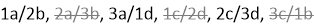

= Reglas para el cableado SAS: Bandejas con módulos IOM12/IOM12B
:allow-uri-read: 
:icons: font
:imagesdir: ../media/

[role="lead"]
Las bandejas de discos con módulos IOM12/IOM12B pueden cablearse en configuraciones de par de alta disponibilidad y de controlador único (para plataformas compatibles) aplicando las reglas de cableado SAS: Reglas de configuración, reglas de numeración de ranuras de controladoras, reglas de conexión de bandeja a bandeja, reglas de conexión de controladora a pila y, si procede, reglas de cables ópticos mini-SAS HD.

NOTE: Las reglas de cableado SAS respecto a las reglas de numeración de las ranuras de la controladora, las reglas de conexión de bandeja a bandeja y las reglas de conexión de controladora a pila descritas en esta guía son las mismas reglas que se aplican a todas las bandejas de discos SAS, ya tengan módulos IOM12/IOM12B, IOM6 o IOM3. Sin embargo, la información de esta guía es específica de las características exclusivas de las bandejas de discos con módulos IOM12 y su uso en configuraciones compatibles.

Las reglas de cableado SAS con respecto a las reglas de configuración y las reglas de cable óptico mini-SAS HD SAS descritas en esta guía son específicas de las bandejas de discos con módulos IOM12/IOM12B.

Las reglas de cableado de SAS descritas en esta guía equilibran el cableado SAS entre los puertos SAS integrados y los puertos SAS de adaptador de bus de host para proporcionar configuraciones de controladora de almacenamiento de alta disponibilidad y cumplir los siguientes objetivos:

* Proporciona un algoritmo universal único y fácil de entender para todos los productos y configuraciones SAS
* Genere el mismo cableado físico al generar la lista de materiales (BOM), seguida en la fábrica y en el campo
* Se pueden verificar mediante el software y las herramientas de comprobación de la configuración
* Ofrece la máxima resiliencia posible para mantener la disponibilidad y minimizar la dependencia de las tomas de control

Debe evitar desviarse de las reglas; las desviaciones pueden reducir la confiabilidad, la universalidad y la similitud.

== Reglas de configuración

Las bandejas de discos con módulos IOM12 son compatibles con los tipos específicos de configuraciones de parejas de alta disponibilidad y de controladoras individuales.

NOTE: Las plataformas FAS25XX no se tratan en este contenido.

* Las configuraciones de parejas de ALTA DISPONIBILIDAD deben cablearse como configuraciones de alta disponibilidad multivía o de alta disponibilidad de ruta cuádruple, con las siguientes excepciones:
+
** Plataformas con almacenamiento interno, como la serie FAS2600, AFF A200, serie FAS2700, AFF A220, Y versiones posteriores, se pueden conectar mediante cables configuraciones de alta disponibilidad de ruta única para admitir la conectividad con un dispositivo de backup a cinta SAS externo.
** Plataformas con almacenamiento interno, como la serie FAS2600, AFF A200, serie FAS2700, AFF A220, Y, más adelante, no admiten la conectividad de alta disponibilidad de ruta cuádruple.

* Las configuraciones de controladora única se deben cableado como configuraciones de multivía o de ruta cuádruple, con las siguientes excepciones:
+
** Las configuraciones de controladora única de la serie FAS2600 (con bandejas de discos externas) se pueden cablear como configuraciones de ruta única.
+
Dado que el almacenamiento interno utiliza la conectividad de ruta única, ONTAP emite advertencias ocasionales en las que se detectan rutas mixtas. Para evitar estas advertencias, puede utilizar la conectividad de una sola ruta a las bandejas de discos externas. Además, puede utilizar conectividad de ruta única cuando se utilice un dispositivo de copia de seguridad en cinta SAS externo.

** Las configuraciones de controladora única de la serie FAS2600 no son compatibles con la conectividad de ruta cuádruple.

== Reglas de numeración de las ranuras de la controladora

Con el fin de aplicar reglas de cableado en todos los pares de alta disponibilidad y las configuraciones de controladora única compatibles, se utiliza una convención para la numeración de ranuras de la controladora.

* Para todos los pares de alta disponibilidad y las configuraciones de controladora única, se aplica lo siguiente:
+
** Un HBA SAS de una ranura PCI física se define como que ocupa la ranura 1, 2, 3, etc., independientemente de la etiqueta física de la ranura de una controladora.
+
Por ejemplo, si los HBA SAS ocuparan las ranuras PCI físicas 3, 5 y 7, se designarían como ranuras 1, 2 y 3 con el fin de aplicar las reglas de cableado SAS.

** Un HBA SAS integrado ocupa la ranura PCI 0 igual que la etiqueta de una controladora.
** Cada puerto de cada ranura se define tal como se etiqueta en una controladora. Por ejemplo, la ranura 0 con dos puertos se conoce como 0a y 0b. La ranura 1 con cuatro puertos se conoce como 1a, 1b, 1c y 1d.
+
En este documento, las ranuras y los puertos de ranura se muestran de la siguiente manera:

+
image::../media/slot0_rules.png[reglas de slot0]

== Reglas de conexión entre bandejas

Cuando dispone de más de una bandeja de discos en una pila de bandejas de discos, se conectan entre sí por cada dominio SAS (IOM A e IOM B) mediante el cableado correspondiente de bandeja a bandeja. El uso del cableado de «estándar» o «doble ancho» depende de la configuración que tenga.

=== Conectividad estándar entre bandejas

* La conectividad estándar entre bandejas se utiliza en configuraciones de alta disponibilidad multivía, alta disponibilidad multivía, ruta única y ruta única.
* La conectividad estándar de bandeja a bandeja es lo que se utiliza en las configuraciones de almacenamiento SAS existentes con módulos IOM3 e IOM6: Se necesita una conexión de cable entre las bandejas de discos de cada dominio: El dominio A (IOM A) y el dominio B (IOM B).
* La práctica recomendada es utilizar los puertos IOM 3 y 1 para la conectividad estándar de bandeja a bandeja.
+
Desde la primera bandeja lógica hasta la última bandeja lógica de una pila, se debe conectar el puerto IOM 3 al puerto IOM 1 de la siguiente bandeja en el dominio A y, a continuación, en el dominio B.

image::../media/drw_shelf_to_shelf_standard.gif[estante drw a estante estándar]

=== Conectividad doble de bandeja a bandeja

* La conectividad de bandeja a bandeja en toda la bandeja se utiliza en configuraciones de cuatro rutas (alta disponibilidad de ruta cuádruple y ruta cuádruple).
* La conectividad de bandeja a bandeja doble ancho requiere dos conexiones de cable entre las bandejas de discos en cada dominio- dominio A (IOM A) y el dominio B (IOM B).
+
La primera conexión de cable se cableó como conectividad estándar de bandeja a bandeja (con los puertos IOM 3 y 1); la segunda conexión de cable se cableó como conectividad de bandeja a bandeja de doble ancho (mediante los puertos IOM 4 y 2).

+
Desde la primera bandeja lógica hasta la última bandeja lógica de una pila, se debe conectar el puerto IOM 3 al puerto IOM 1 de la siguiente bandeja en el dominio A y, a continuación, en el dominio B. Desde la primera bandeja lógica hasta la última bandeja lógica de una pila, se debe conectar el puerto IOM 4 al puerto IOM 2 de la siguiente bandeja en el dominio A y, a continuación, en el dominio B. (Los puertos IOM cableados como conectividad de doble ancho se muestran con azul).

image::../media/drw_shelf_to_shelf_double_wide.gif[bandeja drw a estante doble ancho]

== Reglas de conexión de la controladora a la pila

Puede conectar correctamente las conexiones SAS de cada controladora a cada pila en un par de alta disponibilidad o en una configuración de controladora individual entendiendo que las bandejas de discos SAS utilizan propiedad de disco basada en software y de qué manera los puertos de controladora A/C y B/D están conectados a pilas. cómo se organizan los puertos A/C y B/D de las controladoras en pares de puertos y cómo las plataformas con almacenamiento interno disponen de sus puertos de controladora conectados a pilas.

=== Regla de propiedad de disco basada en software de bandeja de discos SAS

Las bandejas de discos SAS utilizan propiedad de disco basada en software (no propiedad de disco basada en hardware). Esto significa que la propiedad de la unidad de disco se almacena en la unidad de disco en lugar de estar determinada por la topología de las conexiones físicas del sistema de almacenamiento (como lo es para la propiedad de disco basada en hardware). Específicamente, la propiedad de la unidad de disco es asignada por ONTAP (automáticamente o por comandos de la CLI), no por cómo se cablean las conexiones de la controladora a la pila.

Las bandejas de discos SAS nunca se deben cablear mediante el esquema de propiedad de discos basado en hardware.

=== Reglas de conexión de puertos De las controladoras A y C (para plataformas sin almacenamiento interno)

* Los puertos a y C siempre son las rutas principales de una pila.
* Los puertos a y C siempre se conectan a la primera bandeja de discos lógica de una pila.
* Los puertos a y C siempre se conectan a los puertos IOM 1 y 2 de la bandeja de discos.
+
El puerto de IOM 2 solo se utiliza para configuraciones de ruta cuádruple de alta disponibilidad y ruta cuádruple.

* Los puertos A y C de la controladora siempre se conectan al IOM A (dominio A).
* Los puertos A y C de la controladora 2 siempre se conectan al IOM B (dominio B).

En la siguiente ilustración, se destacan cómo los puertos A y C de la controladora se conectan en una configuración de alta disponibilidad multivía con un HBA de puerto cuádruple y dos pilas de bandejas de discos. Las conexiones a la pila 1 se muestran en azul. Las conexiones a la pila 2 se muestran en naranja.

image::../media/drw_controller_to_stack_rules_ports_a_and_c_example.gif[controlador drw para apilar los puertos de reglas a y c ejemplo]

=== Reglas de conexión de puertos B y D de la controladora (para plataformas sin almacenamiento interno)

* Los puertos B y D siempre son las rutas secundarias a la pila.
* Los puertos B y D siempre se conectan a la última bandeja de discos lógica de una pila.
* Los puertos B y D siempre se conectan a los puertos IOM 3 y 4 de la bandeja de discos.
+
El puerto IOM 4 solo se utiliza para configuraciones de alta disponibilidad de ruta cuádruple y ruta cuádruple.

* Los puertos B y D de la controladora 1 siempre se conectan al IOM B (dominio B).
* Los puertos B y D de la controladora 2 siempre se conectan al IOM A (dominio A).
* Los puertos B y D se conectan a los paquetes compensando el orden de las ranuras PCI por uno de manera que el primer puerto de la primera ranura se cablee por último.

En la siguiente ilustración, se destacan cómo los puertos de la controladora B y D se conectan en una configuración de alta disponibilidad multivía con un HBA de puerto cuádruple y dos pilas de bandejas de discos. Las conexiones a la pila 1 se muestran en azul. Las conexiones a la pila 2 se muestran en naranja.

image::../media/drw_controller_to_stack_rules_ports_b_and_d_example.gif[ejemplo de controlador drw para apilar puertos de reglas b y d]

=== Reglas de conexión de pareja de puertos (para plataformas sin almacenamiento interno)

Los puertos a, B, C y D de SAS de la controladora se organizan en pares de puertos mediante un método que aprovecha todos los puertos SAS para la resiliencia y la consistencia del sistema al cablear las conexiones de controladora a pila en configuraciones de par de alta disponibilidad y controladora única.

* Los pares de puertos constan de un puerto SAS de controladora A o C y un puerto SAS de controladora B o D.
+
Los puertos SAS a y C se conectan a la primera bandeja lógica de una pila. Los puertos SAS B y D se conectan a la última bandeja lógica de una pila.

* Las parejas de puertos utilizan todos los puertos SAS de cada controladora del sistema.
+
Debe aumentar la resiliencia del sistema al incorporar todos los puertos SAS (en un HBA en una ranura PCI física [ranura 1-N] y la controladora integrada [ranura 0]) en los pares de puertos. No excluya puertos SAS.

* Las parejas de puertos se identifican y se organizan de la siguiente manera:
+
.. Enumere los puertos A y, a continuación, los puertos C en la secuencia de ranuras (0,1, 2, 3, etc.).
+
Por ejemplo: 1a, 2a, 3a, 1c, 2c, 3c

.. Enumere los puertos B y, a continuación, los puertos D en la secuencia de ranuras (0,1, 2, 3, etc.).
+
Por ejemplo: 1b, 2b, 3b, 1d, 2d, 3d

.. Vuelva a escribir la lista de puertos D y B para que el primer puerto de la lista se mueva al final de la lista.
+
Por ejemplo: image:../media/drw_gen_sas_cable_step2.png[""]

+
Compensar el orden de las ranuras mediante un equilibrio entre pares de puertos en varias ranuras (ranuras PCI físicas y ranuras integradas) cuando hay más de una ranura de puertos SAS disponible; por lo tanto, evitar que se cablee una pila a un único HBA SAS.

.. Empareje los puertos A y C (enumerados en el paso 1) con los puertos D y B (enumerados en el paso 2) en el orden en que se enumeran.
+
Por ejemplo: 1a/2b, 2a/3b, 3a/1d,1c/2d, 2c/3d, 3c/1b.

+

NOTE: En el caso de un par de alta disponibilidad, la lista de pares de puertos que identifica para la primera controladora también se aplica a la segunda controladora.

* Al cablear el sistema, puede utilizar parejas de puertos en el orden en el que se identificaron o se pueden omitir pares de puertos:
+
** Use pares de puertos en el orden en que los identificó (enumerados) cuando se necesitan todas las parejas de puertos para cablear las pilas del sistema.
+
Por ejemplo, si identificó seis parejas de puertos para el sistema y posee seis pilas para cablear como multivía, conecte los cables en el orden en el que se enumeran:

+
1a/2b, 2a/3b, 3a/1d, 1c/2d, 2c/3d, 3c/1b

** Omitir pares de puertos (usar cada otro par de puertos) cuando no se necesitan todas las parejas de puertos para conectar los cables de las pilas del sistema.
+
Por ejemplo, si identificó seis parejas de puertos para el sistema y tenía tres pilas para cablear como multivía, conecte los cables de cada otro par de puertos de la lista:

+

+

NOTE: Si tiene más pares de puertos de los que necesita para conectar las pilas en el sistema, la práctica recomendada es omitir los pares de puertos para optimizar los puertos SAS en el sistema. Al optimizar los puertos SAS, optimiza el rendimiento del sistema.

Las hojas de trabajo para cableado de controladora a pila son herramientas prácticas para identificar y organizar los pares de puertos de modo que pueda cablear las conexiones de controladora a pila para el par de alta disponibilidad o la configuración de controladora única.

link:install-cabling-worksheet-template-multipath.html["Plantilla de hoja de cálculo de cableado de controladora a pila para conectividad multivía"]

link:install-cabling-worksheet-template-quadpath.html["Plantilla de hoja de trabajo para el cableado entre la controladora y la pila para la conectividad con cuatro rutas"]

=== Reglas de conexión de puertos 0b y 0a para plataformas con almacenamiento interno

Plataformas con almacenamiento interno, como la serie FAS2600, AFF A200, serie FAS2700, AFF A220, y, más adelante, tengan un conjunto único de reglas de conexión porque cada controladora debe mantener la misma conectividad de dominio entre el almacenamiento interno (puerto 0b) y la pila. Esto significa que si una controladora se encuentra en la ranura A del chasis (controladora 1), está en el dominio A (IOM A) y, por lo tanto, el puerto 0b debe conectarse a IOM A en la pila. Cuando una controladora se encuentra en la ranura B del chasis (controladora 2), se encuentra en el dominio B (IOM B) y, por lo tanto, el puerto 0b debe conectarse a IOM B en la pila.

NOTE: Las plataformas FAS25XX no se tratan en este contenido.

NOTE: Si no conecta el puerto 0b al dominio correcto (dominios de conexión cruzada), expondrá su sistema a problemas de resiliencia que le impidan realizar procedimientos no disruptivos de forma segura.

* Puerto 0b de la controladora (puerto de almacenamiento interno):
+
** El puerto 0b de la controladora 1 siempre se conecta a IOM A (dominio A).
** El puerto 0b de la controladora 2 siempre se conecta a IOM B (dominio B).
** El puerto 0b es siempre la ruta principal.
** El puerto 0b siempre se conecta a la última bandeja de discos lógica de una pila.
** El puerto 0b siempre conecta con el puerto IOM 3 de la bandeja de discos.

* Puerto 0a de la controladora (puerto HBA interno):
+
** El puerto 0a de la controladora 1 siempre se conecta al IOM B (dominio B).
** El puerto 0a de la controladora 2 siempre se conecta al IOM A (dominio A).
** El puerto 0a siempre es la ruta secundaria.
** El puerto 0a siempre se conecta a la primera bandeja de discos lógica de una pila.
** El puerto 0a siempre se conecta al puerto IOM 1 de la bandeja de discos.

En la siguiente ilustración se destaca la conectividad de dominio de puerto de almacenamiento interno (0b) para una serie FAS2600, AFF A200, serie FAS2700, AFF A220 y una configuración posterior de alta disponibilidad multivía:

image::../media/drw_fas2600_mpha_domain_example.png[ejemplo de dominio drw fas2600 mpha]

== Reglas de cable óptico SAS HD Mini-SAS

Puede utilizar cables ópticos SAS HD Mini-SAS - cables de cable óptico activo multimodo (AOC) con conectores HD Mini-SAS-a-mini-SAS y cables de conexión multimodo (OM4) con conectores HD-a-LC Mini-SAS - para lograr conectividad SAS de larga distancia para determinadas configuraciones que tienen bandejas de discos con módulos IOM12.

* Su plataforma y versión de ONTAP deben ser compatibles con el uso de cables ópticos SAS HD Mini-SAS: Cables ópticos activos multimodo (AOC) con conectores HD HD a mini-SAS Mini-SAS y cables de conexión multimodo (OM4) con conectores HD a LC Mini-SAS.
+
https://hwu.netapp.com["Hardware Universe de NetApp"]

* Los cables AOC ópticos SAS multimodo con conectores HD mini-SAS-a-mini-SAS HD se pueden utilizar para conexiones de controladora a pila y de bandeja a bandeja, y están disponibles en longitudes de hasta 50 metros.
* Si va a utilizar cables de conexión de cable de conexión múltiple óptico SAS (OM4) con conectores HD-to-LC Mini-SAS (para paneles de conexiones), se aplican las siguientes reglas:
+
** Es posible usar estos cables para conexiones de la controladora a la pila y de bandeja a bandeja.
+
Si se utilizan cables de arranque multimodo para conexiones de bandeja a bandeja, solo se podrán usar una vez dentro de una pila de bandejas de discos. Se deben utilizar cables AOC multimodo para conectar el resto de conexiones de bandeja a bandeja.

+
En el caso de configuraciones de rutas cuádruples de alta disponibilidad y rutas cuádruples, si se utilizan cables de arranque multimodo para las conexiones de doble bandeja a bandeja entre dos bandejas de discos, lo más recomendable es utilizar cables de desconexión con emparejamiento idéntico.

** Debe conectar los ocho (cuatro pares) de los conectores LC breakout al panel de conexiones.
** Es necesario suministrar los paneles de conexión y los cables entre paneles.
+
Los cables entre paneles deben tener el mismo modo que el cable de arranque: OM4 multimodo.

** Se pueden utilizar hasta un par de paneles de parches en una ruta.
** La ruta punto a punto (mini-SAS HD a mini-SAS HD) de cualquier cable multimodo no puede superar los 100 metros.
+
La ruta incluye el conjunto de cables de desconexión, paneles de conexión y cables entre paneles.

** La ruta total de extremo a extremo (la suma de las rutas de punto a punto de la controladora a la última bandeja) no puede superar los 300 metros.
+
La ruta total incluye el conjunto de cables de desconexión, paneles de conexión y cables entre paneles.

* Los cables SAS pueden ser de cobre SAS, SAS óptico o una combinación de ambos.
+
Si se utiliza una combinación de cables de cobre SAS y cables ópticos SAS, se aplican las siguientes reglas:

+
** Las conexiones de bandeja a bandeja en una pila deben ser todos los cables de cobre SAS o todos los cables ópticos SAS.
** Si las conexiones de la bandeja a la bandeja son cables ópticos SAS, las conexiones de la controladora a la pila a esa pila también deben ser cables ópticos SAS.
** Si las conexiones de la bandeja a la bandeja son cables de cobre SAS, las conexiones de la controladora a la pila pueden ser cables ópticos SAS o cables de cobre SAS.

