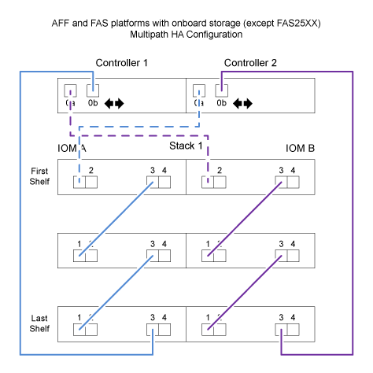

= Hojas de trabajo para cableado de controladora a pila y ejemplos de cableado para plataformas con almacenamiento interno: Bandejas con módulos IOM12/IOM12B
:allow-uri-read: 
:icons: font
:imagesdir: ../media/

[role="lead"]
Puede utilizar las hojas de datos de cableado completas de controladora a pila y ejemplos de cableado para cablear las plataformas con almacenamiento interno, incluidas la serie FAS2600, AFF A200, serie FAS2700, AFF A220, y después.

NOTE: Esta información no se aplica a las plataformas FAS25XX.

* Si es necesario, puede consultar link:install-cabling-rules.html["Reglas para el cableado SAS"] para obtener información sobre las configuraciones compatibles, la conectividad de bandeja a bandeja y la conectividad de controladora a bandeja.
* Los ejemplos de cableado muestran cables de controladora a pila como sólidos o discontinuas para distinguir las conexiones de puerto 0b de controladora de las conexiones de puerto 0a de la controladora.
+
image::../media/drw_fas2600_controller_to_stack_cable_type_key.png[controlador drw fas2600 para apilar tipo de cable]

* Los ejemplos de cableado muestran conexiones de controladora a pila y conexiones de bandeja a bandeja en dos colores diferentes para distinguir la conectividad a través de IOM A (dominio A) e IOM B (dominio B).
+
image::../media/drw_fas2600_cable_color_key.png[tecla de color del cable drw fas2600]

== Plataformas con almacenamiento interno en una configuración de alta disponibilidad multivía con una pila de varias bandejas

En el siguiente ejemplo de hoja de datos y cableado se utiliza la pareja de puertos 0a/0b:

image::../media/drw_fas2600_mpha_worksheet.png[hoja de trabajo drw fas2600 mpha]

== Configuración multivía de la serie FAS2600 con una pila de varias bandejas

Las siguientes hojas de datos y ejemplos de cableado utilizan el par de puertos 0a/0b.

En este ejemplo, la controladora se instala en la ranura A del chasis. Cuando una controladora se encuentra en la ranura A del chasis, su puerto de almacenamiento interno (0b) está en el dominio A (IOM A); por lo tanto, el puerto 0b debe conectarse con el dominio A (IOM A) en la pila.

image::../media/drw_fas2600_mp_slot_a_worksheet.png[hoja de trabajo de la ranura drw fas2600 mp]

image::../media/drw_fas2600_mp_slot_a.png[ranura a drw fas2600 mp]

En este ejemplo, la controladora se instala en la ranura B del chasis. Cuando una controladora se encuentra en la ranura B del chasis, su puerto de almacenamiento interno (0b) se encuentra en el dominio B (IOM B); por lo tanto, el puerto 0b debe conectarse al dominio B (IOM B) en la pila.

image::../media/drw_fas2600_mp_slot_b_worksheet.png[hoja de trabajo b de ranura de drw fas2600 mp]

image::../media/drw_fas2600_mp_slot_b.png[ranura b drw fas2600 mp]
