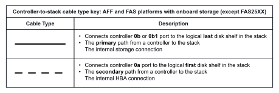
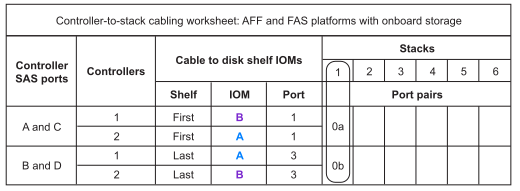

= Hojas de trabajo para cableado de controladora a pila y ejemplos de cableado para plataformas con almacenamiento interno: Bandejas con módulos IOM12/IOM12B
:allow-uri-read: 
:icons: font
:imagesdir: ../media/

[role="lead"]
Puede utilizar las hojas de cálculo de cableado completas de la controladora a la pila y ejemplos de cableado para cablear plataformas con almacenamiento interno.

NOTE: Esta información no se aplica a las plataformas FAS25XX.

* Si es necesario, puede consultar link:install-cabling-rules.html["Reglas y conceptos del cableado SAS"] para obtener información sobre las configuraciones compatibles, la conectividad de bandeja a bandeja y la conectividad de controladora a bandeja.
* Los ejemplos de cableado muestran los cables de la controladora a la pila como sólidos o discontinuos para distinguir las conexiones de los puertos 0b/0b1 del controlador de las conexiones de los puertos 0A del controlador.
+

* Los ejemplos de cableado muestran conexiones de controladora a pila y conexiones de bandeja a bandeja en dos colores diferentes para distinguir la conectividad a través de IOM A (dominio A) e IOM B (dominio B).
+
image::../media/drw_fas2600_cable_color_key.png[tecla de color del cable drw fas2600]

== Plataforma FAS2800 en una configuración de alta disponibilidad multivía sin bandejas externas

El siguiente ejemplo muestra que no es necesario ningún cableado para adquirir conectividad de alta disponibilidad multivía:

image::../media/drw_fas2800_noshelf_mpha_IEOPS-954.svg[drw fas2800 noshelf mpha IEOPS 954]

== Plataforma FAS2800 en una configuración de alta disponibilidad de tres vías sin bandejas externas

En el siguiente ejemplo de cableado se muestra el cableado necesario entre las dos controladoras para lograr una conectividad de tres rutas:

image::../media/drw_fas2800_noshelf_tpha_IEOPS-955.svg[drw fas2800 noshelf tpha IEOPS 955]

== Plataforma FAS2800 en una configuración de alta disponibilidad de tres rutas con una pila de varias bandejas

La siguiente hoja de datos y ejemplo de cableado utiliza el par de puertos 0A/0b1:

image::../media/drw_fas2800_worksheet_IEOPS-948.svg[Hoja DE TRABAJO drw fas2800 IEOPS 948]

image::../media/drw_fas2800_withshelves_tpha_IEOPS-949.svg[drw fas2800 incluye bandejas tpha IEOPS 949]

== Plataformas con almacenamiento interno en una configuración de alta disponibilidad multivía con una pila de varias bandejas

En el siguiente ejemplo de hoja de datos y cableado se utiliza la pareja de puertos 0a/0b:

NOTE: Esta sección no se aplica a los sistemas FAS2800 o FAS25XX.

image::../media/drw_fas2600_mpha_IEOPS-1256.svg[drw fas2600 mpha IEOPS 1256]

== Configuración multivía de la serie FAS2600 con una pila de varias bandejas

Las siguientes hojas de datos y ejemplos de cableado utilizan el par de puertos 0a/0b.

En este ejemplo, la controladora se instala en la ranura A del chasis. Cuando una controladora se encuentra en la ranura A del chasis, su puerto de almacenamiento interno (0b) está en el dominio A (IOM A); por lo tanto, el puerto 0b debe conectarse con el dominio A (IOM A) en la pila.

image::../media/drw_fas2600_mp_slot_a_worksheet.png[hoja de trabajo de la ranura drw fas2600 mp]

image::../media/drw_fas2600_mp_slot_a.png[ranura a drw fas2600 mp]

En este ejemplo, la controladora se instala en la ranura B del chasis. Cuando una controladora se encuentra en la ranura B del chasis, su puerto de almacenamiento interno (0b) se encuentra en el dominio B (IOM B); por lo tanto, el puerto 0b debe conectarse al dominio B (IOM B) en la pila.

image::../media/drw_fas2600_mp_slot_b_worksheet.png[hoja de trabajo b de ranura de drw fas2600 mp]

image::../media/drw_fas2600_mp_slot_b.png[ranura b drw fas2600 mp]
