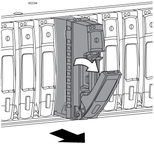

= Cambie en caliente una unidad de disco en una bandeja de discos DS212C o DS212C; bandejas con módulos IOM12/IOM12B
:allow-uri-read: 
:icons: font
:imagesdir: ../media/

[role="lead"]
Se puede intercambiar en caliente una unidad de disco con fallos en una bandeja de discos DS212C o DS212C.

.Antes de empezar
* La bandeja de discos DS212C o DS212C deben admitir la unidad de discos que está instalando.
+
https://hwu.netapp.com["Hardware Universe de NetApp"^]

* Todos los demás componentes del sistema deben funcionar correctamente; si no, póngase en contacto con el soporte técnico.
* La unidad de disco que desea quitar debe tener un error.
+
Para verificar que la unidad de disco ha fallado, ejecute el `storage disk show -broken` comando. La unidad de disco con errores aparece en la lista de unidades de disco con errores. Si no lo hace, debe esperar y ejecutar el comando de nuevo.

+

NOTE: Según el tipo y la capacidad de la unidad de disco, la unidad de disco puede tardar hasta varias horas en aparecer en la lista de unidades de disco con errores.

* Si va a sustituir un disco de cifrado automático (SED), debe seguir las instrucciones para sustituir un SED en la documentación de ONTAP para su versión de ONTAP.
+
Las instrucciones de la documentación de ONTAP describen los pasos adicionales que debe realizar antes y después de reemplazar una SED.

+
https://docs.netapp.com/us-en/ontap/encryption-at-rest/index.html["Información general del cifrado de NetApp con la interfaz de línea de comandos"^]

.Acerca de esta tarea
* Debe tomar medidas para evitar descargas electrostáticas (ESD):
+
** Mantenga la unidad de disco en la bolsa ESD hasta que esté listo para instalarla.
** Abra la bolsa ESD a mano o corte la parte superior con unas tijeras.
+

NOTE: No inserte una herramienta o cuchilla metálicas en la bolsa ESD.

** Utilice siempre una muñequera ESD conectada a una superficie sin pintar en el chasis de la caja de almacenamiento.
+
Si no hay ninguna correa de mano disponible, toque una superficie sin pintar en el chasis de la caja de almacenamiento antes de manejar la unidad de disco.

* Debe tomar las medidas necesarias para tratar las unidades de disco con cuidado:
+
** Utilice siempre dos manos al extraer, instalar o transportar una unidad de disco para soportar su peso.
+

NOTE: No coloque las manos en las placas de la unidad de disco expuestas en la parte inferior del portaunidades de disco.

** Debe colocar las unidades de disco en superficies amortiguadas y nunca apilar unidades de disco entre sí.
** Debe tener cuidado de no golpear las unidades de disco contra otras superficies.

* Las unidades de disco deben mantenerse alejadas de los dispositivos magnéticos.
+

NOTE: Los campos magnéticos pueden destruir todos los datos de la unidad de disco y causar daños irreparables en los circuitos de la unidad de disco.

* La práctica recomendada es tener instalada la versión actual del paquete de cualificación de disco (DQP) antes de intercambiar en funcionamiento una unidad de disco.
+
Tener instalada la versión actual del DQP permite al sistema reconocer y utilizar unidades de disco recién cualificadas; por lo tanto, evita mensajes de eventos del sistema acerca de tener información no actualizada de la unidad de disco. También se evita la posible prevención de la partición de discos, ya que no se reconocen las unidades de disco. El DQP también notifica el firmware de la unidad de disco que no es actual.

+
https://mysupport.netapp.com/site/downloads/firmware/disk-drive-firmware/download/DISKQUAL/ALL/qual_devices.zip["Descargas de NetApp: Paquete de cualificación de disco"^]

* La práctica recomendada es tener las versiones actuales del firmware de bandeja de discos (IOM) y de las unidades de disco instaladas en el sistema antes de agregar nuevas bandejas de discos, componentes FRU de bandeja o cables SAS.
+
Puede encontrar las versiones actuales del firmware en el sitio de soporte de NetApp.

+
https://mysupport.netapp.com/site/downloads/firmware/disk-shelf-firmware["Descargas de NetApp: Firmware de bandeja de discos"^]

+
https://mysupport.netapp.com/site/downloads/firmware/disk-drive-firmware["Descargas de NetApp: Firmware de la unidad de disco"^]

* El firmware de la unidad de disco se actualiza automáticamente (sin interrupciones) en unidades de disco nuevas con versiones de firmware no actuales.
+

NOTE: Las comprobaciones de firmware de la unidad de disco se realizan cada dos minutos.

* Si es necesario, puede encender los LED de ubicación (azul) de la bandeja de discos para ayudar a localizar físicamente la bandeja de discos afectada: `storage shelf location-led modify -shelf-name _shelf_name_ -led-status on`
+
Una bandeja de discos tiene tres LED de ubicación: Una en el panel de pantalla del operador y otra en cada IOM de bandeja. Los LED de ubicación permanecen encendidos durante 30 minutos. Puede desactivarlas introduciendo el mismo comando, pero utilizando la opción OFF.

* Si es necesario, puede consultar la sección LED de bandeja de discos de supervisión para obtener información sobre el significado y la ubicación de los LED de bandeja de discos en el panel de visualización del operador y los componentes FRU.

.Pasos
. Si desea asignar manualmente la propiedad de disco para la unidad de disco de reemplazo, debe deshabilitar la asignación automática de unidades, si está habilitada; de lo contrario, vaya al paso siguiente.
+

NOTE: Es necesario asignar manualmente la propiedad de disco si las unidades de disco de la pila son propiedad de ambas controladoras de una pareja de alta disponibilidad.

+

NOTE: La propiedad de disco se asigna manualmente y, a continuación, se vuelve a habilitar la asignación automática de unidades más adelante en este procedimiento.

+
.. Compruebe si la asignación automática de unidades está habilitada:``storage disk option show``
+
Si tiene un par de alta disponibilidad, puede introducir el comando en la consola de cualquiera de las controladoras.

+
Si la asignación automática de unidades está activada, la salida muestra "'on'" (para cada controlador) en la columna "'asignación automática'".

.. Si la asignación automática de unidad está habilitada, debe deshabilitarla:``storage disk option modify -node _node_name_ -autoassign off``
+
Debe deshabilitar la asignación automática de unidades en ambas controladoras de una pareja de ha.

. Puesta a tierra apropiadamente usted mismo.
. Desembale la nueva unidad de disco y configúrela en una superficie nivelada cerca de la bandeja de discos.
+
Guarde todos los materiales de embalaje para utilizarlos cuando devuelva la unidad de disco con error.

+

NOTE: NetApp requiere que todas las unidades de disco devueltas estén en una bolsa con clasificación ESD.

. Identifique físicamente la unidad de disco con error desde el mensaje de advertencia de la consola del sistema y el LED de atención iluminado (ámbar) en la unidad de disco.
+

NOTE: El LED de actividad (verde) de una unidad de disco con error se puede encender (fijo), lo que indica que la unidad de disco tiene alimentación, pero no debe parpadear, lo que indica actividad de E/S. Una unidad de disco con error no tiene actividad de E/S.

. Pulse el botón de liberación de la cara de la unidad de disco y, a continuación, tire del asa de leva hasta su posición totalmente abierta para liberar la unidad de disco del plano medio.
+
Al pulsar el botón de liberación, la palanca de leva de los resortes de accionamiento de disco se abre parcialmente.

+

NOTE: Las unidades de disco de una bandeja de discos DS212C se organizan en horizontal con el botón de lanzamiento ubicado a la izquierda de la unidad de disco. Las unidades de disco de una bandeja de discos DS224C se organizan verticalmente con el botón de liberación ubicado en la parte superior de la cara de la unidad de disco.

+
Las siguientes muestran unidades de disco en una bandeja de discos DS212C:

+
image::../media/drw_drive_open_no_bezel.png[unidad drw abierta sin bisel]

+
Las siguientes muestran unidades de disco en una bandeja de discos DS224C:

+

. Deslice ligeramente hacia fuera la unidad de disco para permitir que el disco se reduzca de forma segura y, a continuación, extraiga la unidad de disco de la bandeja de discos.
+
Un HDD puede tardar hasta un minuto en detenerse de forma segura.

+

NOTE: Cuando manipule una unidad de disco, utilice siempre dos manos para sostener su peso.

. Con dos manos, con el mango de leva en la posición abierta, inserte la unidad de disco de repuesto en la bandeja de discos, empujando firmemente hasta que la unidad de disco se detenga.
+

NOTE: Espere un mínimo de 10 segundos antes de insertar una nueva unidad de disco. Esto permite al sistema reconocer que se ha quitado una unidad de disco.

+

NOTE: No coloque las manos en las placas de la unidad de disco expuestas en la parte inferior del portadiscos.

. Cierre el asa de leva de forma que la unidad de disco esté completamente asentada en el plano medio y el asa encaje en su lugar.
+
Asegúrese de cerrar el mango de leva lentamente para que quede alineado correctamente con la cara de la unidad de disco.

. Si va a sustituir otra unidad de disco, repita los pasos 3 a 8.
. Verifique que el LED de actividad (verde) de la unidad de disco esté iluminado.
+
Cuando el LED de actividad de la unidad de disco se ilumina en verde de forma permanente, significa que la unidad de disco tiene alimentación. Cuando el LED de actividad de la unidad de disco parpadea, significa que la unidad de disco tiene alimentación y E/S está en curso. Si el firmware de la unidad de disco se actualiza automáticamente, el LED parpadea.

. Si deshabilitó la asignación automática de unidades en el paso 1, asigne manualmente la propiedad de disco y, a continuación, vuelva a activar la asignación automática de unidades si es necesario:
+
.. Mostrar todos los discos sin propietario:``storage disk show -container-type unassigned``
.. Asigne cada disco:``storage disk assign -disk _disk_name_ -owner _owner_name_``
+
Puede utilizar el carácter comodín para asignar más de un disco a la vez.

.. Vuelva a habilitar la asignación automática de unidades si es necesario:``storage disk option modify -node _node_name_ -autoassign on``
+
Debe volver a habilitar la asignación automática de unidades en ambas controladoras de una pareja de alta disponibilidad.

. Devuelva la pieza que ha fallado a NetApp, como se describe en las instrucciones de RMA que se suministran con el kit.
+
Póngase en contacto con el soporte técnico en https://mysupport.netapp.com/site/global/dashboard["Soporte de NetApp"], 888-463-8277 (Norteamérica), 00-800-44-638277 (Europa), o +800-800-80-800 (Asia/Pacífico) si necesita el número RMA o ayuda adicional con el procedimiento de reemplazo.

