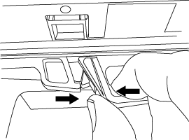

= Intercambio en caliente o reemplazo de un módulo IOM: DS212C, DS224C o DS460C
:allow-uri-read: 
:icons: font
:imagesdir: ../media/

[role="lead"]
La configuración del sistema determina si puede realizar un intercambio en caliente de E/S de estante sin interrupciones o un reemplazo de E/S de estante con interrupciones cuando falla un E/S de estante IOM12 o IOM12B.

.Acerca de esta tarea
* Este procedimiento se aplica a estantes que tienen módulos IOM12 o IOM12B.
+

NOTE: Este procedimiento se aplica a intercambios en caliente o reemplazos de módulos IOM de estanterías idénticas. Esto significa que solo se puede reemplazar un módulo IOM12 por otro módulo IOM12 o un módulo IOM12B por otro módulo IOM12B.

* Los módulos IOM12 o IOM12B se pueden distinguir por su apariencia:
+
Los módulos IOM12 se distinguen por una etiqueta "IOM12":

+
image::../media/drw_iom12.gif[Frente de IOM12]

+
Los módulos IOM12B se distinguen por una banda azul y una etiqueta "IOM12B":

+
image::../media/iom12b.png[Frente de IOM12B]

* En el caso de configuraciones multivía (alta disponibilidad o multivía), de alta disponibilidad de tres rutas y de cuatro rutas (alta disponibilidad de cuatro rutas o cuatro rutas), puede intercambiar en caliente un IOM de bandeja (sustituir de forma no disruptiva un IOM de bandeja en un sistema que se enciende y suministra datos: I/O está en curso).
* Para las configuraciones de alta disponibilidad de ruta única de la serie FAS2600 y la serie FAS2700, debe realizar una operación de toma de control y retorno al nodo primario para sustituir un IOM de bandeja en un sistema encendido y que está sirviendo datos. Las operaciones de I/o están en curso.
* Para las configuraciones de ruta única de la serie FAS2600, debe detener el sistema para sustituir un IOM de bandeja.
+

CAUTION: Si intenta intercambiar un IOM de bandeja en caliente en una bandeja de discos con una conexión de ruta única, se perderá todo el acceso a las unidades de disco de la bandeja de discos y a las bandejas de discos que hay debajo. También podría apagar todo su sistema.

* El firmware de la bandeja de discos (IOM) se actualiza automáticamente (no disruptivo) en un IOM de bandeja nuevo con una versión de firmware no actual.
+
Las comprobaciones de firmware de IOM de la bandeja se realizan cada diez minutos. Una actualización de firmware del IOM puede demorar hasta 30 minutos.

* Si es necesario, puede encender los LED de ubicación (azul) de la bandeja de discos para ayudar a localizar físicamente la bandeja de discos afectada: `storage shelf location-led modify -shelf-name _shelf_name_ -led-status on`
+
Una bandeja de discos tiene tres LED de ubicación: Una en el panel de pantalla del operador y otra en cada IOM de bandeja. Los LED de ubicación permanecen encendidos durante 30 minutos. Puede desactivarlas introduciendo el mismo comando, pero utilizando la opción OFF.

* Si es necesario, puede consultar el link:/sas3/service-monitor-leds.html#operator-display-panel-leds["Monitoreo de los LED del estante del disco"] Guía para obtener información sobre el significado y la ubicación de los LED del estante de discos en el panel de visualización del operador y los componentes FRU.

.Antes de empezar
* Todos los demás componentes del sistema, incluido el otro módulo IOM12/IOM12B, deben funcionar correctamente.
* *Práctica recomendada*: Asegúrese de que su sistema tenga las versiones actuales del firmware de la bandeja de discos (IOM) y del firmware de la unidad de disco antes de agregar nuevas bandejas de discos, componentes FRU de bandeja o cables SAS. Puede visitar el sitio de soporte de NetApp para  https://mysupport.netapp.com/site/downloads/firmware/disk-shelf-firmware["Descargar el firmware del estante de discos"] y  https://mysupport.netapp.com/site/downloads/firmware/disk-drive-firmware["Descargar el firmware de la unidad de disco"] .

.Pasos
. Puesta a tierra apropiadamente usted mismo.
. Desembale el nuevo IOM de la bandeja y configúrelo en una superficie nivelada cerca de la bandeja de discos.
+
Guarde todos los materiales de paquetes que se usarán cuando se devuelve el IOM de bandeja con errores.

. Identifique físicamente el IOM de la bandeja con errores desde el mensaje de advertencia de la consola del sistema y el LED de atención iluminado (ámbar) en el IOM de la bandeja con errores.
. Realice una de las siguientes acciones en función del tipo de configuración que tenga:
+
[cols="2*"]
|===
| Si tiene un... | Realice lo siguiente... 

 a| 
Alta disponibilidad multivía, alta disponibilidad multivía, multivía, alta disponibilidad multivía o multivía
 a| 
Vaya al paso siguiente.

 a| 
Configuración de alta disponibilidad de ruta única de la serie FAS2600 y FAS2700
 a| 
.. Determine el nodo de destino (el nodo al que pertenece el IOM de la bandeja con errores).
+
El IOM A pertenece a la controladora 1. El IOM B pertenece a la controladora 2.

.. Tome el control del nodo de destino: `storage failover takeover -bynode _partner HA node_`

 a| 
Configuración de ruta única de la serie FAS2600
 a| 
.. Apague el sistema desde la consola del sistema: `halt`
.. Compruebe que el sistema esté detenido consultando la consola del sistema de almacenamiento.

|===
. Desconecte el cableado del IOM de la bandeja que se está quitando.
+
Anote los puertos IOM de la bandeja a los que está conectado cada cable.

. Presione el pestillo naranja del asa de leva del IOM de la bandeja hasta que se suelte y, a continuación, abra completamente el asa de leva para liberar el IOM de la bandeja del plano medio.
+

+
image::../media/drw_iom_open.png[Palanca de leva en posición abierta]

. Use el asa de leva para extraer el IOM de la bandeja de discos.
+
Cuando manipule un IOM de bandeja, utilice siempre dos manos para sostener su peso.

. Espere al menos 70 segundos después de quitar el IOM de la bandeja antes de instalar el IOM de la nueva bandeja.
+
Esperar al menos 70 segundos permite al conductor registrar correctamente el ID de bandeja.

. Utilizando dos manos, con el mango de leva del nuevo IOM de bandeja en la posición abierta, respalde y alinee los bordes del nuevo IOM de bandeja con la abertura de la bandeja de discos y, a continuación, empuje con firmeza el nuevo IOM de la bandeja hasta que alcance el plano medio.
+

NOTE: No utilice una fuerza excesiva cuando deslice el IOM de la bandeja hacia la bandeja de discos, ya que podría dañar los conectores.

. Cierre el asa de leva de modo que el pestillo haga clic en la posición de bloqueo y el IOM de la bandeja esté completamente asentado.
. Vuelva a conectar el cableado.
+
Los conectores de cable SAS están codificados; cuando están orientados correctamente a un puerto IOM, el conector hace clic en su lugar y el LED LNK del puerto IOM se ilumina en verde. Inserte un conector de cable SAS en un puerto IOM con la pestaña desplegable orientada hacia abajo (en la parte inferior del conector).

. Realice una de las siguientes acciones en función del tipo de configuración que tenga:
+
[cols="2*"]
|===
| Si tiene un... | Realice lo siguiente... 

 a| 
Alta disponibilidad multivía, alta disponibilidad multivía, multivía, alta disponibilidad multivía o multivía
 a| 
Vaya al paso siguiente.

 a| 
Configuración de alta disponibilidad de ruta única de la serie FAS2600 y FAS2700
 a| 
Proporcione al nodo de destino: `storage failover giveback -fromnode partner_HA_node`

 a| 
Configuración de ruta única de la serie FAS2600
 a| 
Reinicie el sistema.

|===
. Compruebe que se hayan establecido los enlaces de puertos IOM de la bandeja.
+
Por cada puerto de módulo que ha cableado, el LED LNK (verde) se ilumina cuando uno o varios de los cuatro carriles SAS han establecido un enlace (con un adaptador o con otra bandeja de discos).

. Devuelva la pieza que ha fallado a NetApp, como se describe en las instrucciones de RMA que se suministran con el kit.
+
Póngase en contacto con el soporte técnico en https://mysupport.netapp.com/site/global/dashboard["Soporte de NetApp"], 888-463-8277 (Norteamérica), 00-800-44-638277 (Europa), o +800-800-80-800 (Asia/Pacífico) si necesita el número RMA o ayuda adicional con el procedimiento de reemplazo.

