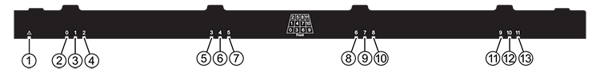

= LED de la bandeja de discos de supervisión - bandejas con módulos IOM12/IOM12B
:allow-uri-read: 
:icons: font
:imagesdir: ../media/

[role="lead"]
Puede supervisar el estado de la bandeja de discos entendiendo las condiciones de ubicación y estado de los LED de los componentes de la bandeja de discos.

== Indicadores LED del panel del operador

Las LED del panel de visualización frontal del operador de la bandeja de discos indican si la bandeja de discos funciona con normalidad o si hay problemas con el hardware.

En la siguiente tabla se describen los tres LED del panel de visualización del operador que se utilizan en las bandejas de discos DS460C, DS212C y DS212C:

[cols="4*"]
|===
| Icono DE LED | Nombre DEL LED | Estado | Descripción 

 a| 

 a| 
Potencia
 a| 
Verde fijo
 a| 
Una o varias fuentes de alimentación están proporcionando alimentación a la bandeja de discos.

.2+| image:../media/drw_sas_fault_icon.png[""] .2+| Atención  a| 
Ámbar fijo
 a| 
Se produjo un error en la función de una de más FRU: La bandeja de discos, las unidades de disco, los módulos IOM12/IOM12B o los suministros de alimentación.

Compruebe los mensajes de eventos para determinar la acción correctiva que se debe realizar.

 a| 
Ámbar intermitente
 a| 
El ID de la bandeja tiene un estado pendiente.

Apague y encienda la bandeja de discos para que el ID de bandeja quede afectado.

 a| 

 a| 
Ubicación
 a| 
Azul fijo
 a| 
El administrador del sistema activó esta función de LED como ayuda para localizar físicamente la bandeja de discos que requería servicio.

El LED de ubicación del panel de visualización del operador y los dos módulos IOM12/IOM12B se iluminan cuando se activa esta función LED. Los LED de ubicación se apagan automáticamente transcurridos 30 minutos.

|===
En función del modelo de bandeja de discos, el panel de visualización del operador tiene un aspecto diferente; sin embargo, los tres LED se organizan de la misma manera.

La siguiente ilustración se muestra del panel de visualización del operador de la bandeja de discos DS224C con la tapa final en:

image::../media/drw_opd.gif[opd drw]

== LED de módulos IOM12/IOM12B

Los LED del módulo IOM12/IOM12B indican si el módulo funciona normalmente, si está preparado para el tráfico de E/S y si hay algún problema con el hardware.

En la siguiente tabla se describen los LED de módulo IOM12/IOM12B asociados con la función del módulo y la función de cada puerto SAS del módulo.

El módulo IOM12/IOM12B se utiliza en bandejas de discos DS460C, DS224C y DS212C.

[cols="4*"]
|===
| Icono DE LED | Nombre DEL LED | Estado | Descripción 

 a| 
image:../media/drw_sas_fault_icon.png[""]
 a| 
Atención
 a| 
Ámbar fijo
 a| 
Función del módulo IOM12/IOM12B: Se ha producido un error con la función del módulo IOM12/IOM12B.

Función de puerto SAS: Menos de los cuatro carriles SAS han establecido un enlace (con un adaptador o una bandeja de discos).

Compruebe los mensajes de eventos para determinar la acción correctiva que se debe realizar.

 a| 
LNK
 a| 
Enlace de puerto
 a| 
Verde fijo
 a| 
Uno o varios de los cuatro carriles SAS han establecido un enlace (con un adaptador o una bandeja de discos).

 a| 

 a| 
Ubicación
 a| 
Azul fijo
 a| 
El administrador del sistema activó esta función de LED para ayudar a localizar físicamente la bandeja de discos con el módulo IOM12/IOM12B que ha fallado.

El LED de ubicación del panel de visualización del operador y los dos módulos IOM12/IOM12B se iluminan cuando se activa esta función LED. Los LED de ubicación se apagan automáticamente transcurridos 30 minutos.

|===
La siguiente ilustración es para un módulo IOM12:

image::../media/drw_iom12.gif[drw iom12]

Los módulos IOM12B se distinguen por una banda azul y una etiqueta "IOM12B":

image::../media/iom12b.png[iom12b]

== Indicadores LED del sistema de alimentación

Los LED del suministro de alimentación indican si el suministro de alimentación funciona con normalidad o si existen problemas de hardware.

En la tabla siguiente se describen los dos LED de los suministros de alimentación utilizados en las bandejas de discos DS460C, DS212C:

[cols="4*"]
|===
| Icono DE LED | Nombre DEL LED | Estado | Descripción 

.2+|  .2+| Potencia  a| 
Verde fijo
 a| 
La fuente de alimentación funciona correctamente.

 a| 
Apagado
 a| 
La fuente de alimentación ha fallado, el interruptor de CA está apagado, el cable de alimentación de CA no está instalado correctamente o la fuente de alimentación no se suministra correctamente.

Compruebe los mensajes de eventos para determinar la acción correctiva que se debe realizar.

 a| 
image:../media/drw_sas_fault_icon.png[""]
 a| 
Atención
 a| 
Ámbar fijo
 a| 
Se ha producido un error en la función de la fuente de alimentación.

Compruebe los mensajes de eventos para determinar la acción correctiva que se debe realizar.

|===
Dependiendo del modelo de bandeja de discos, los suministros de alimentación pueden ser diferentes, lo que determina la ubicación de los dos LED.

La siguiente ilustración es para una fuente de alimentación utilizada en una bandeja de discos DS460C.

Los dos iconos de LED actúan como etiquetas y LED, lo que significa que los iconos se iluminan ellos mismos --no hay LED adyacentes.

image::../media/28_dwg_e2860_de460c_psu.gif[fuente de alimentación de 28 dwg e2860 de460c]

En la siguiente ilustración se utiliza un suministro de alimentación en una bandeja de discos DS212C o DS212C:

image::../media/drw_powersupply_913w_vsd.gif[alimentación drw 913 w vsd]

== LED de ventilador en las bandejas de discos DS460C

Los LED de los ventiladores DS460C indican si el ventilador funciona con normalidad o si hay problemas de hardware.

En la siguiente tabla se describen los LED de los ventiladores utilizados en las bandejas de discos DS460C:

[cols="4*"]
|===
| Elemento | Nombre DEL LED | Estado | Descripción 

 a| 
image:../media/legend_icon_01.png["Número de llamada 1"]
 a| 
Atención
 a| 
Ámbar fijo
 a| 
Se ha producido un error con la función del ventilador.

Compruebe los mensajes de eventos para determinar la acción correctiva que se debe realizar.

|===
image:../media/28_dwg_e2860_de460c_single_fan_canister_with_led_callout.gif[""]

== Indicadores LED de la unidad de disco

Las LED de una unidad de disco indican si funciona con normalidad o si hay problemas con el hardware.

=== LED de unidad de disco para las bandejas de discos DS224C y DS212C

En la siguiente tabla se describen los dos LED de las unidades de disco utilizadas en las bandejas de discos DS212C y DS212C:

[cols="4*"]
|===
| Llamada | Nombre DEL LED | Estado | Descripción 

.2+| image:../media/legend_icon_01.png["Número de llamada 1"] .2+| Actividad  a| 
Verde fijo
 a| 
La unidad de disco tiene alimentación.

 a| 
Verde parpadeante
 a| 
La unidad de disco tiene alimentación y las operaciones de I/o están en curso.

 a| 
image:../media/legend_icon_02.png["Número de llamada 2"]
 a| 
Atención
 a| 
Ámbar fijo
 a| 
Se ha producido un error con la función de la unidad de disco.

Compruebe los mensajes de eventos para determinar la acción correctiva que se debe realizar.

|===
En función del modelo de bandeja de discos, las unidades de disco se organizan vertical u horizontalmente en la bandeja de discos, lo que determina la ubicación de los dos LED.

La siguiente ilustración sirve para una unidad de disco utilizada en una bandeja de discos DS224C.

Las bandejas de discos DS224C utilizan unidades de disco de 2.5 pulgadas dispuestas verticalmente en la bandeja de discos.

image::../media/drw_diskdrive_ds224c.gif[unidad de disco drw ds224c]

La siguiente ilustración corresponde a una unidad de disco utilizada en una bandeja de discos DS212C.

Las bandejas de discos DS212C utilizan unidades de disco de 3.5 pulgadas o unidades de disco de 2.5 pulgadas en portadores dispuestos horizontalmente en la bandeja de discos.

image::../media/drw_diskdrive_ds212c.gif[unidad de disco drw ds212c]

=== LED de unidad de disco para las bandejas de discos DS460C

En la siguiente ilustración y tabla, se describen los LED de actividad de la unidad en el cajón de unidades y sus estados operativos:

[cols="4*"]
|===
| Ubicación | LED | Indicador de estado | Descripción 

.3+| 1 .3+| Atención: Atención del cajón para cada cajón  a| 
Ámbar fijo
 a| 
Un componente dentro del cajón de unidades requiere la atención del operador.

 a| 
Apagado
 a| 
No hay ninguna unidad ni otro componente en el cajón requiere atención y ninguna unidad en ese cajón tiene una operación de localización activa.

 a| 
Ámbar intermitente
 a| 
Existe una operación de localización de unidad activa para cualquier unidad dentro del cajón.

.3+| 2-13 .3+| Actividad: Actividad de las unidades del 0 al 11 en el cajón de unidades  a| 
Verde
 a| 
La alimentación se enciende y la unidad funciona normalmente.

 a| 
Verde parpadeante
 a| 
La unidad tiene alimentación y las operaciones de I/o están en curso.

 a| 
Apagado
 a| 
Se apaga la alimentación.

|===
Cuando el cajón de la unidad está abierto, es posible ver un LED de atención delante de cada unidad.

image::../media/2860_dwg_amber_on_drive.gif[2860 dwg en ámbar en la unidad]

[cols="10,90"]
|===

 a| 
image:../media/legend_icon_01.png["Número de llamada 1"]
| Se enciende la luz LED de atención 
|===