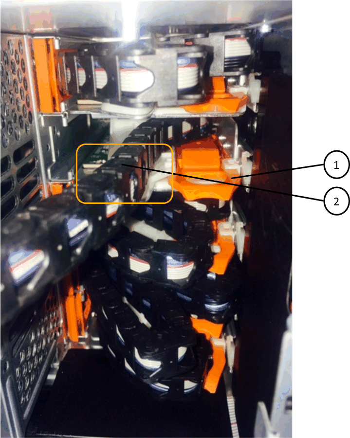
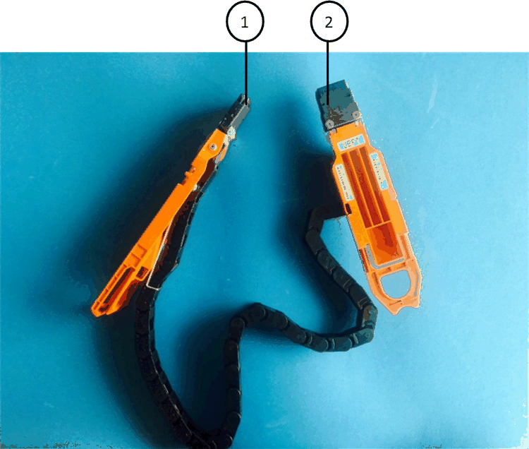

= Reemplace un cajón de unidades en una bandeja de discos DS460C - bandejas con módulos IOM12/IOM12B
:allow-uri-read: 
:icons: font
:imagesdir: ../media/

[role="lead"]
Para reemplazar un cajón de unidades en un estante, puede detener todo el sistema de almacenamiento (par de alta disponibilidad), lo que le permite conservar los agregados de datos en el estante. Como alternativa, puede mantener el par de alta disponibilidad en funcionamiento, lo que requiere mover todos los datos de los agregados de datos en las unidades de disco del estante y, a continuación, desconectarlos y eliminarlos. Si el estante contiene un agregado raíz, debe detener el par de alta disponibilidad.

.Antes de empezar
Necesita estos elementos para este procedimiento:

* Protección antiestática
+

NOTE: *Posible daño de hardware:* para evitar daños por descarga electrostática en la bandeja de unidades, utilice la protección antiestática adecuada al manipular los componentes de la bandeja de unidades.

* Cajón de unidades de reemplazo
* Sustituir las cadenas de cables izquierda y derecha
* Linterna

.Acerca de esta tarea
* Este procedimiento se aplica a las bandejas que tienen cajones de unidades DCM y/o cajones de unidades DCM2. (Las bandejas también tendrán dos módulos IOM12 o dos módulos IOM12B).
+
Cuando falla un cajón de unidad de DCM o DCM2, recibe un cajón de unidad de DCM o DCM2 para reemplazarlo.

[NOTE]
====
Si se sustituye un cajón de unidades con error, la bandeja tiene una combinación de módulos IOM12 y cualquier número de cajones de unidades DCM2, Debe actualizar el firmware IOM12 a la versión 0300 o posterior, ya que los módulos IOM12 requieren una versión de FW compatible con los cajones de unidades DCM2.

La actualización IOM12 FW se puede realizar antes o después de sustituir un cajón de unidades. Este procedimiento incluye la actualización del FW como parte de la preparación para el procedimiento de sustitución del cajón.

====
* Los cajones de unidades DCM y los cajones de unidades DCM2 pueden distinguirse por su apariencia:
+
Los cajones de la unidad DCM son los siguientes:

+
image::../media/28_dwg_e2860_de460c_front_no_callouts.gif[Vista frontal de una bandeja de transmisión del DCM]

+
Los cajones de unidad DCM2 se distinguen por una banda azul y una etiqueta "DCM2":

+
image::../media/dcm2.png[Vista frontal de una bandeja de unidades DCM2]

== Prepare para sustituir un cajón de unidades

Antes de sustituir un cajón de unidades, debe asegurarse de actualizar IOM12 FW si es necesario, y detener el par de alta disponibilidad, lo que le permite conservar los agregados de datos en la bandeja o tiene la opción de mantener el par de alta disponibilidad en funcionamiento. lo que requiere que mueva todos los datos de los agregados de datos que residen en las unidades de disco, desconectar y eliminar los agregados de datos. Sin embargo, si la bandeja contiene un agregado raíz, debe detener la pareja de alta disponibilidad. Por último, se debe apagar la bandeja.

.Pasos
. Determine si al reemplazar el cajón de unidades con error, la bandeja tiene una combinación de módulos IOM12 y cualquier número de cajones de unidades DCM2.
. Si la bandeja tendrá una combinación de módulos IOM12 y cualquier número de cajones de unidades DCM2, debe actualizar el firmware IOM12 a la versión 0300 o posterior; de lo contrario, vaya al paso siguiente.
+
Puede encontrar las versiones actuales del firmware en el sitio de soporte de NetApp.

+
https://mysupport.netapp.com/site/downloads/firmware/disk-shelf-firmware["Descargas de NetApp: Firmware de bandeja de discos"]

. Si la bandeja contiene el agregado raíz de una de las controladoras del par de alta disponibilidad, o si decide detener el par de alta disponibilidad (en lugar de mantener el par de alta disponibilidad en funcionamiento), realice los siguientes subpasos; de lo contrario, vaya al siguiente paso.
+

NOTE: Los agregados de datos pueden permanecer en la bandeja cuando se detenga la pareja de alta disponibilidad.

+
.. Detenga ambas controladoras de la pareja de alta disponibilidad.
.. Compruebe que su pareja de alta disponibilidad ha detenido consultando la consola del sistema de almacenamiento.
.. Apague la bandeja.
.. Vaya a la sección, <<Quite las cadenas para cables>>.

. Si decide mantener el par de alta disponibilidad en funcionamiento, complete los siguientes subpasos:
+

NOTE: Si se intenta sustituir un cajón con agregados en la bandeja de discos, se podría producir una interrupción del sistema con un evento de pánico de varios discos.

+
.. Mueva todos los datos de los agregados de datos ubicados en todas las unidades de disco en el estante.
+
Los datos incluyen volúmenes y LUN, pero no están limitados a ellos.

.. Desmenuar y eliminar los agregados para permitir que las unidades de disco se conviertan en repuestos:
+
Pueden introducirse comandos desde el shell en clúster de cualquiera de las controladoras.

+
`storage aggregate offline -aggregate _aggregate_name_`

+
`storage aggregate delete -aggregate _aggregate_name_`

.. Compruebe que las unidades de disco no tienen agregados (son piezas de repuesto):
+
... Introduzca el siguiente comando desde el shell de clúster de cualquiera de las controladoras: `storage disk show -shelf _shelf_number_`
... Compruebe la salida para verificar que las unidades de disco duro sean de repuesto.
+
Se muestran las unidades de disco de repuesto `spare` en la `Container Type` columna.

+

NOTE: Si tiene unidades de disco con fallos en la bandeja, `broken` aparece en la `Container Type` columna.

.. Apague la bandeja.

== Quite las cadenas para cables

Las cadenas para cables izquierda y derecha de cada cajón de unidades de la bandeja de unidades DS460C permiten que los cajones se deslice hacia adentro y hacia afuera. Para poder quitar un cajón de unidades, es necesario quitar ambas cadenas para cables.

.Antes de empezar
* Completó la <<Prepare para sustituir un cajón de unidades>> Pasos para que la pareja de alta disponibilidad esté detenida o haya movido todos los datos de los agregados de datos que residen en las unidades de disco y haya interrumpido y eliminado los agregados de datos para permitir que las unidades de disco se conviertan en repuestos.
* Encendió la bandeja.
* Ha obtenido los siguientes elementos:
+
** Protección antiestática
+

NOTE: *Posibles daños en el hardware:* para evitar daños por descarga electrostática en el estante, utilice la protección antiestática adecuada al manipular los componentes de la estantería.

** Linterna

.Acerca de esta tarea
Cada cajón de unidades tiene cadenas para cables izquierda y derecha. Los extremos metálicos de las cadenas para cables se deslizan en los soportes verticales y horizontales correspondientes dentro de la carcasa, de la siguiente manera:

* Los soportes verticales izquierdo y derecho conectan la cadena de cables al plano medio del gabinete.
* Los soportes horizontales izquierdo y derecho conectan la cadena de cables con el cajón individual.

.Pasos
. Póngase protección antiestática.
. En la parte posterior de la bandeja de unidades, quite el módulo de ventilador derecho de la siguiente manera:
+
.. Presione la lengüeta naranja para soltar el asa del módulo del ventilador.
+
La figura muestra el asa del módulo de ventilador extendido y liberado de la lengüeta naranja de la izquierda.

+
image::../media/28_dwg_e2860_de460c_fan_canister_handle_with_callout.gif[Manija del módulo del ventilador extendido]

+
[cols="10,90"]
|===

 a| 
image:../media/icon_round_1.png["Número de llamada 1"]
| Asa del módulo del ventilador 
|===
.. Utilizando la empuñadura, saque el módulo del ventilador de la bandeja de unidades y déjelo a un lado.

. Determinar manualmente cuál de las cinco cadenas para cables debe desconectarse.
+
La figura muestra el lado derecho de la bandeja de unidades con el módulo de ventilador quitado. Con el módulo de ventilador quitado, puede ver las cinco cadenas de cables y los conectores vertical y horizontal de cada cajón. Se proporcionan las anotaciones para el cajón de la unidad 1.

+
image::../media/2860_dwg_full_back_view_chain_connectors.gif[Vista de las cinco cadenas para cables y los conectores vertical y horizontal de cada cajón]

+
[cols="10,90"]
|===

 a| 
image:../media/icon_round_1.png["Número de llamada 1"]
| Cadena de cables 

 a| 
image:../media/icon_round_2.png["Número de llamada 2"]
 a| 
Conector vertical (conectado al plano medio)

 a| 
image:../media/icon_round_3.png["Número de llamada 3"]
 a| 
Conector horizontal (conectado al cajón de la unidad)

|===
+
La cadena de cables superior está conectada al cajón de mando 1. La cadena de cables inferior está conectada al cajón de mando 5.

. Utilice el dedo para mover la cadena de cables del lado derecho hacia la izquierda.
. Siga estos pasos para desconectar cualquiera de las cadenas de cable derecha de su soporte vertical correspondiente.
+
.. Con una linterna, localice el anillo naranja en el extremo de la cadena de cables que está conectada al soporte vertical de la carcasa.
+
image::../media/2860_dwg_vertical_ring_for_chain.gif[Anillo naranja en el extremo de la cadena de cables]

+
[cols="10,90"]
|===

 a| 
image:../media/icon_round_1.png["Número de llamada 1"]
| Anillo naranja en el soporte vertical 
|===
.. Desconecte el conector vertical (conectado al plano medio) presionando suavemente el centro del anillo naranja y tirando del lado izquierdo del cable para sacarlo de la carcasa.
.. Para desenchufar la cadena del cable, tire con cuidado del dedo hacia usted aproximadamente 2.5 cm (1 pulgada), pero deje el conector de la cadena del cable dentro del soporte vertical.

. Siga estos pasos para desconectar el otro extremo de la cadena de cables:
+
.. Con una linterna, localice el anillo naranja en el extremo de la cadena de cables que está fijado al soporte horizontal de la carcasa.
+
La figura muestra el conector horizontal de la derecha y la cadena del cable desconectada y parcialmente retirada del lado izquierdo.

+

+
[cols="10,90"]
|===

 a| 
image:../media/icon_round_1.png["Número de llamada 1"]
| Anillo naranja en soporte horizontal 

 a| 
image:../media/icon_round_2.png["Número de llamada 2"]
 a| 
Cadena de cables

|===
.. Inserte con cuidado el dedo en el anillo naranja.
+
La figura muestra el anillo naranja del soporte horizontal que se está empujando hacia abajo para que el resto de la cadena de cables pueda extraerse de la carcasa.

.. Tire del dedo hacia usted para desenchufar la cadena de cables.

. Saque con cuidado toda la cadena de cables de la bandeja de unidades.
. Desde la parte posterior de la bandeja de unidades, retire el módulo de ventilador izquierdo.
. Siga estos pasos para desconectar la cadena de cables izquierda de su soporte vertical:
+
.. Con una linterna, coloque el anillo naranja en el extremo de la cadena de cables conectado al soporte vertical.
.. Introduzca el dedo en el anillo naranja.
.. Para desenchufar la cadena del cable, tire del dedo hacia usted aproximadamente 2.5 cm (1 pulgada), pero deje el conector de la cadena del cable dentro del soporte vertical.

. Desconecte la cadena de cables izquierda del soporte horizontal y saque toda la cadena de cables de la bandeja de unidades.

== Quite un cajón de unidad

Después de quitar las cadenas para cables derecha e izquierda, es posible quitar el cajón de unidades de la bandeja de unidades. Para extraer un cajón de unidad, es necesario deslizar la parte del cajón hacia fuera, extraer las unidades y extraer el cajón de la unidad.

.Antes de empezar
* Quitó las cadenas para cables derecha e izquierda del cajón de unidades.
* Ha sustituido los módulos de ventilador derecho e izquierdo.

.Pasos
. Quite el panel frontal de la parte delantera de la bandeja de unidades.
. Desenganche el cajón de mando tirando de ambas palancas.
. Con las palancas extendidas, tire con cuidado del cajón de la unidad hasta que se detenga. No quite completamente el cajón de unidades de la bandeja de unidades.
. Quite las unidades del cajón de la unidad:
+
.. Tire suavemente hacia atrás del pestillo de liberación naranja que se ve en la parte frontal central de cada unidad. En la siguiente imagen, se muestra el pestillo de liberación naranja de cada una de las unidades.
+
image::../media/28_dwg_e2860_drive_latches_top_view.gif[Pestillos de liberación de la unidad]

.. Levante la manija de la unidad hasta la posición vertical.
.. Utilice el asa para levantar la unidad del cajón de la unidad.
+
image::../media/92_dwg_de6600_install_or_remove_drive.gif[Instalar o quitar una unidad]

.. Coloque la unidad sobre una superficie plana y sin estática y lejos de los dispositivos magnéticos.
+

NOTE: *Posible pérdida de acceso a los datos:* los campos magnéticos pueden destruir todos los datos de la unidad y causar daños irreparables a los circuitos de la unidad. Para evitar la pérdida de acceso a los datos y daños en las unidades, mantenga siempre las unidades alejadas de los dispositivos magnéticos.

. Siga estos pasos para quitar el cajón de la unidad:
+
.. Coloque la palanca de liberación de plástico en cada lado del cajón de la unidad.
+
image::../media/92_pht_de6600_drive_drawer_release_lever.gif[Palanca de liberación del cajón]

+
[cols="10,90"]
|===

 a| 
image:../media/icon_round_1.png["Número de llamada 1"]
| Palanca de liberación del cajón de la unidad 
|===
.. Abra ambas palancas de liberación tirando de los pestillos hacia usted.
.. Mientras sujeta ambas palancas de liberación, tire de la bandeja de transmisión hacia usted.
.. Quite el cajón de unidades de la bandeja de unidades.

== Instale un cajón de unidades

La instalación de un cajón de unidades en una bandeja de unidades implica deslizar el cajón en la ranura vacía, instalar las unidades y reemplazar el embellecedor frontal.

.Antes de empezar
* Ha obtenido los siguientes elementos:
+
** Cajón de unidades de reemplazo
** Linterna

.Pasos
. Desde la parte frontal de la bandeja de unidades, haga brillar una linterna en la ranura vacía del cajón y localice el vaso de bloqueo para esa ranura.
+
El conjunto del vaso con cierre de bloqueo es una función de seguridad que evita que pueda abrir más de un cajón de accionamiento a la vez.

+
image::../media/92_pht_de6600_lock_out_tumbler_detail.gif[Ubicación del vaso de bloqueo y la guía del cajón]

+
[cols="10,90"]
|===

 a| 
image:../media/icon_round_1.png["Número de llamada 1"]
| Vaso con cierre de bloqueo 

 a| 
image:../media/icon_round_2.png["Número de llamada 2"]
 a| 
Guía del cajón

|===
. Coloque el cajón de unidades de repuesto delante de la ranura vacía y ligeramente a la derecha del centro.
+
La colocación del cajón ligeramente a la derecha del centro ayuda a garantizar que el vaso de bloqueo y la guía del cajón están correctamente acoplados.

. Deslice el cajón de la unidad dentro de la ranura y asegúrese de que la guía del cajón se desliza debajo del vaso de bloqueo.
+

NOTE: *Riesgo de daños en el equipo:* se produce un daño si la guía del cajón no se desliza debajo del vaso de bloqueo.

. Empuje con cuidado el cajón de la unidad hasta que el pestillo se acople completamente.
+

NOTE: *Riesgo de daños en el equipo:* deje de empujar el cajón de accionamiento si siente una resistencia o agarrotamiento excesivos. Utilice las palancas de liberación de la parte delantera del cajón para desdeslizar el cajón hacia atrás. A continuación, vuelva a insertar el cajón en la ranura y asegúrese de que se desliza hacia dentro y hacia fuera libremente.

. Siga estos pasos para volver a instalar las unidades en el cajón de la unidad:
+
.. Desenganche el cajón de la unidad tirando de ambas palancas en la parte delantera del cajón.
.. Con las palancas extendidas, tire con cuidado del cajón de la unidad hasta que se detenga. No quite completamente el cajón de unidades de la bandeja de unidades.
.. En la unidad que está instalando, levante el asa hasta la posición vertical.
.. Alinee los dos botones levantados de cada lado de la unidad con las muescas del cajón.
+
La figura muestra la vista del lado derecho de una unidad, donde se muestra la ubicación de los botones levantados.

+
image::../media/28_dwg_e2860_de460c_drive_cru.gif[Ubicación de los botones levantados en la unidad]

+
[cols="10,90"]
|===

 a| 
image:../media/icon_round_1.png["Número de llamada 1"]
| Botón elevado en el lado derecho de la unidad. 
|===
.. Baje la unidad en línea recta hacia abajo y gire la manija de la unidad hacia abajo hasta que la unidad encaje en su lugar.
+
Si dispone de una bandeja parcialmente llena, lo que significa que el cajón en el que se van a reinstalar unidades tiene menos que las 12 unidades compatibles, instale las primeras cuatro unidades en las ranuras frontales (0, 3, 6 y 9).

+

NOTE: *Riesgo de avería del equipo:* para permitir un flujo de aire adecuado y evitar el sobrecalentamiento, instale siempre las cuatro primeras unidades en las ranuras delanteras (0, 3, 6 y 9).

+
image::../media/92_dwg_de6600_install_or_remove_drive.gif[Instalar o quitar una unidad]

.. Repita estos subpasos para volver a instalar todas las unidades.

. Deslice el cajón de nuevo hacia la bandeja de la unidad empujándolo desde el centro y cerrando ambas palancas.
+

NOTE: *Riesgo de avería del equipo:* Asegúrese de cerrar completamente el cajón de accionamiento empujando ambas palancas. Debe cerrar por completo el cajón de la unidad para permitir el flujo de aire adecuado y evitar el sobrecalentamiento.

. Conecte el panel frontal a la parte delantera de la bandeja de unidades.

== Conecte las cadenas para cables

El paso final en la instalación de un cajón de unidades está conectando las cadenas para cables izquierda y derecha de reemplazo a la bandeja de unidades. Al conectar una cadena de cables, invierta el orden que utilizó al desconectar la cadena de cables. Debe insertar el conector horizontal de la cadena en el soporte horizontal de la carcasa antes de insertar el conector vertical de la cadena en el soporte vertical de la carcasa.

.Antes de empezar
* Se reemplazó el cajón de la unidad y todas las unidades.
* Tiene dos cadenas para cables de repuesto, marcadas COMO IZQUIERDA y DERECHA (en el conector horizontal junto al cajón de la unidad).

[cols="4*"]
|===
| Llamada | Cadena de cables | Conector | Se conecta a. 

 a| 
image:../media/icon_round_1.png["Número de llamada 1"]
| Izquierda  a| 
Vertical
 a| 
Plano medio

 a| 
image:../media/icon_round_2.png["Número de llamada 2"]
 a| 
Izquierda
 a| 
Horizontal
 a| 
Cajón de unidades

|===
image:../media/28_dwg_e2860_de460c_cable_chain_right.gif["Cadena de cables de sustitución derecha"]

[cols="4*"]
|===
| Llamada | Cadena de cables | Conector | Se conecta a. 

 a| 
image:../media/icon_round_1.png["Número de llamada 1"]
| Cierto  a| 
Horizontal
 a| 
Cajón de unidades

 a| 
image:../media/icon_round_2.png["Número de llamada 2"]
 a| 
Cierto
 a| 
Vertical
 a| 
Plano medio

|===
.Pasos
. Siga estos pasos para conectar la cadena de cables izquierda:
+
.. Localice los conectores horizontal y vertical en la cadena de cables izquierda y los soportes horizontales y verticales correspondientes dentro de la carcasa.
.. Alinee ambos conectores de la cadena de cables con sus soportes correspondientes.
.. Deslice el conector horizontal de la cadena de cables por debajo del riel de guía del soporte horizontal y empújelo hasta el máximo.
+
La figura muestra el riel de guía en el lado izquierdo del segundo cajón de la caja.

+
image::../media/2860_dwg_guide_rail.gif[Guía]

+
[cols="10,90"]
|===

 a| 
image:../media/icon_round_1.png["Número de llamada 1"]
| Guía 
|===
+
[NOTE]
====
*Riesgo de avería del equipo:* Asegúrese de deslizar el conector debajo del riel de guía en el soporte. Si el conector descansa sobre la parte superior del riel guía, pueden producirse problemas cuando el sistema funciona.

====
.. Deslice el conector vertical de la cadena de cables izquierda en el soporte vertical.
.. Después de volver a conectar ambos extremos de la cadena del cable, tire con cuidado de la cadena del cable para verificar que ambos conectores estén bloqueados.
+
[NOTE]
====
*Riesgo de avería del equipo:* Si los conectores no están bloqueados, la cadena de cables podría soltarse durante el funcionamiento de la bandeja.

====

. Vuelva a instalar el módulo del ventilador izquierdo.
. Siga estos pasos para volver a colocar la cadena de cables derecha:
+
.. Localice los conectores horizontal y vertical en la cadena de cables y sus correspondientes soportes horizontales y verticales dentro de la carcasa.
.. Alinee ambos conectores de la cadena de cables con sus soportes correspondientes.
.. Deslice el conector horizontal de la cadena de cables por debajo del riel de guía del soporte horizontal y empújelo hasta el máximo.
+
[NOTE]
====
*Riesgo de avería del equipo:* Asegúrese de deslizar el conector debajo del riel de guía en el soporte. Si el conector descansa sobre la parte superior del riel guía, pueden producirse problemas cuando el sistema funciona.

====
.. Deslice el conector vertical de la cadena de cables derecha en el soporte vertical.
.. Después de volver a conectar ambos extremos de la cadena del cable, tire con cuidado de la cadena del cable para verificar que ambos conectores estén bloqueados.
+
[NOTE]
====
*Riesgo de avería del equipo:* Si los conectores no están bloqueados, la cadena de cables podría soltarse durante el funcionamiento de la bandeja.

====

. Vuelva a instalar el módulo del ventilador derecho.
. Volver a aplicar potencia:
+
.. Encienda ambos switches de alimentación de la bandeja de unidades.
.. Confirme que ambos ventiladores se encienden y que el LED ámbar de la parte posterior de los ventiladores está apagado.

. Si había detenido la pareja de alta disponibilidad, arranque ONTAP en ambas controladoras; de lo contrario, vaya al siguiente paso.
. Si había movido datos de la bandeja y eliminado los agregados de datos, ahora puede usar los discos de reserva de la bandeja para crear un agregado o expandirse.
+
https://docs.netapp.com/us-en/ontap/disks-aggregates/aggregate-creation-workflow-concept.html["Flujo de trabajo de creación de agregados"]

+
https://docs.netapp.com/us-en/ontap/disks-aggregates/aggregate-expansion-workflow-concept.html["Flujo de trabajo de ampliación de agregados"]

